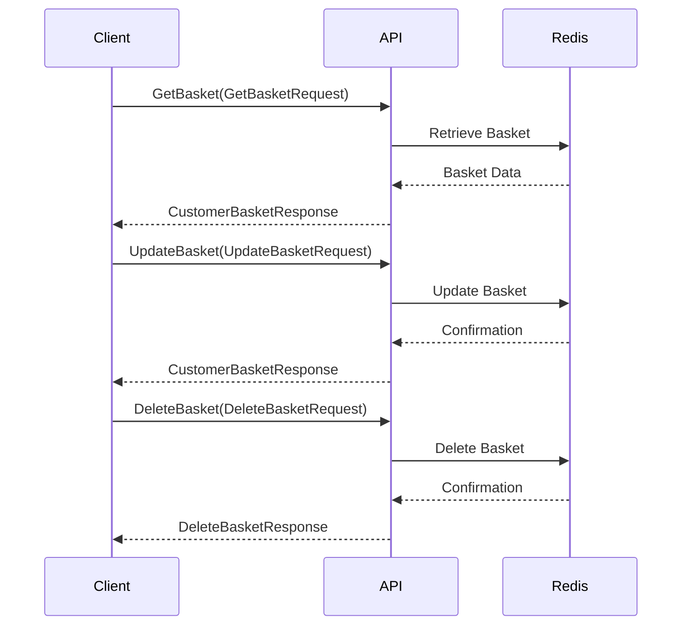
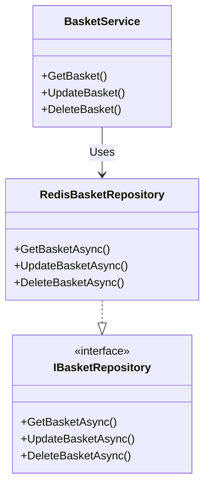

# Basket API Documentation

## 1. Feature Overview

The Basket API provides functionality for managing a shopping basket in an e-commerce platform. It allows operations such as retrieving, updating, and deleting a customer's basket.

- **Business motivation:**
  - Enable a personalized shopping experience by maintaining user-specific baskets.
  - Improve checkout flow efficiency by managing basket items asynchronously.
  - Facilitate integration with other microservices, such as order processing and inventory management.
  - Support scalability and flexibility in shopping operations through a microservices architecture.

- **Key stakeholders:**
  - Customers using the e-commerce platform.
  - Frontend developers integrating shopping basket functionalities.
  - Backend developers working on related microservices like order processing and inventory.

## 2. Business Implementation Details

- **Business rules implemented:**
  - Baskets are user-specific, identified by a user ID.
  - Baskets can be retrieved, updated, or deleted.
  - Only authenticated users can modify a basket.

- **Use cases covered:**
  - Viewing the current items in the basket.
  - Adding or removing items from the basket.
  - Clearing the basket after checkout or by user choice.

- **Assumptions and constraints:**
  - The user's identity is determined from the server call context.
  - Baskets are stored in Redis, requiring the Redis infrastructure to be available.

## 3. Technical Implementation Details

- **API endpoints with HTTP methods:**
  - The Basket API exposes gRPC endpoints rather than HTTP endpoints. The methods include:
    - `GetBasket(GetBasketRequest)`
    - `UpdateBasket(UpdateBasketRequest)`
    - `DeleteBasket(DeleteBasketRequest)`

- **Key classes and their responsibilities:**
  - `BasketService`: Implements gRPC service methods for basket operations.
  - `RedisBasketRepository`: Handles data access operations for baskets in Redis.
  - `IBasketRepository`: Defines the contract for basket data operations.
  - `CustomerBasket` and `BasketItem`: Domain models for the basket and its items.

- **Database/storage information:**
  - Baskets are stored in Redis, using unique keys derived from user IDs.

- **Integration points with other services:**
  - The Basket API integrates with an event bus (RabbitMQ) for publishing integration events, such as `OrderStartedIntegrationEvent`.

## 4. Validation and Error Handling

- **Input validation rules:**
  - Basket items must have a quantity greater than 0.

- **Error scenarios and HTTP status codes:**
  - Unauthenticated access attempts result in a `StatusCode.Unauthenticated` error.
  - Attempts to update or delete a non-existent basket return `StatusCode.NotFound`.

- **Retry/fallback logic:**
  - Not explicitly implemented in the provided code. Clients are expected to handle retries based on error responses.

## 5. Security and Access Control

- **Authentication mechanism:**
  - Uses server call context to identify authenticated users. Authentication is assumed to be handled upstream.

- **Authorization rules:**
  - Users can only access their own baskets.

- **Data access restrictions:**
  - There are no explicit roles or permissions; access control is based on user identity.

## 6. Testing Strategy

- **Types of tests:**
  - Unit tests for individual components (e.g., `RedisBasketRepository` methods).
  - Integration tests for gRPC service endpoints.

- **Key test scenarios:**
  - Retrieving, updating, and deleting a basket successfully.
  - Handling unauthenticated requests.
  - Validating basket item quantities.

- **Testing tools/frameworks used:**
  - xUnit for unit and integration testing.
  - Moq for mocking dependencies.

## 7. Deployment Considerations

- **Infrastructure requirements:**
  - A Redis instance for basket storage.
  - RabbitMQ for event bus integration.

- **Configuration needed:**
  - Connection strings for Redis and RabbitMQ.
  - Authentication settings for securing gRPC endpoints.

- **Post-deployment validation:**
  - Verify connectivity to Redis and RabbitMQ.
  - Test gRPC endpoints for expected functionality and security.

## 8. References

- **Links to key source files:**
  - Basket Service: `/Grpc/BasketService.cs`
  - Basket Repository Interface: `/Repositories/IBasketRepository.cs`
  - Redis Basket Repository: `/Repositories/RedisBasketRepository.cs`
  - Domain Models: `/Model/CustomerBasket.cs` and `/Model/BasketItem.cs`
  - Integration Events: `/IntegrationEvents/Events/OrderStartedIntegrationEvent.cs`

- **Related documentation:**
  - gRPC documentation for .NET.
  - Redis documentation for data modeling and operations.
  - RabbitMQ documentation for event-driven architecture patterns.