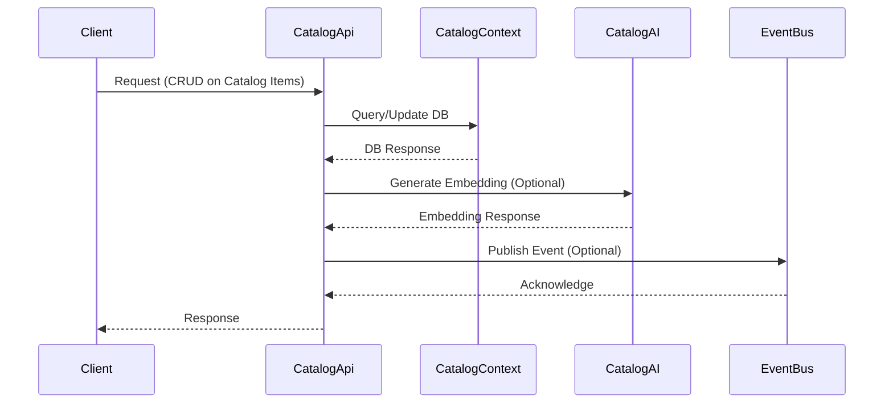
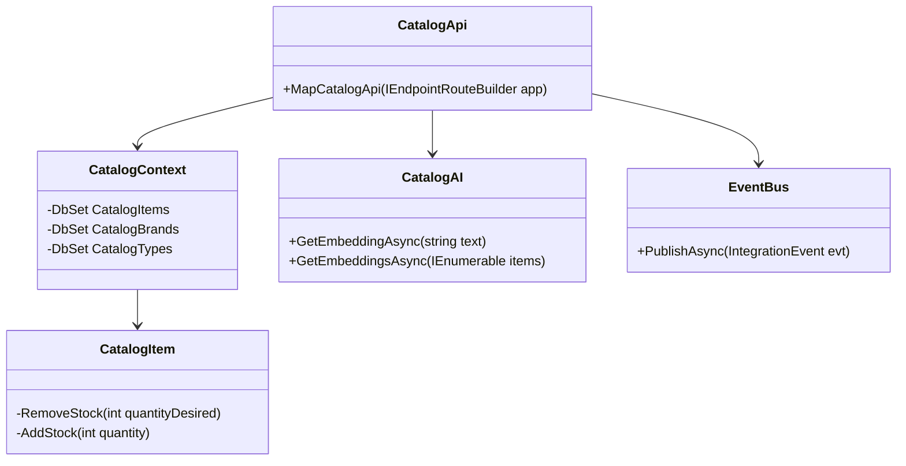

# Catalog API Documentation

## 1. Feature Overview
- The Catalog API provides functionalities to manage catalog items, including querying, adding, updating, and deleting catalog items. It supports versioning to accommodate evolving business requirements.
- **Business motivation:**
  - Enable a dynamic and scalable product catalog for e-commerce platforms.
  - Support advanced search capabilities, including AI-based semantic search.
  - Facilitate integration with other services through event-driven architecture.
  - Ensure a consistent and up-to-date view of product information across services.
- **Key stakeholders:**
  - E-commerce platform administrators managing the product catalog.
  - Customers browsing the e-commerce platform.
  - External systems and services integrating with the catalog for product information.

## 2. Business Implementation Details

- **Business rules implemented:**
  - Catalog items can be queried by ID, name, type, and brand.
  - AI-based semantic search is available for finding relevant items.
  - Catalog items can be added, updated (including bulk updates), and deleted.
  - Stock management is enforced through domain logic in the `CatalogItem` class.
- **Use cases covered:**
  - Viewing a list of catalog items with pagination.
  - Searching for items based on textual relevance using AI.
  - Managing catalog items (CRUD operations).
  - Integration with external systems via event publishing for changes in catalog items.
- **Assumptions and constraints:**
  - The AI-based semantic search feature is optional and depends on the configuration.
  - Integration events are published only if there are changes in the price of catalog items.

## 3. Technical Implementation Details

- **API endpoints with HTTP methods:**
  - GET `/api/catalog/items` (v1 & v2)
  - GET `/api/catalog/items/by`
  - GET `/api/catalog/items/{id}`
  - GET `/api/catalog/items/by/{name}`
  - GET `/api/catalog/items/{id}/pic`
  - GET `/api/catalog/items/withsemanticrelevance/{text}` (v1)
  - GET `/api/catalog/items/withsemanticrelevance` (v2)
  - PUT `/api/catalog/items` (v1)
  - PUT `/api/catalog/items/{id}` (v2)
  - POST `/api/catalog/items`
  - DELETE `/api/catalog/items/{id}`
  - GET `/catalogtypes`
  - GET `/catalogbrands`
- **Key classes and their responsibilities:**
  - `CatalogApi`: Defines and maps the endpoints for the catalog API.
  - `CatalogContext`: Entity Framework DbContext for accessing the catalog database.
  - `CatalogAI`: Provides AI-based services, such as generating embeddings for items.
  - `CatalogItem`: Represents a catalog item and contains domain logic for stock management.
  - `EventBus`: Manages publishing integration events to external systems.
- **Database/storage information:**
  - PostgreSQL database with Pgvector extension for AI-based searches.
- **Integration points with other services:**
  - RabbitMQ for publishing integration events related to catalog operations.

## 4. Validation and Error Handling
- **Input validation rules:**
  - Item IDs must be positive integers.
  - Pagination parameters must be non-negative.
  - Text for semantic search must not be empty.
- **Error scenarios and HTTP status codes:**
  - `400 Bad Request` for validation errors.
  - `404 Not Found` for requests for non-existent catalog items.
  - `500 Internal Server Error` for unexpected failures.
- **Retry/fallback logic:**
  - Fallback to name-based search if AI-based semantic search is not available.

## 5. Security and Access Control
- **Authentication mechanism:** (Not detailed in the provided code, typically implemented via middleware in ASP.NET Core.)
- **Authorization rules:** (Not detailed in the provided code, typically roles or policies based.)
- **Data access restrictions:** (Not detailed in the provided code, could be based on user roles or claims.)

## 6. Testing Strategy
- **Types of tests:**
  - Unit tests for domain logic.
  - Integration tests for API endpoints and database interactions.
- **Key test scenarios:**
  - Adding, updating, and deleting catalog items.
  - Pagination and filtering of catalog items.
  - AI-based semantic search functionality.
- **Testing tools/frameworks used:**
  - xUnit for unit and integration tests.
  - Moq for mocking dependencies.
  - Entity Framework Core In-Memory Database Provider for testing data access logic.

## 7. Deployment Considerations
- **Infrastructure requirements:**
  - .NET 6 runtime environment.
  - PostgreSQL database with Pgvector extension.
  - RabbitMQ for event bus functionality.
- **Configuration needed:**
  - Database connection strings.
  - RabbitMQ connection details.
  - AI service configuration (if AI-based features are enabled).
- **Post-deployment validation:**
  - Ensure all endpoints are accessible and functioning as expected.
  - Validate integration with external systems (e.g., event bus).

## 8. References
- **Links to key source files:**
  - `Apis/CatalogApi.cs`
  - `Model/CatalogItem.cs`
  - `Services/CatalogAI.cs`
  - `Infrastructure/CatalogContext.cs`
  - `IntegrationEvents/ICatalogIntegrationEventService.cs`
- **Related documentation:**
  - ASP.NET Core documentation: https://docs.microsoft.com/aspnet/core/
  - Entity Framework Core documentation: https://docs.microsoft.com/ef/core/
  - RabbitMQ documentation: https://www.rabbitmq.com/documentation.html