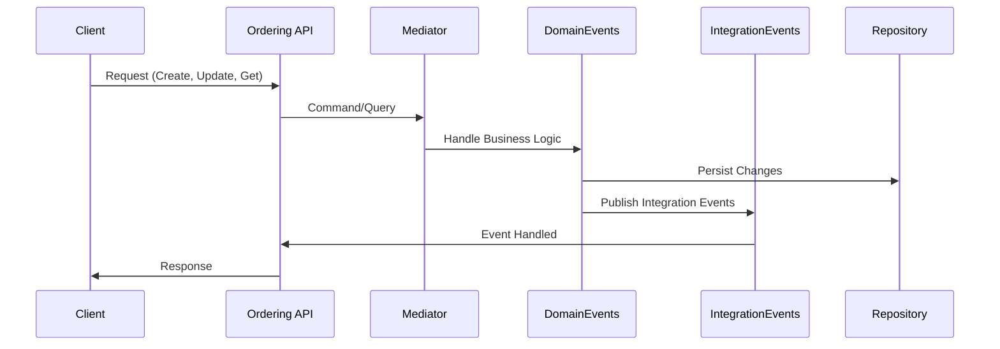
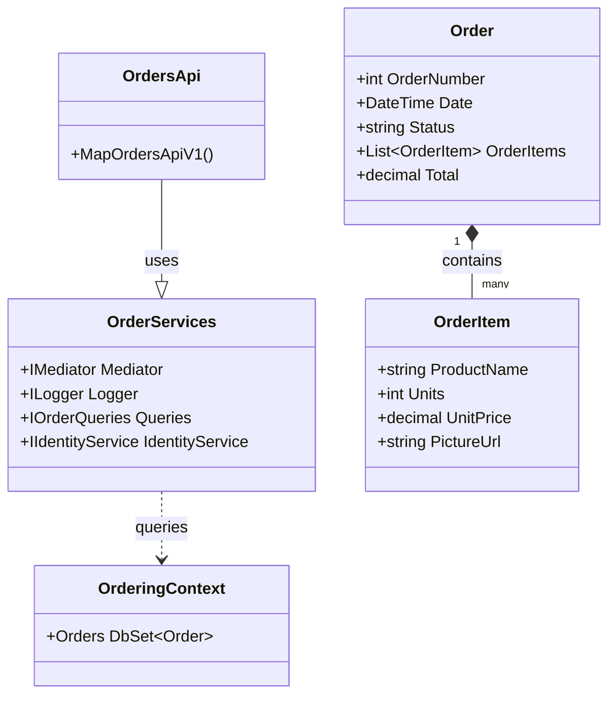

# Ordering API Documentation

## 1. Feature Overview
- The Ordering API manages order processing within an e-commerce system, handling operations such as creating orders, updating order statuses, and managing order queries.
- **Business motivation:**
  - Automate the order processing workflow to reduce manual intervention.
  - Provide a seamless integration point for front-end services and external systems.
  - Enable detailed tracking and management of orders to enhance customer service.
  - Support scalability and flexibility in handling order operations through a microservices architecture.
- **Key stakeholders:**
  - Customers who place orders through the e-commerce platform.
  - Back-office staff responsible for order fulfillment and management.
  - External systems and services that integrate with the order processing system.

## 2. Business Implementation Details

- **Business rules implemented:**
  - Orders can be created, updated (cancel, ship), and queried (get by ID, get by user).
  - Order creation triggers domain events for validation and integration events for external communication.
  - Order updates change the order status and can trigger additional domain and integration events.
- **Use cases covered:**
  - Creating a draft order from a shopping cart.
  - Submitting an order for processing.
  - Cancelling or shipping an order based on stock availability and payment status.
  - Retrieving order details and statuses for customer inquiries.
- **Assumptions and constraints:**
  - Orders are linked to specific users identified by a user ID.
  - External systems handle payment processing and stock management.
  - The system assumes that the necessary validations are performed before an order is submitted.

## 3. Technical Implementation Details

- **List all API endpoints with HTTP methods:**
  - PUT `/api/orders/cancel`
  - PUT `/api/orders/ship`
  - GET `/api/orders/{orderId:int}`
  - GET `/api/orders/`
  - GET `/api/orders/cardtypes`
  - POST `/api/orders/draft`
  - POST `/api/orders/`
- **Key classes and their responsibilities:**
  - `OrderServices`: Facilitates the handling of commands and queries related to orders.
  - `OrdersApi`: Defines the endpoints for the Ordering API.
  - `Order`, `OrderItem`: Domain models representing orders and their line items.
  - `OrderingContext`: EF Core context, acting as the primary interface to the database.
- **Database/storage information:**
  - PostgreSQL is used as the database, with `OrderingContext` as the EF Core DbContext.
- **Integration points with other services:**
  - RabbitMQ for publishing integration events.
  - HTTP Context for user identity services.

## 4. Validation and Error Handling
- **Input validation rules:**
  - Order commands validate non-empty fields and correct data formats (e.g., GUIDs for request IDs, valid credit card information).
- **Error scenarios and HTTP status codes:**
  - Bad Request (400) for validation failures.
  - Not Found (404) for queries to non-existent orders.
  - Internal Server Error (500) for processing failures.
- **Retry/fallback logic:**
  - The application logs failed operations without automatic retry logic, delegating retry behavior to the client or external systems.

## 5. Security and Access Control
- **Authentication mechanism:**
  - The API uses bearer token authentication for securing endpoints.
- **Authorization rules:**
  - Certain operations, such as creating or cancelling an order, require user authentication.
- **Data access restrictions:**
  - Users can only access their orders. Admin roles can access all orders.

## 6. Testing Strategy
- **Types of tests:**
  - Unit tests for domain logic and command/query handlers.
  - Integration tests for API endpoints and database interactions.
- **Key test scenarios:**
  - Creating an order and validating the resulting order state.
  - Cancelling an order and verifying the order status change.
  - Retrieving orders for a user and ensuring correct data is returned.
- **Testing tools/frameworks used:**
  - xUnit for unit and integration testing.
  - Moq for mocking dependencies.
  - Entity Framework Core In-Memory Database for testing data access logic.

## 7. Deployment Considerations
- **Infrastructure requirements:**
  - .NET 6 runtime environment.
  - PostgreSQL database.
  - RabbitMQ server for event bus communications.
- **Configuration needed:**
  - Database connection strings.
  - RabbitMQ connection and credential details.
- **Post-deployment validation:**
  - Health checks for API endpoints.
  - Database migration execution.
  - Event bus connectivity tests.

## 8. References
- **Links to key source files:**
  - [OrderServices](./Ordering.API/Apis/OrderServices.cs)
  - [OrdersApi](./Ordering.API/Apis/OrdersApi.cs)
  - [OrderingContext](./Ordering.Infrastructure/OrderingContext.cs)
- **Related documentation:**
  - [MediatR Documentation](https://github.com/jbogard/MediatR)
  - [Entity Framework Core Documentation](https://docs.microsoft.com/en-us/ef/core/)