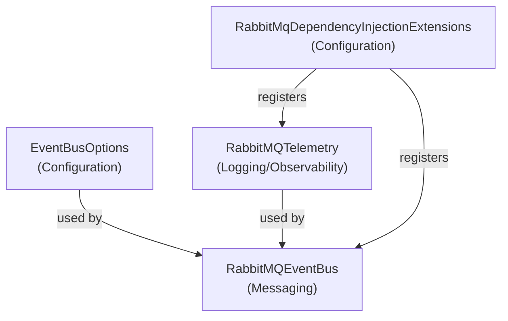

# EventBusRabbitMQ Classifications

This document classifies the main .cs files in the EventBusRabbitMQ library according to their developer roles and dependency order.

## Dependency Graph

## Ordered Classifications

1. **EventBusOptions** ([source](https://github.com/akhileshap9/automated-doc-poc-repo/blob/main/src/EventBusRabbitMQ/EventBusOptions.cs#L3-L7)) — *Configuration*
2. **RabbitMqDependencyInjectionExtensions** ([source](https://github.com/akhileshap9/automated-doc-poc-repo/blob/main/src/EventBusRabbitMQ/RabbitMqDependencyInjectionExtensions.cs#L6-L50)) — *Configuration*
3. **RabbitMQTelemetry** ([source](https://github.com/akhileshap9/automated-doc-poc-repo/blob/main/src/EventBusRabbitMQ/RabbitMQTelemetry.cs#L6-L13)) — *Logging/Observability*
4. **RabbitMQEventBus** ([source](https://github.com/akhileshap9/automated-doc-poc-repo/blob/main/src/EventBusRabbitMQ/RabbitMQEventBus.cs#L13-L319)) — *Messaging*

*No additional dynamic groups were required; all files fit the standard classification rules.*
