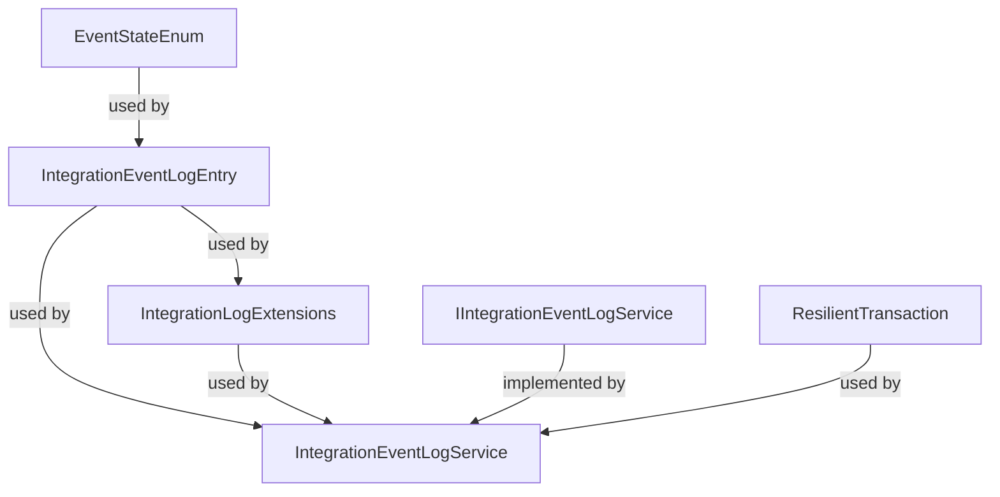

# IntegrationEventLogEF Classifications

This document classifies the main .cs files in the IntegrationEventLogEF library according to their developer documentation roles and provides a topologically ordered dependency graph.

## Dependency Graph

## Ordered Classifications

1. **EventStateEnum** — Data Interactions (Enum for event state, used in persistence logic)
2. **IntegrationEventLogEntry** — Data Interactions (Represents event log entity, interacts with persistence)
3. **IntegrationLogExtensions** — Data Interactions (EF ModelBuilder extension for event log table)
4. **ResilientTransaction** — Data Interactions (Transaction helper for EF Core)
5. **IIntegrationEventLogService** — Services (Interface for event log service orchestration)
6. **IntegrationEventLogService** — Services (Implements event log service, orchestrates event persistence)

_All files fit the standard groups; no dynamic group was needed._
