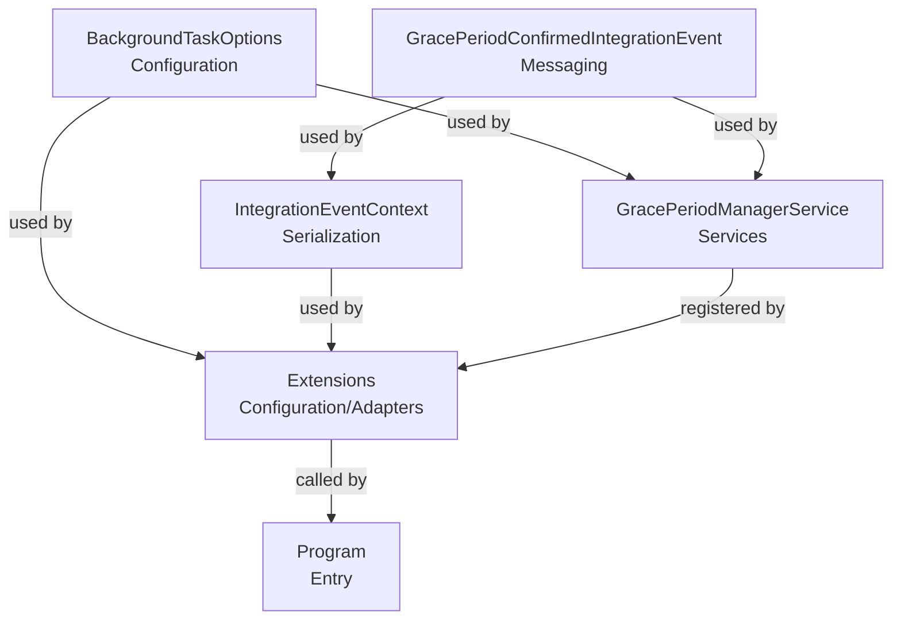

# OrderProcessor Class Classification

Below is the classification and dependency graph for the main classes in the OrderProcessor project.

## Class List (Topological Order)

1. **BackgroundTaskOptions.cs** (Configuration) - No dependencies, 9 lines
2. **GracePeriodConfirmedIntegrationEvent.cs** (Messaging) - Depends on IntegrationEvent (external), 11 lines
3. **IntegrationEventContext.cs** (Serialization) - Depends on GracePeriodConfirmedIntegrationEvent, 8 lines
4. **Extensions.cs** (Configuration/Adapters) - Depends on BackgroundTaskOptions, GracePeriodManagerService, IntegrationEventContext, 22 lines
5. **GracePeriodManagerService.cs** (Services) - Depends on BackgroundTaskOptions, GracePeriodConfirmedIntegrationEvent, IEventBus, ILogger, NpgsqlDataSource, 66 lines

## Mermaid Dependency Graph

---

This file documents the classification and dependencies of classes in the OrderProcessor project for developer documentation.
