## Classification List

1. BasketItem.cs | Data Interactions | None | 18 lines
2. CustomerBasket.cs | Data Interactions | BasketItem | 13 lines
3. IIdentityService.cs | Services | None | 8 lines
4. IdentityService.cs | Services | IIdentityService | 11 lines
5. IOrderQueries.cs | Data Interactions | None | 13 lines
6. OrderQueries.cs | Data Interactions | IOrderQueries, OrderingContext | 54 lines
7. IOrderingIntegrationEventService.cs | Messaging | None | 8 lines
8. OrderingIntegrationEventService.cs | Messaging | IOrderingIntegrationEventService, IEventBus, OrderingContext, IIntegrationEventLogService, ILogger | 43 lines
9. OrderingContextSeed.cs | Configuration | IDbSeeder<OrderingContext>, OrderingContext | 28 lines
10. OrderingApiTrace.cs | Logging/Observability | ILogger, OrderStatus | 18 lines
11. LinqSelectExtensions.cs | Extensions | None | 46 lines
12. BasketItemExtensions.cs | Mappers | BasketItem, OrderItemDTO | 27 lines
13. Extensions.cs | Configuration | IHostApplicationBuilder, IServiceCollection | 63 lines
14. CreateOrderCommand.cs | Data Interactions | BasketItem, OrderItemDTO | 86 lines
15. IdentifiedCommand.cs | Messaging | IRequest<R> | 15 lines
16. IdentifiedCommandHandler.cs | Messaging | IMediator, IRequestManager, ILogger | 106 lines
17. CancelOrderCommandHandler.cs | Services | IOrderRepository, CancelOrderCommand | 34 lines
18. CancelOrderIdentifiedCommandHandler.cs | Messaging | IdentifiedCommandHandler<CancelOrderCommand, bool> | 8 lines
19. SetPaidOrderStatusCommandHandler.cs | Services | IOrderRepository, SetPaidOrderStatusCommand | 34 lines
20. SetPaidIdentifiedOrderStatusCommandHandler.cs | Messaging | IdentifiedCommandHandler<SetPaidOrderStatusCommand, bool> | 8 lines
21. SetAwaitingValidationOrderStatusCommandHandler.cs | Services | IOrderRepository, SetAwaitingValidationOrderStatusCommand | 34 lines
22. SetAwaitingValidationIdentifiedOrderStatusCommandHandler.cs | Messaging | IdentifiedCommandHandler<SetAwaitingValidationOrderStatusCommand, bool> | 8 lines
23. SetStockConfirmedOrderStatusCommandHandler.cs | Services | IOrderRepository, SetStockConfirmedOrderStatusCommand | 34 lines
24. SetStockConfirmedOrderStatusIdentifiedCommandHandler.cs | Messaging | IdentifiedCommandHandler<SetStockConfirmedOrderStatusCommand, bool> | 8 lines
25. SetStockRejectedOrderStatusCommandHandler.cs | Services | IOrderRepository, SetStockRejectedOrderStatusCommand | 34 lines
26. SetStockRejectedOrderStatusIdentifiedCommandHandler.cs | Messaging | IdentifiedCommandHandler<SetStockRejectedOrderStatusCommand, bool> | 8 lines
27. ShipOrderCommandHandler.cs | Services | IOrderRepository, ShipOrderCommand | 34 lines
28. ShipOrderIdentifiedCommandHandler.cs | Messaging | IdentifiedCommandHandler<ShipOrderCommand, bool> | 8 lines
29. CreateOrderCommandValidator.cs | Validation | CreateOrderCommand | 36 lines
30. OrdersApi.cs | Adapters (External Integrations) | OrderServices, IMediator, IOrderQueries, IIdentityService, ILogger | 186 lines
31. OrderServices.cs | Services | IMediator, IOrderQueries, IIdentityService, ILogger | 13 lines

## Dependency Graph (Mermaid)

```mermaid
graph TD
	BasketItem
	CustomerBasket --> BasketItem
	IIdentityService
	IdentityService --> IIdentityService
	IOrderQueries
	OrderQueries --> IOrderQueries
	OrderQueries --> OrderingContext
	IOrderingIntegrationEventService
	OrderingIntegrationEventService --> IOrderingIntegrationEventService
	OrderingIntegrationEventService --> IEventBus
	OrderingIntegrationEventService --> OrderingContext
	OrderingIntegrationEventService --> IIntegrationEventLogService
	OrderingIntegrationEventService --> ILogger
	OrderingContextSeed --> IDbSeeder
	OrderingContextSeed --> OrderingContext
	OrderingApiTrace --> ILogger
	OrderingApiTrace --> OrderStatus
	LinqSelectExtensions
	BasketItemExtensions --> BasketItem
	BasketItemExtensions --> OrderItemDTO
	Extensions --> IHostApplicationBuilder
	Extensions --> IServiceCollection
	CreateOrderCommand --> BasketItem
	CreateOrderCommand --> OrderItemDTO
	IdentifiedCommand --> IRequest
	IdentifiedCommandHandler --> IMediator
	IdentifiedCommandHandler --> IRequestManager
	IdentifiedCommandHandler --> ILogger
	CancelOrderCommandHandler --> IOrderRepository
	CancelOrderCommandHandler --> CancelOrderCommand
	CancelOrderIdentifiedCommandHandler --> IdentifiedCommandHandler
	SetPaidOrderStatusCommandHandler --> IOrderRepository
	SetPaidOrderStatusCommandHandler --> SetPaidOrderStatusCommand
	SetPaidIdentifiedOrderStatusCommandHandler --> IdentifiedCommandHandler
	SetAwaitingValidationOrderStatusCommandHandler --> IOrderRepository
	SetAwaitingValidationOrderStatusCommandHandler --> SetAwaitingValidationOrderStatusCommand
	SetAwaitingValidationIdentifiedOrderStatusCommandHandler --> IdentifiedCommandHandler
	SetStockConfirmedOrderStatusCommandHandler --> IOrderRepository
	SetStockConfirmedOrderStatusCommandHandler --> SetStockConfirmedOrderStatusCommand
	SetStockConfirmedOrderStatusIdentifiedCommandHandler --> IdentifiedCommandHandler
	SetStockRejectedOrderStatusCommandHandler --> IOrderRepository
	SetStockRejectedOrderStatusCommandHandler --> SetStockRejectedOrderStatusCommand
	SetStockRejectedOrderStatusIdentifiedCommandHandler --> IdentifiedCommandHandler
	ShipOrderCommandHandler --> IOrderRepository
	ShipOrderCommandHandler --> ShipOrderCommand
	ShipOrderIdentifiedCommandHandler --> IdentifiedCommandHandler
	CreateOrderCommandValidator --> CreateOrderCommand
	OrdersApi --> OrderServices
	OrdersApi --> IMediator
	OrdersApi --> IOrderQueries
	OrdersApi --> IIdentityService
	OrdersApi --> ILogger
	OrderServices --> IMediator
	OrderServices --> IOrderQueries
	OrderServices --> IIdentityService
	OrderServices --> ILogger
```

