# Ordering.Infrastructure Class & Dependency Classification

This document classifies the main classes in the `Ordering.Infrastructure` project, lists their primary responsibilities, categories, and shows their dependencies in topological order.

## Classifications & Categories

1. **ClientRequest** (Idempotency)
   - Category: Data Interactions
   - Dependencies: None
2. **IRequestManager** (Idempotency)
   - Category: Data Interactions
   - Dependencies: None
3. **MediatorExtension**
   - Category: Services
   - Dependencies: None
4. **BuyerEntityTypeConfiguration**
   - Category: Configuration
   - Dependencies: None
5. **CardTypeEntityTypeConfiguration**
   - Category: Configuration
   - Dependencies: None
6. **ClientRequestEntityTypeConfiguration**
   - Category: Configuration
   - Dependencies: None
7. **OrderEntityTypeConfiguration**
   - Category: Configuration
   - Dependencies: None
8. **OrderItemEntityTypeConfiguration**
   - Category: Configuration
   - Dependencies: None
9. **PaymentMethodEntityTypeConfiguration**
   - Category: Configuration
   - Dependencies: None
10. **OrderingContext**
    - Category: Data Interactions
    - Dependencies: BuyerEntityTypeConfiguration, CardTypeEntityTypeConfiguration, ClientRequestEntityTypeConfiguration, OrderEntityTypeConfiguration, OrderItemEntityTypeConfiguration, PaymentMethodEntityTypeConfiguration
11. **RequestManager** (Idempotency)
    - Category: Data Interactions
    - Dependencies: OrderingContext, ClientRequest
12. **OrderRepository**
    - Category: Data Interactions
    - Dependencies: OrderingContext
13. **BuyerRepository**
    - Category: Data Interactions
    - Dependencies: OrderingContext

## Dependency Graph

```mermaid
flowchart TD
    ClientRequest["ClientRequest"]
    IRequestManager["IRequestManager"]
    MediatorExtension["MediatorExtension"]
    BuyerEntityTypeConfiguration["BuyerEntityTypeConfiguration"]
    CardTypeEntityTypeConfiguration["CardTypeEntityTypeConfiguration"]
    ClientRequestEntityTypeConfiguration["ClientRequestEntityTypeConfiguration"]
    OrderEntityTypeConfiguration["OrderEntityTypeConfiguration"]
    OrderItemEntityTypeConfiguration["OrderItemEntityTypeConfiguration"]
    PaymentMethodEntityTypeConfiguration["PaymentMethodEntityTypeConfiguration"]

    OrderingContext["OrderingContext"]
    RequestManager["RequestManager"]
    OrderRepository["OrderRepository"]
    BuyerRepository["BuyerRepository"]

    BuyerEntityTypeConfiguration -->|configures| OrderingContext
    CardTypeEntityTypeConfiguration -->|configures| OrderingContext
    ClientRequestEntityTypeConfiguration -->|configures| OrderingContext
    OrderEntityTypeConfiguration -->|configures| OrderingContext
    OrderItemEntityTypeConfiguration -->|configures| OrderingContext
    PaymentMethodEntityTypeConfiguration -->|configures| OrderingContext

    OrderingContext -->|used by| RequestManager
    ClientRequest -->|used by| RequestManager
    OrderingContext -->|used by| OrderRepository
    OrderingContext -->|used by| BuyerRepository

    click ClientRequest "https://github.com/akhileshap9/automated-doc-poc-repo/blob/main/src/Ordering.Infrastructure/Idempotency/ClientRequest.cs#L5-L13"
    click IRequestManager "https://github.com/akhileshap9/automated-doc-poc-repo/blob/main/src/Ordering.Infrastructure/Idempotency/IRequestManager.cs#L3-L9"
    click MediatorExtension "https://github.com/akhileshap9/automated-doc-poc-repo/blob/main/src/Ordering.Infrastructure/MediatorExtension.cs#L3-L22"
    click BuyerEntityTypeConfiguration "https://github.com/akhileshap9/automated-doc-poc-repo/blob/main/src/Ordering.Infrastructure/EntityConfigurations/BuyerEntityTypeConfiguration.cs#L3-L32"
    click CardTypeEntityTypeConfiguration "https://github.com/akhileshap9/automated-doc-poc-repo/blob/main/src/Ordering.Infrastructure/EntityConfigurations/CardTypeEntityTypeConfiguration.cs#L3-L22"
    click ClientRequestEntityTypeConfiguration "https://github.com/akhileshap9/automated-doc-poc-repo/blob/main/src/Ordering.Infrastructure/EntityConfigurations/ClientRequestEntityTypeConfiguration.cs#L3-L11"
    click OrderEntityTypeConfiguration "https://github.com/akhileshap9/automated-doc-poc-repo/blob/main/src/Ordering.Infrastructure/EntityConfigurations/OrderEntityTypeConfiguration.cs#L3-L38"
    click OrderItemEntityTypeConfiguration "https://github.com/akhileshap9/automated-doc-poc-repo/blob/main/src/Ordering.Infrastructure/EntityConfigurations/OrderItemEntityTypeConfiguration.cs#L3-L22"
    click PaymentMethodEntityTypeConfiguration "https://github.com/akhileshap9/automated-doc-poc-repo/blob/main/src/Ordering.Infrastructure/EntityConfigurations/PaymentMethodEntityTypeConfiguration.cs#L3-L40"
    click OrderingContext "https://github.com/akhileshap9/automated-doc-poc-repo/blob/main/src/Ordering.Infrastructure/OrderingContext.cs#L10-L40"
    click RequestManager "https://github.com/akhileshap9/automated-doc-poc-repo/blob/main/src/Ordering.Infrastructure/Idempotency/RequestManager.cs#L3-L38"
    click OrderRepository "https://github.com/akhileshap9/automated-doc-poc-repo/blob/main/src/Ordering.Infrastructure/Repositories/OrderRepository.cs#L3-L40"
    click BuyerRepository "https://github.com/akhileshap9/automated-doc-poc-repo/blob/main/src/Ordering.Infrastructure/Repositories/BuyerRepository.cs#L3-L40"
```

## Topological Order

1. ClientRequest, Data Interactions
2. IRequestManager, Data Interactions
3. MediatorExtension, Services
4. BuyerEntityTypeConfiguration, Configuration
5. CardTypeEntityTypeConfiguration, Configuration
6. ClientRequestEntityTypeConfiguration, Configuration
7. OrderEntityTypeConfiguration, Configuration
8. OrderItemEntityTypeConfiguration, Configuration
9. PaymentMethodEntityTypeConfiguration, Configuration
10. OrderingContext, Data Interactions, depends on: BuyerEntityTypeConfiguration, CardTypeEntityTypeConfiguration, ClientRequestEntityTypeConfiguration, OrderEntityTypeConfiguration, OrderItemEntityTypeConfiguration, PaymentMethodEntityTypeConfiguration
11. RequestManager, Data Interactions, depends on: OrderingContext, ClientRequest
12. OrderRepository, Data Interactions, depends on: OrderingContext
13. BuyerRepository, Data Interactions, depends on: OrderingContext

