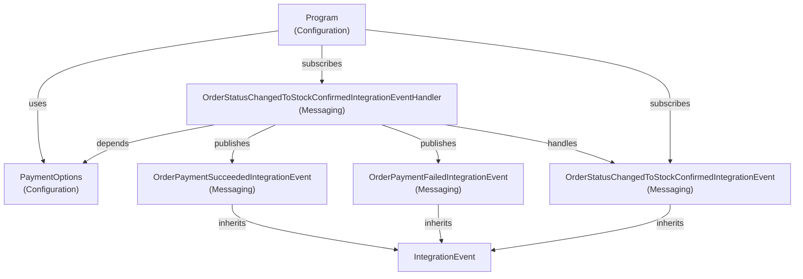

# PaymentProcessor Class Classification

Below is the classification and dependency graph for the main classes in the PaymentProcessor project. Test, auto-generated, and obj files are excluded.

## Topological Order of Classes

1. PaymentOptions.cs - Configuration - No dependencies - 6 lines
2. OrderStatusChangedToStockConfirmedIntegrationEvent.cs - Messaging - Depends on IntegrationEvent - 3 lines
3. OrderPaymentSucceededIntegrationEvent.cs - Messaging - Depends on IntegrationEvent - 3 lines
4. OrderPaymentFailedIntegrationEvent.cs - Messaging - Depends on IntegrationEvent - 3 lines
5. OrderStatusChangedToStockConfirmedIntegrationEventHandler.cs - Messaging - Depends on PaymentOptions, OrderStatusChangedToStockConfirmedIntegrationEvent, OrderPaymentSucceededIntegrationEvent, OrderPaymentFailedIntegrationEvent - 38 lines
6. Program.cs - Configuration - Depends on PaymentOptions, OrderStatusChangedToStockConfirmedIntegrationEventHandler, OrderStatusChangedToStockConfirmedIntegrationEvent - 14 lines

## Dependency Graph

