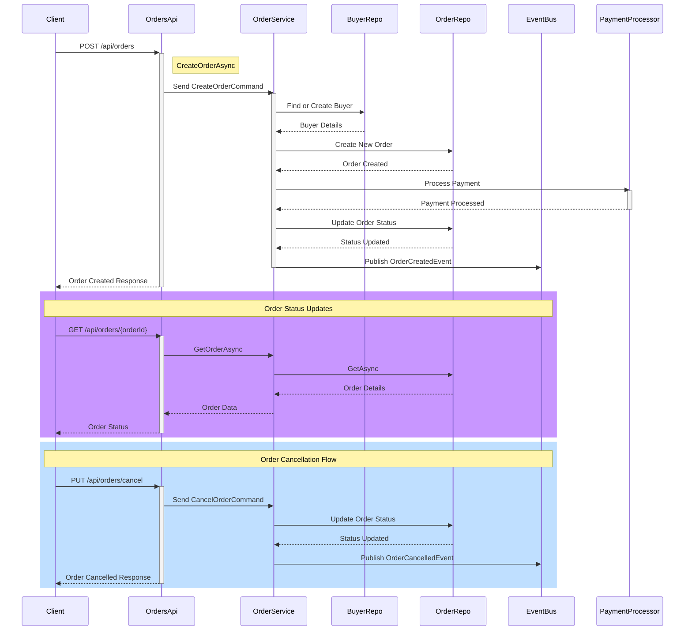
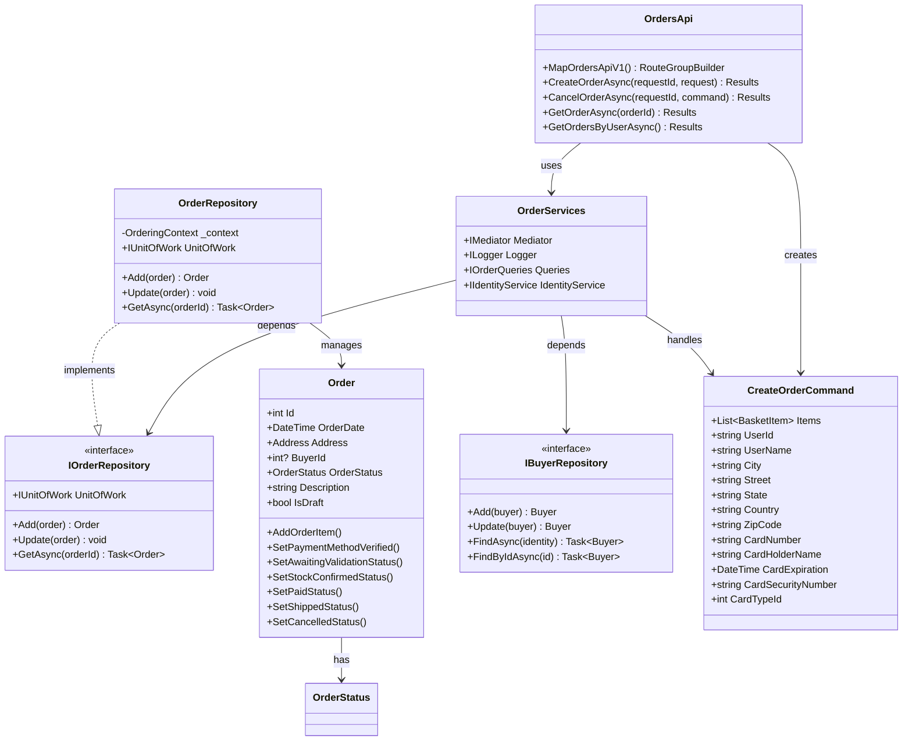

# Ordering API Documentation

## Sequence Diagram


## Class Diagram


## 1. Feature Overview
The Ordering API is a critical microservice in the eShop system that manages the complete order lifecycle, from creation to fulfillment. It implements a Domain-Driven Design (DDD) approach with CQRS (Command Query Responsibility Segregation) pattern to handle complex order processing workflows.

### Business Motivation
- Enable customers to place, track, and manage their orders
- Provide a robust order management system for the eShop platform
- Ensure order consistency and reliability through proper domain modeling
- Support various payment methods and order statuses

### Key Stakeholders
- End customers placing orders
- System administrators managing orders
- Payment processing system
- Shipping and logistics teams

## 2. Business Implementation Details

### Business Rules
1. Order Creation:
   - Orders must have valid user information
   - Orders require valid payment details
   - Each order must contain at least one order item
   - Items must have valid product information and quantities

2. Order Status Flow:
   - Submitted → Awaiting Validation
   - Awaiting Validation → Stock Confirmed
   - Stock Confirmed → Paid
   - Paid → Shipped
   - Any State → Cancelled (if applicable conditions are met)

3. Payment Processing:
   - Payment method must be verified before order confirmation
   - Supports multiple card types
   - Requires valid card holder information and expiration date

4. Order Cancellation:
   - Orders can be cancelled by users
   - Automatic cancellation if stock validation fails
   - Cancellation may trigger refund workflow

### Assumptions and Constraints
- Users must be authenticated to place orders
- Payment processing is done through a secure payment gateway
- Order modifications are not allowed once confirmed
- Order history is preserved indefinitely
- Shipping addresses must be validated

## 3. Technical Implementation Details

### API Endpoints
```http
# Orders API v1.0
PUT  /api/orders/cancel        # Cancel an existing order
PUT  /api/orders/ship         # Ship an order
GET  /api/orders/{orderId}    # Get order details by ID
GET  /api/orders/             # Get orders for current user
GET  /api/orders/cardtypes    # Get available card types
POST /api/orders/draft        # Create an order draft
POST /api/orders/             # Create a new order
```

### Request/Response Examples

#### Create Order Request
```json
{
  "userId": "string",
  "userName": "string",
  "city": "string",
  "street": "string",
  "state": "string",
  "country": "string",
  "zipCode": "string",
  "cardNumber": "string",
  "cardHolderName": "string",
  "cardExpiration": "2025-09-05T00:00:00Z",
  "cardSecurityNumber": "string",
  "cardTypeId": 1,
  "buyer": "string",
  "items": [
    {
      "productId": "string",
      "productName": "string",
      "unitPrice": 0,
      "units": 0,
      "pictureUrl": "string"
    }
  ]
}
```

### Key Components

1. Domain Layer (`Ordering.Domain`):
   - Order Aggregate Root with Order and OrderItem entities
   - Buyer Aggregate Root for customer information
   - Domain events for order status changes
   - Repository interfaces

2. Infrastructure Layer (`Ordering.Infrastructure`):
   - EntityFramework implementation of repositories
   - Database context and migrations
   - Idempotency handling

3. Application Layer (`Ordering.API`):
   - Command handlers for order operations
   - Query handlers for order retrieval
   - Integration event handlers
   - Validators for commands

## 4. Validation and Error Handling

### Input Validation
- Command validation using FluentValidation
- Order items validation (quantity, price)
- Address information validation
- Payment information validation

### Error Scenarios
1. Invalid Order Creation:
   - Missing required fields
   - Invalid payment information
   - Non-existent products

2. Order Processing Failures:
   - Payment verification failure
   - Stock validation failure
   - Shipping address validation failure

### Retry Mechanisms
- Integration events use RabbitMQ for reliable messaging
- Idempotency handling for order creation
- Transactional consistency for order status updates

## 5. Security and Access Control

### Authentication
- JWT-based authentication
- Identity service integration
- Claims-based authorization

### Authorization
- User can only access their own orders
- Administrative endpoints require elevated privileges
- Payment information is encrypted

## 6. Testing Strategy

### Unit Tests
- Domain model behavior testing
- Command handler testing
- Validation rules testing

### Integration Tests
- API endpoint testing
- Database integration testing
- Event handling testing

### End-to-End Tests
- Order creation workflow
- Payment processing
- Status update scenarios

## 7. Deployment Considerations

### Dependencies
- SQL Server database
- RabbitMQ for event bus
- Identity Server for authentication

### Configuration
- Database connection strings
- RabbitMQ connection settings
- API versioning settings
- Authentication settings

### Monitoring
- Application Insights integration
- Order processing metrics
- Payment processing success rate
- API response times

## 8. References

### Source Code
- [Order Aggregate Root](../Ordering.Domain/AggregatesModel/OrderAggregate/Order.cs)
- [Order Repository](../Ordering.Infrastructure/Repositories/OrderRepository.cs)
- [Orders API](./Apis/OrdersApi.cs)

### Related Components
- Identity.API - User authentication
- Basket.API - Shopping cart management
- Payment Processor - Payment handling
- Event Bus - Integration events

### Integration Events
- OrderStartedEvent
- OrderStatusChangedEvent
- OrderCancelledEvent
- OrderShippedEvent
