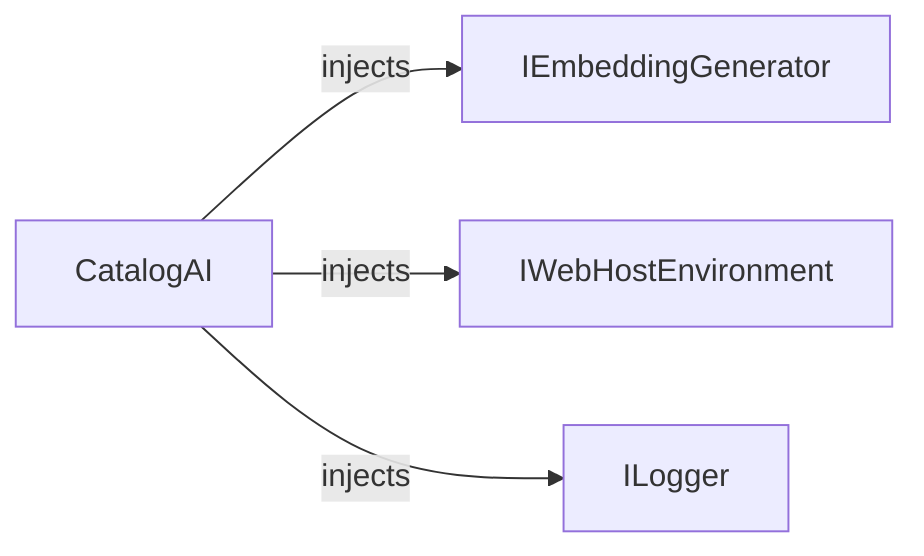
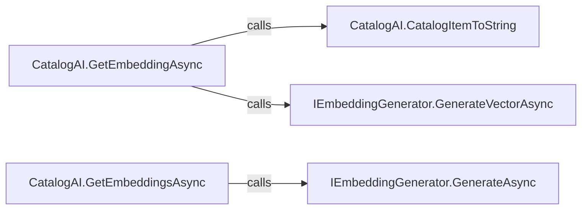

# CatalogAI

[Definition](https://github.com/akhileshap9/automated-doc-poc-repo/blob/main/src/Catalog.API/Services/CatalogAI.cs#L7)

CatalogAI is the implementation of semantic search and embedding generation for catalog items. It provides AI-powered vector embeddings for text and catalog items, enabling advanced search and relevance features in the API.

---

## Dependencies

- [IEmbeddingGenerator<string, Embedding<float>>](external)
- [IWebHostEnvironment](external)
- [ILogger](external)

---

## Dependency Diagram



CatalogAI depends on the embedding generator, environment, and logger for its operations.

---

## Contracts

- Preconditions: Embedding generator may be null (disables AI features).
- Postconditions: Provides vector embeddings for text and items.
- Idempotency: Stateless; repeated calls yield consistent results.
- Stateful: No internal state beyond dependencies.

---

## Configuration

| Setting           | Default | Read In         | Effect                                      |
|-------------------|---------|-----------------|----------------------------------------------|
| EmbeddingDimensions | 384     | Internal        | Controls vector size for embeddings          |

---

## Errors & Cancellation

- Returns null if AI is disabled.
- Logs errors and trace information.
- No explicit cancellation or retry logic.

---

## Threading & Lifetime

- DI Lifetime: Scoped or Singleton (depends on registration).
- Thread-safety: Not thread-safe; intended for DI use.
- Disposal: No disposal required.

---

## Usage

```csharp
// Example DI registration
services.AddSingleton<ICatalogAI, CatalogAI>();

// Usage in handler
var embedding = await catalogAI.GetEmbeddingAsync("search text");
```

---

## Public Methods

### bool IsEnabled
[Signature](https://github.com/akhileshap9/automated-doc-poc-repo/blob/main/src/Catalog.API/Services/CatalogAI.cs#L19)

Indicates whether the AI embedding generator is available.

### ValueTask<Vector> GetEmbeddingAsync(string text)
[Signature](https://github.com/akhileshap9/automated-doc-poc-repo/blob/main/src/Catalog.API/Services/CatalogAI.cs#L44)

Generates a vector embedding for the provided text. Returns null if AI is disabled.

### ValueTask<Vector> GetEmbeddingAsync(CatalogItem item)
[Signature](https://github.com/akhileshap9/automated-doc-poc-repo/blob/main/src/Catalog.API/Services/CatalogAI.cs#L27)

Generates a vector embedding for the provided catalog item. Returns null if AI is disabled.

### ValueTask<IReadOnlyList<Vector>> GetEmbeddingsAsync(IEnumerable<CatalogItem> items)
[Signature](https://github.com/akhileshap9/automated-doc-poc-repo/blob/main/src/Catalog.API/Services/CatalogAI.cs#L32)

Generates vector embeddings for a collection of catalog items. Returns null if AI is disabled.

---

## Call Graph



The main methods delegate to the embedding generator and utility conversion functions.

