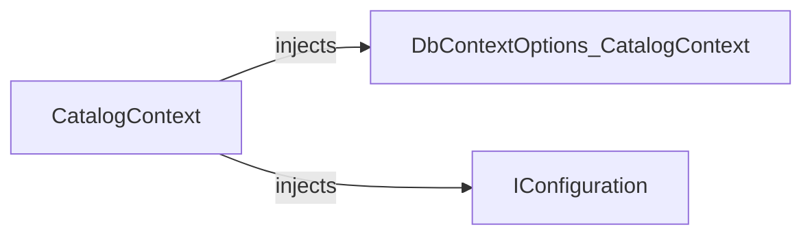

# CatalogContext

[Definition](https://github.com/akhileshap9/automated-doc-poc-repo/blob/main/src/Catalog.API/Infrastructure/CatalogContext.cs#L8)

CatalogContext is the Entity Framework Core DbContext for the catalog domain. It manages catalog items, brands, and types, and configures entity mappings and integration event logs.

---

## Dependencies

- [DbContextOptions<CatalogContext>](external)
- [IConfiguration](external)

---

## Dependency Diagram



---

## Contracts

- Preconditions: Options and configuration must be provided.
- Postconditions: Provides DbSets for catalog entities and configures mappings.
- Idempotency: Safe for repeated use.
- Stateful: Tracks entity state and migrations.

---

## Configuration

| Setting           | Default | Read In         | Effect                                      |
|-------------------|---------|-----------------|----------------------------------------------|
| Postgres vector   |         | OnModelCreating | Enables vector extension for AI embeddings   |

---

## Errors & Cancellation

- Throws if options/configuration are missing.
- No explicit cancellation or retry logic.

---

## Threading & Lifetime

- DI Lifetime: Scoped (per request).
- Thread-safety: Not thread-safe; intended for per-request use.
- Disposal: Implements IDisposable via DbContext.

---

## Usage

```csharp
// Example DI registration
services.AddDbContext<CatalogContext>();

// Usage in handler
var items = await context.CatalogItems.ToListAsync();
```

---

## Public Members

- `DbSet<CatalogItem> CatalogItems` — Catalog items table. [Definition](https://github.com/akhileshap9/automated-doc-poc-repo/blob/main/src/Catalog.API/Infrastructure/CatalogContext.cs#L14)
- `DbSet<CatalogBrand> CatalogBrands` — Catalog brands table. [Definition](https://github.com/akhileshap9/automated-doc-poc-repo/blob/main/src/Catalog.API/Infrastructure/CatalogContext.cs#L15)
- `DbSet<CatalogType> CatalogTypes` — Catalog types table. [Definition](https://github.com/akhileshap9/automated-doc-poc-repo/blob/main/src/Catalog.API/Infrastructure/CatalogContext.cs#L16)

---

