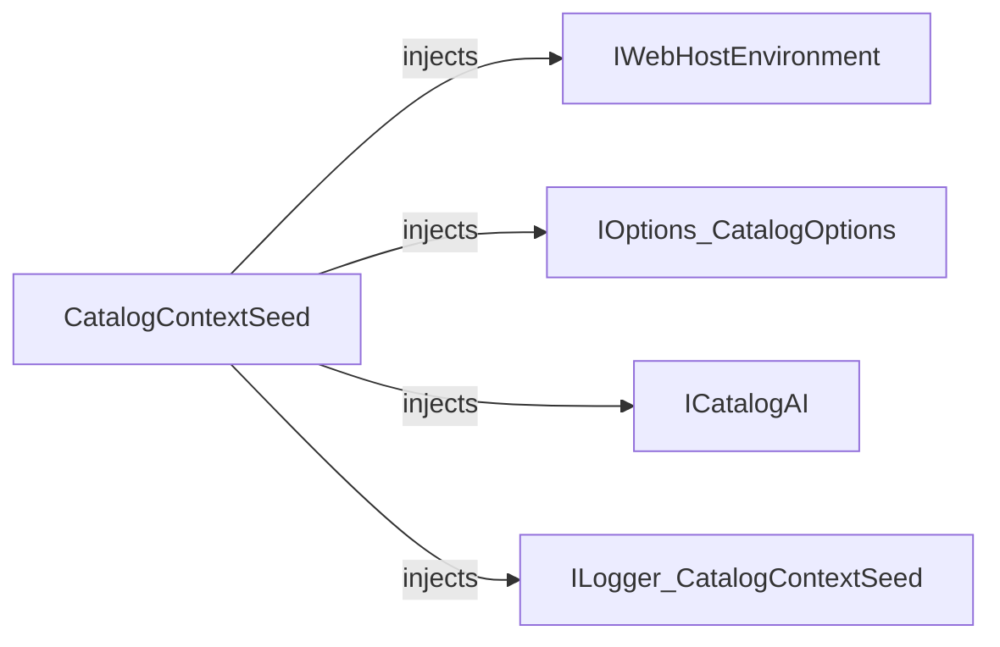

# CatalogContextSeed

[Definition](https://github.com/akhileshap9/automated-doc-poc-repo/blob/main/src/Catalog.API/Infrastructure/CatalogContextSeed.cs#L7)

CatalogContextSeed is responsible for seeding the catalog database with initial data, including brands, types, and items. It supports AI embedding generation for items and uses configuration to control seeding behavior.

---

## Dependencies

- [IWebHostEnvironment](external)
- [IOptions<CatalogOptions>](https://github.com/akhileshap9/automated-doc-poc-repo/blob/main/src/Catalog.API/CatalogOptions.cs#L4)
- [ICatalogAI](https://github.com/akhileshap9/automated-doc-poc-repo/blob/main/src/Catalog.API/Services/ICatalogAI.cs#L6)
- [ILogger<CatalogContextSeed>](external)

---

## Dependency Diagram



---

## Contracts

- Preconditions: All dependencies must be registered and non-null.
- Postconditions: Seeds database with initial data and embeddings.
- Idempotency: Safe for repeated calls; only seeds if empty.
- Stateful: No internal state beyond dependencies.

---

## Configuration

| Setting           | Default | Read In         | Effect                                      |
|-------------------|---------|-----------------|----------------------------------------------|
| UseCustomizationData | false | CatalogOptions  | Controls whether custom data is seeded       |

---

## Errors & Cancellation

- Logs errors during seeding.
- No explicit cancellation or retry logic.

---

## Threading & Lifetime

- DI Lifetime: Scoped or Singleton (depends on registration).
- Thread-safety: Not thread-safe; intended for DI use.
- Disposal: No disposal required.

---

## Usage

```csharp
// Example DI registration
services.AddTransient<IDbSeeder<CatalogContext>, CatalogContextSeed>();

// Usage in startup
await seeder.SeedAsync(context);
```

---

## Public Methods

### Task SeedAsync(CatalogContext context)
[Signature](https://github.com/akhileshap9/automated-doc-poc-repo/blob/main/src/Catalog.API/Infrastructure/CatalogContextSeed.cs#L12)

Seeds the database with brands, types, items, and embeddings if enabled.

---

