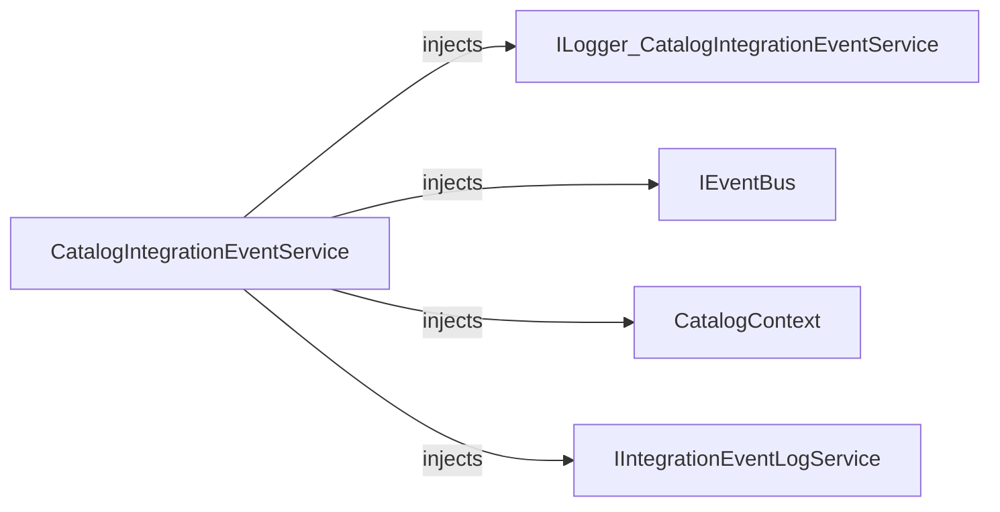
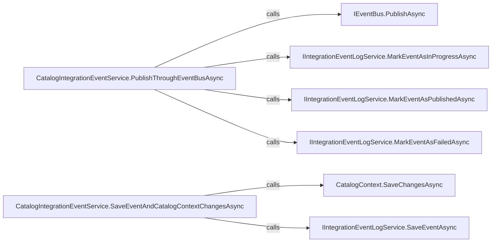

# CatalogIntegrationEventService

[Definition](https://github.com/akhileshap9/automated-doc-poc-repo/blob/main/src/Catalog.API/IntegrationEvents/CatalogIntegrationEventService.cs#L4)

CatalogIntegrationEventService is the implementation responsible for saving and publishing integration events in the catalog. It ensures atomicity between catalog updates and event log persistence, and handles error logging and retries for event publishing.

---

## Dependencies

- [ILogger<CatalogIntegrationEventService>](external)
- [IEventBus](external)
- [CatalogContext](https://github.com/akhileshap9/automated-doc-poc-repo/blob/main/src/Catalog.API/Infrastructure/CatalogContext.cs#L8)
- [IIntegrationEventLogService](external)

---

## Dependency Diagram



---

## Contracts

- Preconditions: All dependencies must be registered and non-null.
- Postconditions: Publishes and saves events atomically.
- Idempotency: Safe for repeated calls; event log tracks state.
- Stateful: Tracks disposal state.

---

## Configuration

| Setting           | Default | Read In         | Effect                                      |
|-------------------|---------|-----------------|----------------------------------------------|
| None              |         |                 |                                              |

---

## Errors & Cancellation

- Logs errors and marks events as failed if publishing fails.
- No explicit cancellation or retry logic.

---

## Threading & Lifetime

- DI Lifetime: Scoped or Singleton (depends on registration).
- Thread-safety: Not thread-safe; intended for DI use.
- Disposal: Implements IDisposable; disposes event log service.

---

## Usage

```csharp
// Example DI registration
services.AddTransient<ICatalogIntegrationEventService, CatalogIntegrationEventService>();

// Usage in handler
await eventService.SaveEventAndCatalogContextChangesAsync(evt);
await eventService.PublishThroughEventBusAsync(evt);
```

---

## Public Methods

### Task SaveEventAndCatalogContextChangesAsync(IntegrationEvent evt)
[Signature](https://github.com/akhileshap9/automated-doc-poc-repo/blob/main/src/Catalog.API/IntegrationEvents/CatalogIntegrationEventService.cs#L27)

Saves the event and catalog context changes atomically using a resilient transaction.

### Task PublishThroughEventBusAsync(IntegrationEvent evt)
[Signature](https://github.com/akhileshap9/automated-doc-poc-repo/blob/main/src/Catalog.API/IntegrationEvents/CatalogIntegrationEventService.cs#L11)

Publishes the event through the event bus, marking event log state accordingly and handling errors.

---

## Call Graph



The main methods coordinate event publishing and persistence, handling errors and state transitions.

