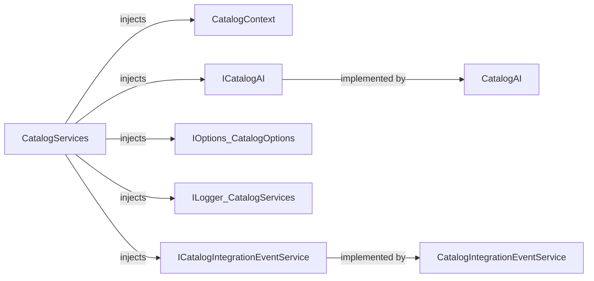

# CatalogServices

[Definition](https://github.com/akhileshap9/automated-doc-poc-repo/blob/main/src/Catalog.API/Model/CatalogServices.cs#L4)

CatalogServices is a critical orchestration class that aggregates dependencies required for catalog operations, including database context, AI, configuration, logging, and integration event service. It is injected into API handlers to centralize access to these services.

---

## Dependencies

- [CatalogContext](https://github.com/akhileshap9/automated-doc-poc-repo/blob/main/src/Catalog.API/Infrastructure/CatalogContext.cs#L8) (DbContext)
- [ICatalogAI](https://github.com/akhileshap9/automated-doc-poc-repo/blob/main/src/Catalog.API/Services/ICatalogAI.cs#L6) ↔ [CatalogAI](https://github.com/akhileshap9/automated-doc-poc-repo/blob/main/src/Catalog.API/Services/CatalogAI.cs#L7)
- [IOptions<CatalogOptions>](https://github.com/akhileshap9/automated-doc-poc-repo/blob/main/src/Catalog.API/CatalogOptions.cs#L4)
- [ILogger<CatalogServices>](https://github.com/akhileshap9/automated-doc-poc-repo/blob/main/src/Catalog.API/Model/CatalogServices.cs#L12)
- [ICatalogIntegrationEventService](https://github.com/akhileshap9/automated-doc-poc-repo/blob/main/src/Catalog.API/IntegrationEvents/ICatalogIntegrationEventService.cs#L4) ↔ [CatalogIntegrationEventService](https://github.com/akhileshap9/automated-doc-poc-repo/blob/main/src/Catalog.API/IntegrationEvents/CatalogIntegrationEventService.cs#L4)

---

## Dependency Diagram



CatalogServices injects all required dependencies, with interfaces resolved to their implementations via DI.

---

## Contracts

- Preconditions: All dependencies must be registered in DI and non-null.
- Postconditions: Provides access to all required services for catalog operations.
- Idempotency: Stateless; safe for repeated use.
- Stateful: No internal state beyond references.

---

## Configuration

| Setting           | Default | Read In         | Effect                                      |
|-------------------|---------|-----------------|----------------------------------------------|
| PicBaseUrl        |         | CatalogOptions  | Used for image URL construction              |
| UseCustomizationData | false | CatalogOptions  | Controls seeding behavior                    |

---

## Errors & Cancellation

- Throws if any dependency is missing (constructor).
- No explicit cancellation support.
- No retry/backoff logic.

---

## Threading & Lifetime

- DI Lifetime: Scoped (per request).
- Thread-safety: Not thread-safe; intended for per-request use.
- Disposal: No disposal required.

---

## Usage

```csharp
// Example DI registration and usage
services.AddScoped<CatalogServices>();

public async Task<IActionResult> Get([FromServices] CatalogServices services) {
    var items = await services.Context.CatalogItems.ToListAsync();
    // ...
}
```

