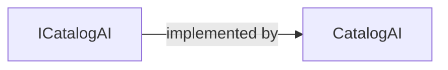

# ICatalogAI

[Definition](https://github.com/akhileshap9/automated-doc-poc-repo/blob/main/src/Catalog.API/Services/ICatalogAI.cs#L6)

## Purpose & Role

ICatalogAI defines the contract for AI-powered embedding generation in the catalog. It enables semantic search and relevance ranking by providing vector embeddings for text and catalog items. This interface is intended for extension and DI registration, allowing alternative AI implementations.

---

## Members

- `bool IsEnabled` — Indicates if the AI system is available. [Definition](https://github.com/akhileshap9/automated-doc-poc-repo/blob/main/src/Catalog.API/Services/ICatalogAI.cs#L8)
- `ValueTask<Vector> GetEmbeddingAsync(string text)` — Generates an embedding for the given text. [Definition](https://github.com/akhileshap9/automated-doc-poc-repo/blob/main/src/Catalog.API/Services/ICatalogAI.cs#L10)
- `ValueTask<Vector> GetEmbeddingAsync(CatalogItem item)` — Generates an embedding for a catalog item. [Definition](https://github.com/akhileshap9/automated-doc-poc-repo/blob/main/src/Catalog.API/Services/ICatalogAI.cs#L13)
- `ValueTask<IReadOnlyList<Vector>> GetEmbeddingsAsync(IEnumerable<CatalogItem> items)` — Generates embeddings for multiple catalog items. [Definition](https://github.com/akhileshap9/automated-doc-poc-repo/blob/main/src/Catalog.API/Services/ICatalogAI.cs#L16)

---

## Implementation Discovery

- [CatalogAI](https://github.com/akhileshap9/automated-doc-poc-repo/blob/main/src/Catalog.API/Services/CatalogAI.cs#L7) (primary implementation)

---

## Implementation Diagram

ICatalogAI is implemented by CatalogAI, which is registered in DI and consumed by CatalogServices and API handlers.

---

## Recommended Usage

Use ICatalogAI when semantic search or AI-powered relevance is required for catalog items. To extend, implement the interface in a new class, override all members, and register your implementation in DI (e.g., as singleton or scoped). Reference implementations can be found in CatalogAI. Ensure your implementation handles nulls and errors gracefully, and consider configuration for enabling/disabling AI features.

