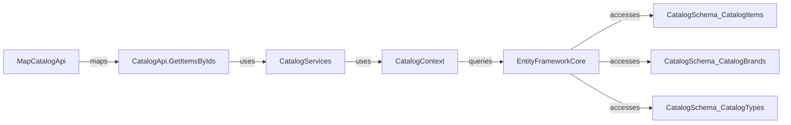
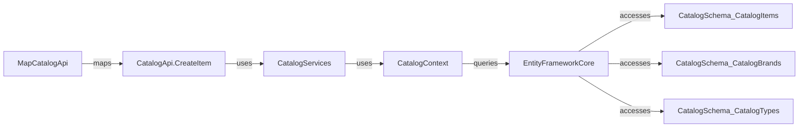
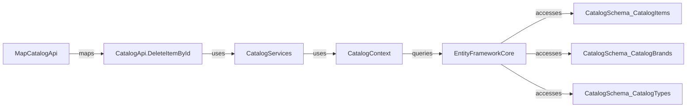

```mermaid
flowchart LR
  MapCatalogApi -->|maps| CatalogApi.GetItemsBySemanticRelevanceV1
  CatalogApi.GetItemsBySemanticRelevanceV1 -->|calls| CatalogApi.GetItemsBySemanticRelevance
  CatalogApi.GetItemsBySemanticRelevance -->|uses| CatalogServices
  CatalogServices -->|uses| CatalogAI
  CatalogAI -->|uses| IEmbeddingGenerator
  CatalogServices -->|uses| CatalogContext
  CatalogContext -->|queries| CatalogItems
  CatalogContext -->|uses| EntityFrameworkCore
  EntityFrameworkCore -->|accesses| PostgreSQL
  click MapCatalogApi "https://github.com/akhileshap9/automated-doc-poc-repo/blob/main/src/Catalog.API/Apis/CatalogApi.cs#L13"
  click CatalogApi.GetItemsBySemanticRelevanceV1 "https://github.com/akhileshap9/automated-doc-poc-repo/blob/main/src/Catalog.API/Apis/CatalogApi.cs#L227"
  click CatalogApi.GetItemsBySemanticRelevance "https://github.com/akhileshap9/automated-doc-poc-repo/blob/main/src/Catalog.API/Apis/CatalogApi.cs#L237"
  click CatalogServices "https://github.com/akhileshap9/automated-doc-poc-repo/blob/main/src/Catalog.API/Model/CatalogServices.cs#L4"
  click CatalogAI "https://github.com/akhileshap9/automated-doc-poc-repo/blob/main/src/Catalog.API/Services/CatalogAI.cs#L7"
  click IEmbeddingGenerator "https://github.com/akhileshap9/automated-doc-poc-repo/blob/main/src/Catalog.API/Services/CatalogAI.cs#L10"
  click CatalogContext "https://github.com/akhileshap9/automated-doc-poc-repo/blob/main/src/Catalog.API/Infrastructure/CatalogContext.cs#L8"
  click CatalogItems "https://github.com/akhileshap9/automated-doc-poc-repo/blob/main/src/Catalog.API/Infrastructure/CatalogContext.cs#L14"
```

```mermaid
flowchart LR
  MapCatalogApi -->|maps| CatalogApi.UpdateItemV1
  CatalogApi.UpdateItemV1 -->|calls| CatalogApi.UpdateItem
  CatalogApi.UpdateItem -->|uses| CatalogServices
  CatalogServices -->|uses| CatalogContext
  CatalogServices -->|uses| CatalogIntegrationEventService
  CatalogIntegrationEventService -->|uses| EventBus
  CatalogIntegrationEventService -->|uses| IntegrationEventLogService
  CatalogContext -->|queries| EntityFrameworkCore
  EntityFrameworkCore -->|accesses| CatalogSchema_CatalogItems
  EntityFrameworkCore -->|accesses| CatalogSchema_CatalogBrands
  EntityFrameworkCore -->|accesses| CatalogSchema_CatalogTypes
  click MapCatalogApi "https://github.com/akhileshap9/automated-doc-poc-repo/blob/main/src/Catalog.API/Apis/CatalogApi.cs#L13"
  click CatalogApi.UpdateItemV1 "https://github.com/akhileshap9/automated-doc-poc-repo/blob/main/src/Catalog.API/Apis/CatalogApi.cs#L293"
  click CatalogApi.UpdateItem "https://github.com/akhileshap9/automated-doc-poc-repo/blob/main/src/Catalog.API/Apis/CatalogApi.cs#L304"
  click CatalogServices "https://github.com/akhileshap9/automated-doc-poc-repo/blob/main/src/Catalog.API/Model/CatalogServices.cs#L4"
  click CatalogIntegrationEventService "https://github.com/akhileshap9/automated-doc-poc-repo/blob/main/src/Catalog.API/IntegrationEvents/CatalogIntegrationEventService.cs#L4"
  click EventBus "https://github.com/akhileshap9/automated-doc-poc-repo/blob/main/src/EventBusRabbitMQ/EventBusRabbitMQ.cs"
  click IntegrationEventLogService "https://github.com/akhileshap9/automated-doc-poc-repo/blob/main/src/IntegrationEventLogEF/IntegrationEventLogService.cs"
  click CatalogContext "https://github.com/akhileshap9/automated-doc-poc-repo/blob/main/src/Catalog.API/Infrastructure/CatalogContext.cs#L8"
  click CatalogSchema_CatalogItems "https://github.com/akhileshap9/automated-doc-poc-repo/blob/main/src/Catalog.API/Model/CatalogItem.cs#L7"
  click CatalogSchema_CatalogBrands "https://github.com/akhileshap9/automated-doc-poc-repo/blob/main/src/Catalog.API/Model/CatalogBrand.cs#L6"
  click CatalogSchema_CatalogTypes "https://github.com/akhileshap9/automated-doc-poc-repo/blob/main/src/Catalog.API/Model/CatalogType.cs#L6"
```

# CatalogApi Minimal API Surface

**Overview**

The `CatalogApi` module exposes REST endpoints for querying, searching, and modifying catalog items, brands, and types. It supports versioning (v1, v2), semantic search via AI, and standard CRUD operations. All endpoints are grouped under the base route `/api/catalog` and leverage API versioning. Authentication and policies are not enforced at the API layer.

---

## Endpoints

### GET /api/catalog/items (v1, v2)
**Endpoint Overview**
- **Verb:** GET
- **Route:** `/api/catalog/items`
- **Purpose:** Returns a paginated list of catalog items.
- [Handler Definition](https://github.com/akhileshap9/automated-doc-poc-repo/blob/main/src/Catalog.API/Apis/CatalogApi.cs#L54)

**Request**
- Query: `pageSize` (int), `pageIndex` (int)
- Example:
```json
{
  "pageSize": 10,
  "pageIndex": 0
}
```

**Response**
- Status: 200 OK
- Model: [PaginatedItems<CatalogItem>](https://github.com/akhileshap9/automated-doc-poc-repo/blob/main/src/Catalog.API/Model/PaginatedItems.cs#L6)
- Example:
```json
{
  "pageIndex": 0,
  "pageSize": 10,
  "count": 100,
  "data": [
    {
      "id": 1,
      "name": "Summit Pro Harness",
      "description": "Lightweight climbing harness.",
      "price": 99.99,
      "pictureFileName": "1.webp",
      "catalogTypeId": 2,
      "catalogBrandId": 3,
      "availableStock": 100,
      "restockThreshold": 10,
      "maxStockThreshold": 200,
      "onReorder": false
    }
  ]
}
```


**Call Graph**



```mermaid
flowchart LR
  MapCatalogApi -->|maps| CatalogApi.GetAllItemsV1
  CatalogApi.GetAllItemsV1 -->|calls| CatalogApi.GetAllItems
  CatalogApi.GetAllItems -->|uses| CatalogServices
  CatalogServices -->|uses| CatalogContext
  CatalogContext -->|queries| EntityFrameworkCore
  EntityFrameworkCore -->|accesses| CatalogSchema_CatalogItems
  EntityFrameworkCore -->|accesses| CatalogSchema_CatalogBrands
  EntityFrameworkCore -->|accesses| CatalogSchema_CatalogTypes
  click MapCatalogApi "https://github.com/akhileshap9/automated-doc-poc-repo/blob/main/src/Catalog.API/Apis/CatalogApi.cs#L13"
  click CatalogApi.GetAllItemsV1 "https://github.com/akhileshap9/automated-doc-poc-repo/blob/main/src/Catalog.API/Apis/CatalogApi.cs#L121"
  click CatalogApi.GetAllItems "https://github.com/akhileshap9/automated-doc-poc-repo/blob/main/src/Catalog.API/Apis/CatalogApi.cs#L128"
  click CatalogServices "https://github.com/akhileshap9/automated-doc-poc-repo/blob/main/src/Catalog.API/Model/CatalogServices.cs#L4"
  click CatalogContext "https://github.com/akhileshap9/automated-doc-poc-repo/blob/main/src/Catalog.API/Infrastructure/CatalogContext.cs#L8"
  click CatalogSchema_CatalogItems "https://github.com/akhileshap9/automated-doc-poc-repo/blob/main/src/Catalog.API/Model/CatalogItem.cs#L7"
  click CatalogSchema_CatalogBrands "https://github.com/akhileshap9/automated-doc-poc-repo/blob/main/src/Catalog.API/Model/CatalogBrand.cs#L6"
  click CatalogSchema_CatalogTypes "https://github.com/akhileshap9/automated-doc-poc-repo/blob/main/src/Catalog.API/Model/CatalogType.cs#L6"
```

The flow starts with `GetAllItemsV1`, which delegates to `GetAllItems` for actual data retrieval, using the injected `CatalogServices.Context` and pagination parameters.

---

### GET /api/catalog/items/by
**Endpoint Overview**
- **Verb:** GET
- **Route:** `/api/catalog/items/by`
- **Purpose:** Batch get catalog items by IDs.
- [Handler Definition](https://github.com/akhileshap9/automated-doc-poc-repo/blob/main/src/Catalog.API/Apis/CatalogApi.cs#L146)

**Request**
- Query: `ids` (int[])
- Example:
```json
{
  "ids": [1, 2, 3]
}
```

**Response**
- Status: 200 OK
- Model: [List<CatalogItem>](https://github.com/akhileshap9/automated-doc-poc-repo/blob/main/src/Catalog.API/Model/CatalogItem.cs#L7)
- Example:
```json
[
  {
    "id": 1,
    "name": "Summit Pro Harness",
    "description": "Lightweight climbing harness.",
    "price": 99.99,
    "pictureFileName": "1.webp",
    "catalogTypeId": 2,
    "catalogBrandId": 3,
    "availableStock": 100,
    "restockThreshold": 10,
    "maxStockThreshold": 200,
    "onReorder": false
  }
]
```


**Call Graph**



The handler queries the context for items matching the provided IDs and returns them as a list.

---

### GET /api/catalog/items/{id:int}
**Endpoint Overview**
- **Verb:** GET
- **Route:** `/api/catalog/items/{id:int}`
- **Purpose:** Get a single catalog item by ID.
- [Handler Definition](https://github.com/akhileshap9/automated-doc-poc-repo/blob/main/src/Catalog.API/Apis/CatalogApi.cs#L158)

**Request**
- Path: `id` (int)
- Example: `/api/catalog/items/1`


```json
{
  "pictureFileName": "1.webp",
  "catalogTypeId": 2,
  "catalogBrandId": 3,

}
```
```mermaid
flowchart LR
  MapCatalogApi -->|maps| CatalogApi.GetItemById

  EntityFrameworkCore -->|accesses| CatalogSchema_CatalogBrands
  EntityFrameworkCore -->|accesses| CatalogSchema_CatalogTypes
  click CatalogSchema_CatalogItems "https://github.com/akhileshap9/automated-doc-poc-repo/blob/main/src/Catalog.API/Model/CatalogItem.cs#L7"
  click CatalogSchema_CatalogBrands "https://github.com/akhileshap9/automated-doc-poc-repo/blob/main/src/Catalog.API/Model/CatalogBrand.cs#L6"
  click CatalogSchema_CatalogTypes "https://github.com/akhileshap9/automated-doc-poc-repo/blob/main/src/Catalog.API/Model/CatalogType.cs#L6"

---

- **Purpose:** Get catalog items by name (paginated).
- [Handler Definition](https://github.com/akhileshap9/automated-doc-poc-repo/blob/main/src/Catalog.API/Apis/CatalogApi.cs#L184)


**Response**

**Call Graph**

```mermaid

  CatalogServices -->|uses| CatalogContext
  CatalogContext -->|queries| EntityFrameworkCore
  EntityFrameworkCore -->|accesses| CatalogSchema_CatalogItems
  click CatalogApi.GetAllItems "https://github.com/akhileshap9/automated-doc-poc-repo/blob/main/src/Catalog.API/Apis/CatalogApi.cs#L128"
  click CatalogServices "https://github.com/akhileshap9/automated-doc-poc-repo/blob/main/src/Catalog.API/Model/CatalogServices.cs#L4"
  click CatalogContext "https://github.com/akhileshap9/automated-doc-poc-repo/blob/main/src/Catalog.API/Infrastructure/CatalogContext.cs#L8"
  click CatalogSchema_CatalogItems "https://github.com/akhileshap9/automated-doc-poc-repo/blob/main/src/Catalog.API/Model/CatalogItem.cs#L7"

---

### GET /api/catalog/items/{id:int}/pic
- [Handler Definition](https://github.com/akhileshap9/automated-doc-poc-repo/blob/main/src/Catalog.API/Apis/CatalogApi.cs#L196)

**Request**

- Status: 200 OK or 404 Not Found
- Model: byte[] (image)
```mermaid
flowchart LR
  MapCatalogApi -->|maps| CatalogApi.GetItemPictureById

  EntityFrameworkCore -->|accesses| CatalogSchema_CatalogTypes
  CatalogApi.GetItemPictureById -->|uses| IWebHostEnvironment
  click CatalogSchema_CatalogItems "https://github.com/akhileshap9/automated-doc-poc-repo/blob/main/src/Catalog.API/Model/CatalogItem.cs#L7"
  click CatalogSchema_CatalogBrands "https://github.com/akhileshap9/automated-doc-poc-repo/blob/main/src/Catalog.API/Model/CatalogBrand.cs#L6"
  click CatalogSchema_CatalogTypes "https://github.com/akhileshap9/automated-doc-poc-repo/blob/main/src/Catalog.API/Model/CatalogType.cs#L6"
```

**Call Graph Description:**
This endpoint maps the route to the `GetItemPictureById` handler, which uses the `CatalogContext` to query the `CatalogItems` table via Entity Framework Core. The actual database table accessed is `CatalogItems` in PostgreSQL. The handler also uses the web host environment to resolve image paths.

---

### GET /api/catalog/items/withsemanticrelevance/{text:minlength(1)} (v1)
### GET /api/catalog/items/withsemanticrelevance (v2)
**Endpoint Overview**
- **Verb:** GET
- **Route:** `/api/catalog/items/withsemanticrelevance/{text:minlength(1)}` (v1), `/api/catalog/items/withsemanticrelevance` (v2)
- **Purpose:** Search catalog for items related to the specified text using AI embeddings.
- [Handler Definition](https://github.com/akhileshap9/automated-doc-poc-repo/blob/main/src/Catalog.API/Apis/CatalogApi.cs#L227)

**Request**
- Path/Query: `text` (string)
- Query: `pageSize`, `pageIndex`
- Example: `/api/catalog/items/withsemanticrelevance/Summit?pageSize=10&pageIndex=0`

**Response**
- Status: 200 OK
- Model: [PaginatedItems<CatalogItem>](https://github.com/akhileshap9/automated-doc-poc-repo/blob/main/src/Catalog.API/Model/PaginatedItems.cs#L6)


**Call Graph**



---

### PUT /api/catalog/items (v1)
### PUT /api/catalog/items/{id:int} (v2)
**Endpoint Overview**
- **Verb:** PUT
- **Route:** `/api/catalog/items` (v1), `/api/catalog/items/{id:int}` (v2)
- **Purpose:** Create or replace a catalog item.
- [Handler Definition](https://github.com/akhileshap9/automated-doc-poc-repo/blob/main/src/Catalog.API/Apis/CatalogApi.cs#L293)

**Request**
- Body: [CatalogItem](https://github.com/akhileshap9/automated-doc-poc-repo/blob/main/src/Catalog.API/Model/CatalogItem.cs#L7)
- Example:
```json
{
  "id": 1,
  "name": "Summit Pro Harness",
  "description": "Lightweight climbing harness.",
  "price": 99.99,
  "pictureFileName": "1.webp",
  "catalogTypeId": 2,
  "catalogBrandId": 3,
  "availableStock": 100,
  "restockThreshold": 10,
  "maxStockThreshold": 200,
  "onReorder": false
}
```

**Response**
- Status: 201 Created


**Call Graph**



---

### POST /api/catalog/items
**Endpoint Overview**
- **Verb:** POST
- **Route:** `/api/catalog/items`
- **Purpose:** Create a new catalog item.
- [Handler Definition](https://github.com/akhileshap9/automated-doc-poc-repo/blob/main/src/Catalog.API/Apis/CatalogApi.cs#L346)

**Request**
- Body: [CatalogItem](https://github.com/akhileshap9/automated-doc-poc-repo/blob/main/src/Catalog.API/Model/CatalogItem.cs#L7)
- Example: (see above)

**Response**
- Status: 201 Created


**Call Graph**



---

### DELETE /api/catalog/items/{id:int}
**Endpoint Overview**
- **Verb:** DELETE
- **Route:** `/api/catalog/items/{id:int}`
- **Purpose:** Delete a catalog item by ID.
- [Handler Definition](https://github.com/akhileshap9/automated-doc-poc-repo/blob/main/src/Catalog.API/Apis/CatalogApi.cs#L370)

**Request**
- Path: `id` (int)
- Example: `/api/catalog/items/1`

**Response**
- Status: 204 No Content or 404 Not Found


**Call Graph**



---

### GET /api/catalog/catalogtypes
**Endpoint Overview**
- **Verb:** GET
- **Route:** `/api/catalog/catalogtypes`
- **Purpose:** List catalog item types.
- [Handler Definition](https://github.com/akhileshap9/automated-doc-poc-repo/blob/main/src/Catalog.API/Apis/CatalogApi.cs#L77)

**Response**
- Status: 200 OK
- Model: [List<CatalogType>](https://github.com/akhileshap9/automated-doc-poc-repo/blob/main/src/Catalog.API/Model/CatalogType.cs#L6)
- Example:
```json
[
  {
    "id": 1,
    "type": "Harness"
  }
]
```

---

### GET /api/catalog/catalogbrands
**Endpoint Overview**
- **Verb:** GET
- **Route:** `/api/catalog/catalogbrands`
- **Purpose:** List catalog item brands.
- [Handler Definition](https://github.com/akhileshap9/automated-doc-poc-repo/blob/main/src/Catalog.API/Apis/CatalogApi.cs#L84)

**Response**
- Status: 200 OK
- Model: [List<CatalogBrand>](https://github.com/akhileshap9/automated-doc-poc-repo/blob/main/src/Catalog.API/Model/CatalogBrand.cs#L6)
- Example:
```json
[
  {
    "id": 1,
    "brand": "Gravitator"
  }
]
```

---

### GET /api/catalog/items/type/{typeId}/brand/{brandId?} (v1)
**Endpoint Overview**
- **Verb:** GET
- **Route:** `/api/catalog/items/type/{typeId}/brand/{brandId?}`
- **Purpose:** Get catalog items by type and brand.
- [Handler Definition](https://github.com/akhileshap9/automated-doc-poc-repo/blob/main/src/Catalog.API/Apis/CatalogApi.cs#L266)

**Request**
- Path: `typeId` (int), `brandId` (int, optional)
- Query: `pageSize`, `pageIndex`

**Response**
- Status: 200 OK
- Model: [PaginatedItems<CatalogItem>](https://github.com/akhileshap9/automated-doc-poc-repo/blob/main/src/Catalog.API/Model/PaginatedItems.cs#L6)

---

### GET /api/catalog/items/type/all/brand/{brandId:int?} (v1)
**Endpoint Overview**
- **Verb:** GET
- **Route:** `/api/catalog/items/type/all/brand/{brandId:int?}`
- **Purpose:** List catalog items by brand.
- [Handler Definition](https://github.com/akhileshap9/automated-doc-poc-repo/blob/main/src/Catalog.API/Apis/CatalogApi.cs#L272)

**Request**
- Path: `brandId` (int, optional)
- Query: `pageSize`, `pageIndex`

**Response**
- Status: 200 OK
- Model: [PaginatedItems<CatalogItem>](https://github.com/akhileshap9/automated-doc-poc-repo/blob/main/src/Catalog.API/Model/PaginatedItems.cs#L6)

---

