# eShop - Catalog HTTP API Documentation

## 1. Feature Overview

### Purpose
The Catalog API is a Data-Driven/CRUD microservice that manages the product catalog functionality in the eShop application. It serves as the central repository for all product-related information, incorporating AI-powered search capabilities and real-time integration events for state changes.

### Business Motivation
- Enable efficient product catalog management with comprehensive CRUD operations
- Support dynamic product searches with both traditional and AI-powered semantic search
- Provide seamless integration with other eShop services through event-driven architecture
- Enable real-time product updates and inventory management with automated notifications
- Maintain data consistency across the distributed system

### Key Stakeholders
- Store administrators (catalog management and inventory control)
- Customers (product browsing and semantic search)
- Other microservices (basket, ordering) requiring catalog data
- Mobile and web applications consuming the API
- AI/ML team maintaining the semantic search capabilities

## 2. Business Implementation Details

### Business Flow Sequence Diagram

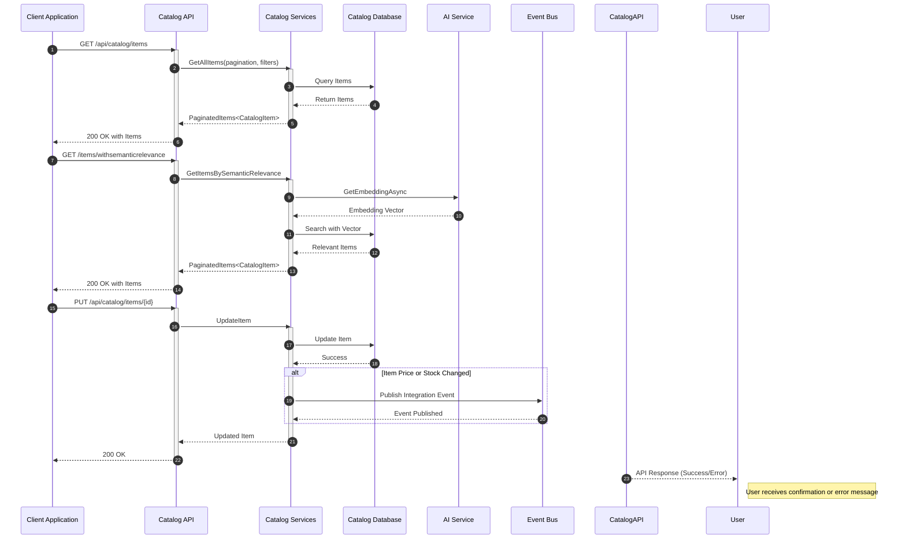

### Business Rules

1. Product Management
   - Each product must have a unique identifier and required fields (name, price)
   - Products are categorized by type and brand with proper references
   - Products maintain inventory tracking with three thresholds:
     - Available stock (current quantity)
     - Restock threshold (minimum quantity to trigger reorder)
     - Maximum stock threshold (storage capacity limit)

2. Catalog Organization
   - Products are hierarchically organized by types and brands
   - Pagination is mandatory for large result sets (default page size: 10)
   - Multiple search capabilities:
     - Basic: by name, type, or brand
     - Advanced: semantic search using AI embeddings
     - Batch: retrieve multiple items by IDs

3. Pricing and Stock
   - Price changes trigger immediate notifications via integration events
   - Stock level changes below restock threshold trigger alerts
   - Maximum stock threshold prevents over-ordering
   - All changes are atomic and consistent

4. Data Consistency
   - Optimistic concurrency for updates
   - Transactional integrity for related operations
   - Event sourcing for critical state changes

### Use Cases

1. Product Browsing (Customer Perspective)
   - List products with pagination and filters
   - Search products using:
     - Text-based search by name
     - Category/brand filtering
     - Semantic relevance search
   - View detailed product information
   - Access product images
   - Check stock availability

2. Catalog Management (Admin Perspective)
   - Product CRUD operations:
     - Create new products with validation
     - Update existing product details
     - Remove discontinued products
     - Batch update capabilities
   - Image management:
     - Upload product images
     - Update image references
     - Handle image versioning

3. Inventory Control (System Perspective)
   - Real-time stock tracking:
     - Monitor current stock levels
     - Track stock thresholds
     - Generate restock alerts
   - Integration events:
     - Notify price changes
     - Alert stock level changes
     - Sync with other services
   - Stock optimization:
     - Prevent overstock situations
     - Maintain minimum stock levels
     - Handle stockout scenarios

## 3. Technical Implementation Details

### API Endpoints

#### Basic Operations (v1 & v2)
```http
GET /api/catalog/items
- Purpose: Lists catalog items with pagination and filtering
- Parameters: 
  - pageSize (int): Number of items per page
  - pageIndex (int): Page number
  - name (string, optional): Filter by name
  - type (int?, optional): Filter by type ID
  - brand (int?, optional): Filter by brand ID
- Returns: PaginatedItems<CatalogItem>
- Success: 200 OK
- Error: 400 Bad Request

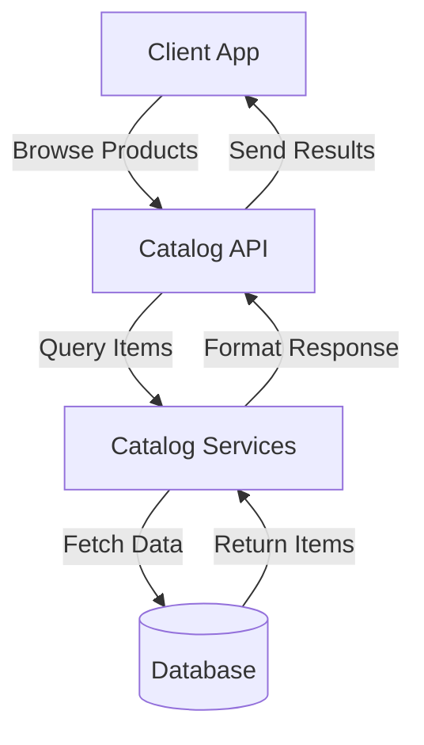

GET /api/catalog/items/{id}
- Purpose: Retrieves a specific catalog item
- Parameters: id (int): Item identifier
- Returns: CatalogItem
- Success: 200 OK
- Error: 404 Not Found

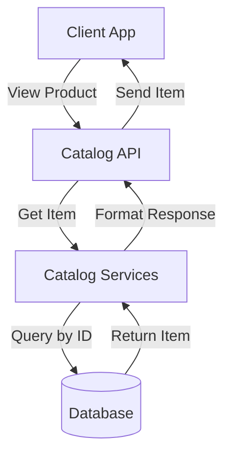

POST /api/catalog/items
- Purpose: Creates a new catalog item
- Body: CatalogItem
- Returns: Created CatalogItem
- Success: 201 Created
- Error: 400 Bad Request

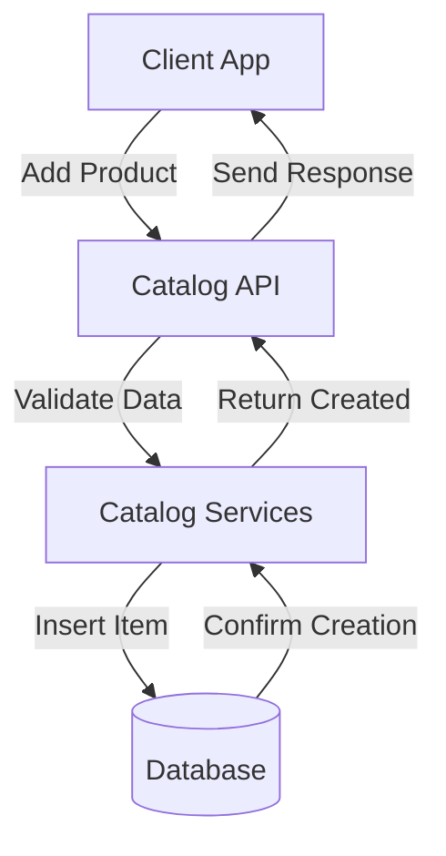

PUT /api/catalog/items/{id}
- Purpose: Updates an existing catalog item
- Parameters: id (int): Item identifier
- Body: CatalogItem
- Returns: Updated CatalogItem
- Success: 200 OK
- Error: 400 Bad Request, 404 Not Found

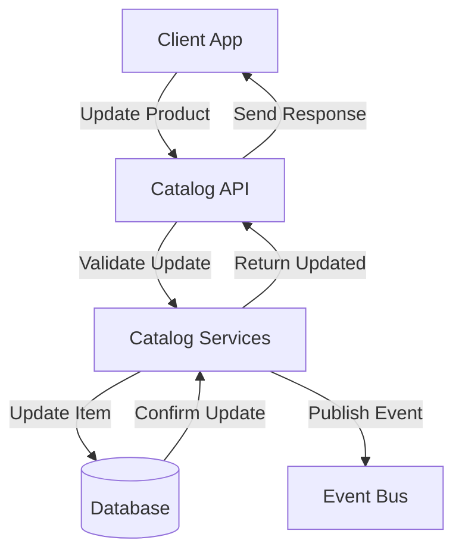

DELETE /api/catalog/items/{id}
- Purpose: Removes a catalog item
- Parameters: id (int): Item identifier
- Success: 204 No Content
- Error: 404 Not Found

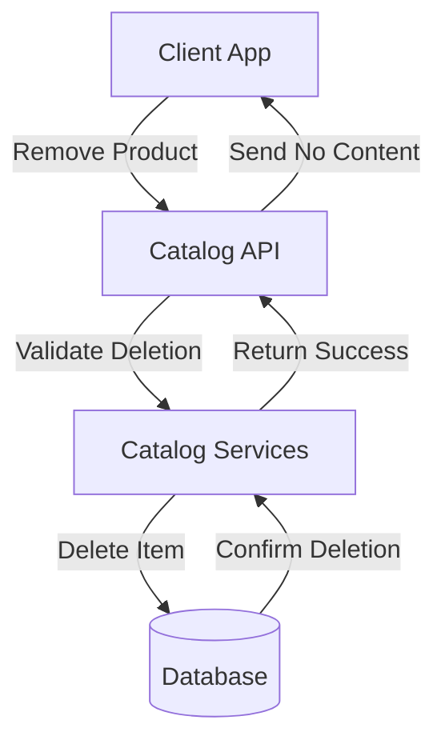
```

#### Advanced Search Operations
```http
GET /api/catalog/items/withsemanticrelevance/{text}
- Purpose: AI-powered semantic search
- Parameters:
  - text (string): Search query
  - pageSize (int): Items per page
  - pageIndex (int): Page number
- Returns: PaginatedItems<CatalogItem>
- Success: 200 OK
- Error: 400 Bad Request

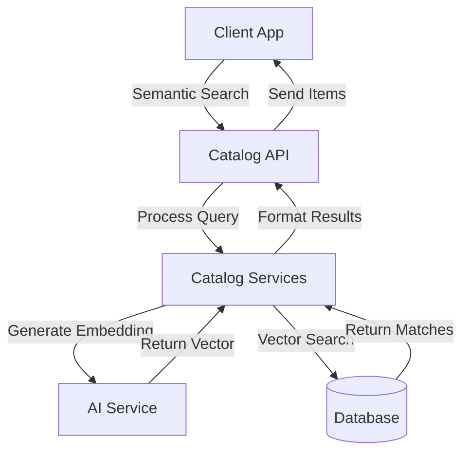

GET /api/catalog/items/by
- Purpose: Batch retrieval of items
- Parameters: ids (int[]): Array of item IDs
- Returns: List<CatalogItem>
- Success: 200 OK
- Error: 400 Bad Request

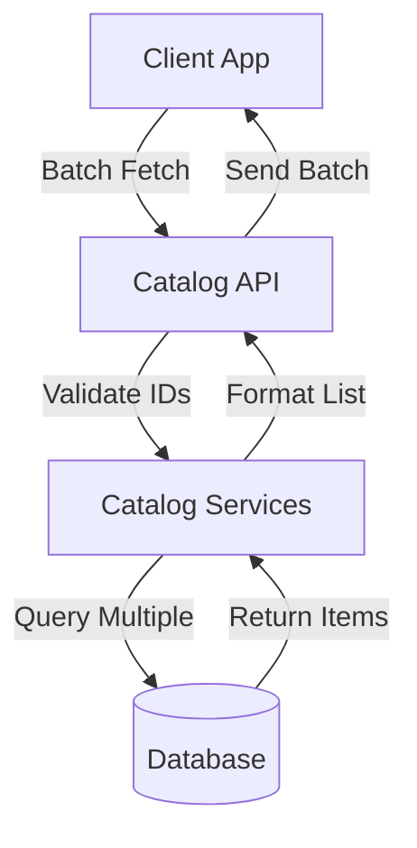

GET /api/catalog/items/by/{name}
- Purpose: Name-based search
- Parameters:
  - name (string): Item name
  - pageSize (int): Items per page
  - pageIndex (int): Page number
- Returns: PaginatedItems<CatalogItem>
- Success: 200 OK
- Error: 400 Bad Request

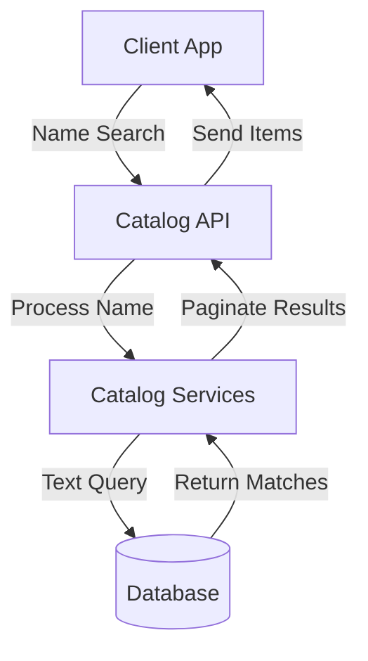
```

#### Category and Brand Management
```http
GET /api/catalog/catalogtypes
- Purpose: Lists all available catalog types
- Returns: List<CatalogType>
- Success: 200 OK
- Error: 400 Bad Request

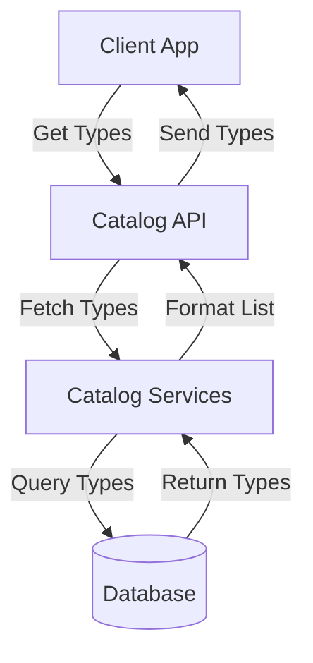

GET /api/catalog/catalogbrands
- Purpose: Lists all available catalog brands
- Returns: List<CatalogBrand>
- Success: 200 OK
- Error: 400 Bad Request

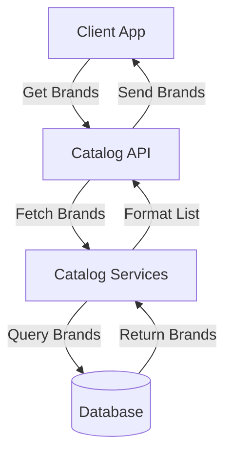

GET /api/catalog/items/type/{typeId}/brand/{brandId?}
- Purpose: Filter items by type and optional brand
- Parameters:
  - typeId (int): Type identifier
  - brandId (int?, optional): Brand identifier
  - pageSize (int): Items per page
  - pageIndex (int): Page number
- Returns: PaginatedItems<CatalogItem>
- Success: 200 OK
- Error: 400 Bad Request

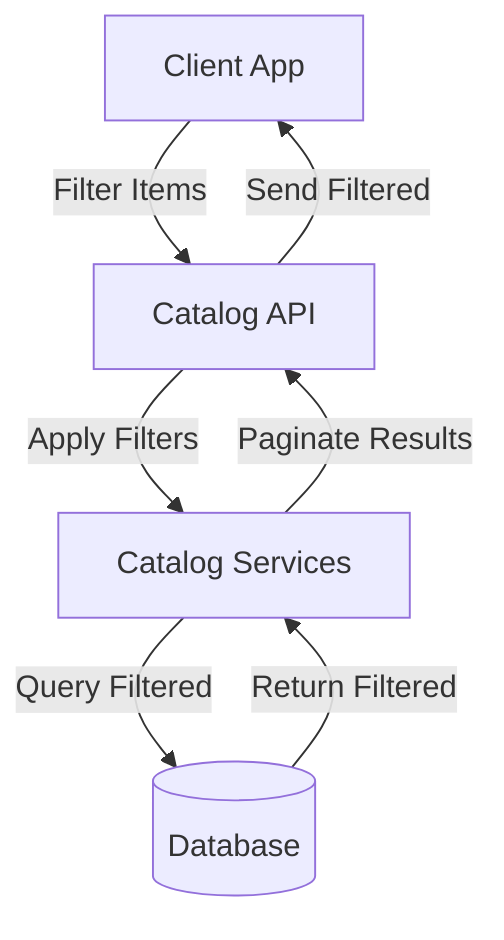
```

#### Image Management
```http
GET /api/catalog/items/{id}/pic
- Purpose: Retrieves product image
- Parameters: id (int): Item identifier
- Returns: Image file
- Success: 200 OK
- Error: 404 Not Found

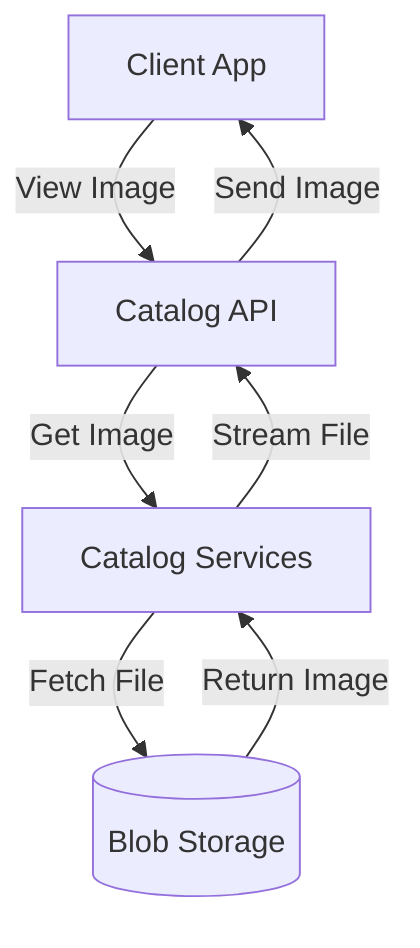

PUT /api/catalog/items/{id}/pic
- Purpose: Updates product image
- Parameters: id (int): Item identifier
- Body: Image file (multipart/form-data)
- Success: 200 OK
- Error: 400 Bad Request, 404 Not Found

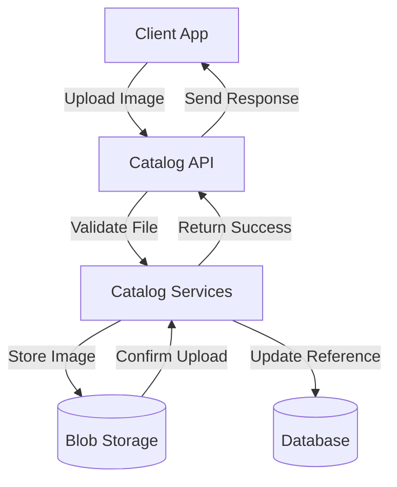

GET /api/catalog/items/withsemanticrelevance
- Searches items using AI-powered semantic relevance
- Parameters: text
- Returns: PaginatedItems<CatalogItem>

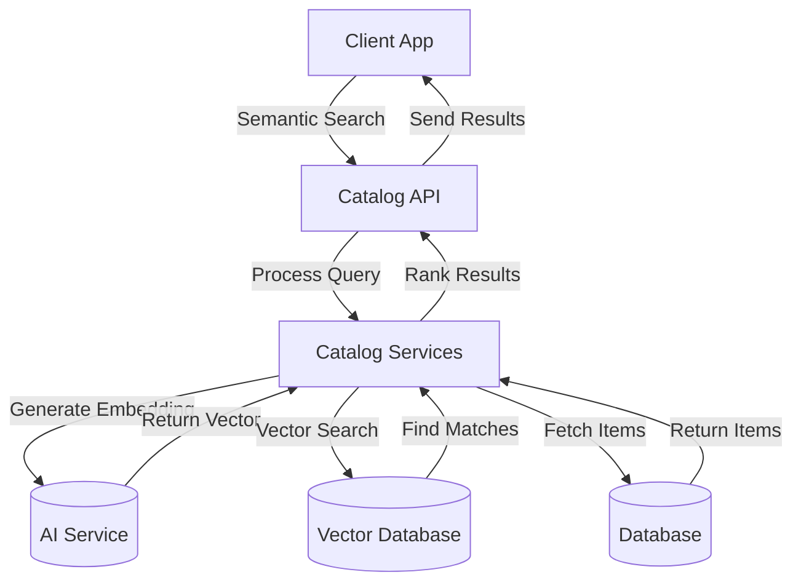
```

### Key Components

#### Models
1. CatalogItem
```csharp
class CatalogItem {
    int Id
    string Name
    string Description
    decimal Price
    string PictureFileName
    int CatalogTypeId
    int CatalogBrandId
    int AvailableStock
    int RestockThreshold
    int MaxStockThreshold
}
```

2. CatalogServices
```csharp
class CatalogServices {
    CatalogContext Context
    CatalogAI CatalogAI
    ILogger Logger
    IEventService EventService
}
```

### Class Dependency Diagram

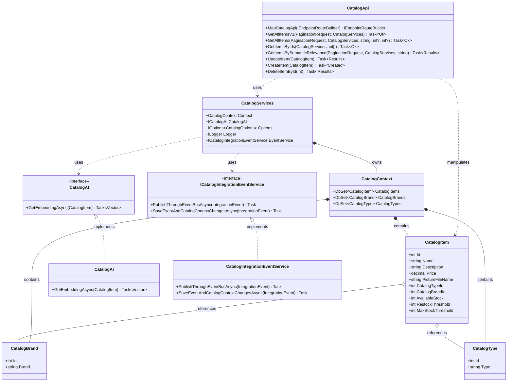

### Integration Points

1. Event Bus Integration
   - ProductPriceChangedIntegrationEvent: Notifies when product prices are updated
   - ProductStockChangedIntegrationEvent: Alerts when stock levels cross thresholds
   - ProductAddedIntegrationEvent: Announces new product additions
   - ProductUpdatedIntegrationEvent: Broadcasts product information changes
   - ProductRemovedIntegrationEvent: Signals product removals

2. AI Service Integration
   - Semantic Search: Utilizes AI embeddings for context-aware product search
   - Vector Database: Stores and queries product embeddings efficiently
   - Real-time Inference: Generates embeddings for new/updated products

3. External Service Dependencies
   - Entity Framework Core: Database operations and migrations
   - Azure Blob Storage: Product image storage
   - Redis Cache: Optional caching layer for high-traffic scenarios
   - Health Checks: Integrated with platform monitoring

4. Client Integration Points
   - RESTful API endpoints with OpenAPI documentation
   - Versioned API support (v1 and v2)
   - Pagination for large result sets
   - ETags for optimistic concurrency
   - HATEOAS links for API navigation
   - Integration with RabbitMQ for event publishing

2. AI Integration
   - Semantic search capabilities
   - Product embedding generation

## 4. Validation and Error Handling

### Input Validation
1. Model Validation
   - Required fields enforcement (Name, Price, Type, Brand)
   - Data type validation (decimal for Price, int for stock values)
   - Range validation (non-negative prices and stock values)
   - String length limits (Name, Description)

2. Business Rule Validation
   - Stock level consistency (Available ≤ MaxStockThreshold)
   - Restock threshold logic (RestockThreshold < MaxStockThreshold)
   - Unique constraints (product name within type/brand)
   - Image format and size validation

3. Concurrency Handling
   - ETag-based optimistic concurrency
   - Last-modified timestamp tracking
   - Conflict resolution strategies

### Error Handling
1. Standard HTTP Status Codes
   - 200: Successful operations
   - 201: Resource creation
   - 400: Invalid request/validation errors
   - 404: Resource not found
   - 409: Concurrency conflicts
   - 500: Server errors

2. Error Response Format
```json
{
    "type": "https://api.eshop.com/errors/validation",
    "title": "Validation Error",
    "status": 400,
    "detail": "The request contains invalid parameters",
    "errors": [
        {
            "field": "Price",
            "message": "Price must be greater than 0"
        }
    ]
}
```

3. Error Logging
   - Structured logging with correlation IDs
   - Error severity classification
   - Error metrics collection
   - Integration with monitoring systems

## 5. Security and Access Control

### Authentication
1. OAuth 2.0/OpenID Connect
   - JWT token validation
   - Role-based access control
   - Scope-based authorization

2. API Security
   - HTTPS enforcement
   - API key validation
   - Rate limiting
   - Request size limits

3. Data Protection
   - Data encryption at rest
   - Secure configuration management
   - Audit logging
   - PII handling compliance

### Authorization Matrix
| Operation              | Admin | Catalog Manager | Reader |
|-----------------------|-------|-----------------|---------|
| View Products         | ✓     | ✓              | ✓       |
| Create Products       | ✓     | ✓              | ✗       |
| Update Products       | ✓     | ✓              | ✗       |
| Delete Products       | ✓     | ✗              | ✗       |
| Manage Categories     | ✓     | ✗              | ✗       |
| View Analytics        | ✓     | ✓              | ✗       |

## 6. Testing Strategy

### Test Categories
1. Unit Tests
   - Controller logic validation
   - Service layer business rules
   - Model validation rules
   - Event handling logic
   - Coverage target: >80%

2. Integration Tests
   - Database operations
   - Event bus publishing
   - AI service integration
   - External service interactions
   - API endpoint functionality

3. Performance Tests
   - Load testing (1000 concurrent users)
   - Response time targets (<200ms)
   - Resource utilization
   - Caching effectiveness
   - Stress testing scenarios

### Testing Tools
- xUnit for unit testing
- WebApplicationFactory for integration tests
- JMeter for performance testing
- Moq for mocking dependencies
- FluentAssertions for readable assertions
- Coverlet for code coverage

## 7. Deployment Considerations

### Configuration Management
1. Environment Settings
```json
{
    "ConnectionStrings": {
        "CatalogDb": "Server=...;Database=Catalog;",
        "EventBus": "..."
    },
    "CatalogOptions": {
        "PicBaseUrl": "http://...",
        "AzureStorageEnabled": true
    }
}
```

2. Feature Flags
   - EnableAISearch
   - UseRedisCache
   - EnableEventBus
   - EnableMetrics

### Infrastructure Requirements
1. Compute Resources
   - CPU: 2 cores minimum
   - Memory: 4GB minimum
   - Storage: 20GB minimum
   - Scaling: Horizontal auto-scaling

2. Dependencies
   - SQL Server 2019+
   - Redis Cache (optional)
   - Azure Blob Storage
   - RabbitMQ/Azure Service Bus

### Monitoring
1. Health Checks
   - Database connectivity
   - Message bus status
   - External service health
   - Resource utilization

2. Metrics Collection
   - Request latency
   - Error rates
   - Cache hit rates
   - API usage patterns

## 8. References

### Documentation
- [API Swagger Documentation](https://api.eshop.com/swagger)
- [Event Schema Documentation](https://api.eshop.com/events)
- [Database Schema](https://github.com/eshop/catalog-api/schema.sql)

### Related Components
- [Basket.API](../Basket.API/README.md)
- [Ordering.API](../Ordering.API/README.md)
- [Identity.API](../Identity.API/README.md)

### External Resources
- [Event Bus Documentation](https://github.com/eshop/eventbus)
- [AI Service API](https://ai.eshop.com/docs)
- [Monitoring Dashboard](https://metrics.eshop.com)
