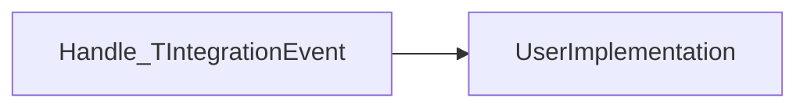
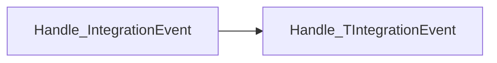
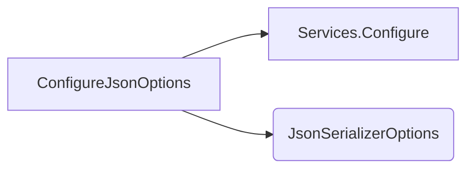
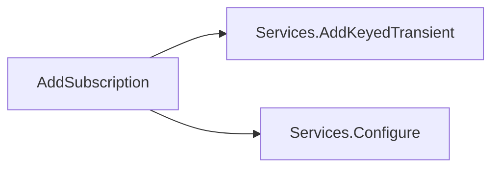

# Messaging

## [IntegrationEvent.cs](https://github.com/akhileshap9/automated-doc-poc-repo/blob/main/src/EventBus/Events/IntegrationEvent.cs#L3) {click}

### Overview
Defines the base contract for integration events, providing unique identification and creation timestamp for event-driven workflows.

### Properties
- `Id`: Globally unique identifier for the event.
- `CreationDate`: UTC timestamp of event creation.

### Usage Example
```csharp
var evt = new IntegrationEvent();
```

---

## EventBusSubscriptionInfo.cs

### [EventBusSubscriptionInfo.cs](https://github.com/akhileshap9/automated-doc-poc-repo/blob/main/src/EventBus/Abstractions/EventBusSubscriptionInfo.cs#L6) {click}
Manages event type registrations and JSON serialization options for the event bus. Central to event subscription and serialization configuration.

### Properties
- `EventTypes`: Dictionary mapping event type names to their .NET types.
- `JsonSerializerOptions`: Options for customizing event serialization.

### Methods
- `CreateDefaultTypeResolver()`: Internal method for creating a default type info resolver for JSON serialization.

### Configuration

| Key                  | Default                | Effect                                      |
|----------------------|------------------------|----------------------------------------------|
| TypeInfoResolver     | DefaultJsonTypeInfoResolver | Controls how event types are serialized |

### Usage Example
```csharp
var info = new EventBusSubscriptionInfo();
```

---

## IEventBus.cs

### [IEventBus.cs](https://github.com/akhileshap9/automated-doc-poc-repo/blob/main/src/EventBus/Abstractions/IEventBus.cs#L3) {click}
Defines the interface for publishing integration events to the bus.

### Methods
#### [PublishAsync(IntegrationEvent @event)](https://github.com/akhileshap9/automated-doc-poc-repo/blob/main/src/EventBus/Abstractions/IEventBus.cs#L5) {click}
- **Overview:** Publishes an integration event asynchronously.
- **Call Graph:**


**Flow Description:**
1. Call `PublishAsync` with an integration event.
2. The method delegates to the message broker implementation.
3. The event is published asynchronously.
```
- **Exceptions:**
  - Implementation-dependent (e.g., broker failures, serialization errors).

### Usage Example
```csharp
await eventBus.PublishAsync(new IntegrationEvent());
```

---

## IEventBusBuilder.cs

### [IEventBusBuilder.cs](https://github.com/akhileshap9/automated-doc-poc-repo/blob/main/src/EventBus/Abstractions/IEventBusBuilder.cs#L3) {click}
Interface for building and configuring the event bus, exposing DI service collection.

### Properties
- `Services`: The DI service collection for configuring event bus dependencies.

### Usage Example
```csharp
var builder = ... // get IEventBusBuilder
var services = builder.Services;
```

---

## IIntegrationEventHandler.cs

### [IIntegrationEventHandler.cs](https://github.com/akhileshap9/automated-doc-poc-repo/blob/main/src/EventBus/Abstractions/IIntegrationEventHandler.cs#L3) {click}
Interface for handling integration events, supporting both generic and non-generic event handlers.

### Methods
#### [Handle(TIntegrationEvent @event)](https://github.com/akhileshap9/automated-doc-poc-repo/blob/main/src/EventBus/Abstractions/IIntegrationEventHandler.cs#L6) {click}
- **Overview:** Handles a specific integration event type.
- **Call Graph:**


**Flow Description:**
1. The handler receives a specific integration event.
2. The method is called by the event bus or user code.
3. The user implementation processes the event.
```
- **Exceptions:**
  - User implementation may throw domain-specific exceptions.

#### [Handle(IntegrationEvent @event)](https://github.com/akhileshap9/automated-doc-poc-repo/blob/main/src/EventBus/Abstractions/IIntegrationEventHandler.cs#L13) {click}
- **Overview:** Handles a base integration event, typically by casting to the specific type.
- **Call Graph:**


**Flow Description:**
1. The handler receives a base integration event.
2. The method attempts to cast the event to the specific type.
3. If successful, calls the generic handler.
4. If not, may throw an exception.
```
- **Exceptions:**
  - InvalidCastException if event type does not match.

### Usage Example
```csharp
public class MyHandler : IIntegrationEventHandler<MyEvent> {
    public Task Handle(MyEvent evt) { ... }
}
```

---

## EventBusBuilderExtensions.cs

### [EventBusBuilderExtensions.cs](https://github.com/akhileshap9/automated-doc-poc-repo/blob/main/src/EventBus/Extensions/EventBusBuilderExtensions.cs#L8) {click}
Provides extension methods for configuring the event bus and adding event subscriptions.

### Methods
#### [ConfigureJsonOptions(Action<JsonSerializerOptions> configure)](https://github.com/akhileshap9/automated-doc-poc-repo/blob/main/src/EventBus/Extensions/EventBusBuilderExtensions.cs#L10) {click}
- **Overview:** Configures JSON serialization options for event subscriptions.
- **Call Graph:**


**Flow Description:**
1. Call `ConfigureJsonOptions` with a configuration delegate.
2. The method configures the DI container to update `EventBusSubscriptionInfo`.
3. The delegate customizes the `JsonSerializerOptions` for event subscriptions.
```
- **Exceptions:**
  - Misconfiguration may result in serialization errors at runtime.

#### [AddSubscription<T, TH>()](https://github.com/akhileshap9/automated-doc-poc-repo/blob/main/src/EventBus/Extensions/EventBusBuilderExtensions.cs#L20) {click}
- **Overview:** Registers a handler for a specific event type in the DI container and tracks event type mapping.
- **Call Graph:**


**Flow Description:**
1. Call `AddSubscription` with event and handler types.
2. Registers the handler for the event type in the DI container using keyed transient registration.
3. Configures `EventBusSubscriptionInfo` to track the event type mapping.
```
- **Exceptions:**
  - DI registration errors if types are invalid.

### Usage Example
```csharp
services.AddSubscription<MyEvent, MyHandler>();
```

---
