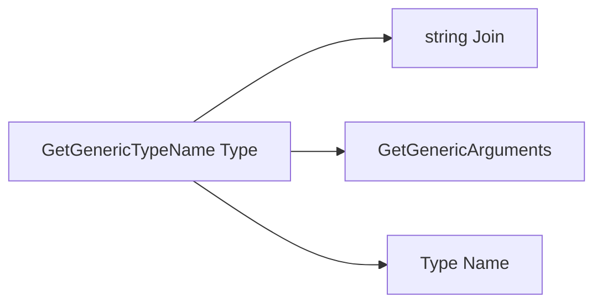
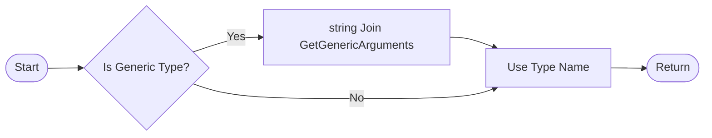

# Utilities

## [GenericTypeExtensions.cs](https://github.com/akhileshap9/automated-doc-poc-repo/blob/main/src/EventBus/Extensions/GenericTypeExtensions.cs#L3) {click}

### Overview

Provides extension methods for resolving generic type names at runtime. Useful for diagnostics, logging, and dynamic type handling in the EventBus system.

### Methods

#### [GetGenericTypeName(Type type)](https://github.com/akhileshap9/automated-doc-poc-repo/blob/main/src/EventBus/Extensions/GenericTypeExtensions.cs#L5) {click}
- **Overview:** Returns the name of a generic type, including its type arguments, for improved readability and diagnostics.
- **Call Graph:**


- **Flow Diagram:**



**Flow Description:**

1. Start the method.
2. Check if the type is generic.
3. If yes, get all generic arguments and join their names.
4. Format the type name with its generic arguments.
5. If not generic, use the type's name directly.
6. Return the formatted name.
```


#### [GetGenericTypeName(object obj)](https://github.com/akhileshap9/automated-doc-poc-repo/blob/main/src/EventBus/Extensions/GenericTypeExtensions.cs#L22) {click}
- **Overview:** Returns the generic type name of an object by delegating to the above method.
- **Call Graph:**


**Flow Description:**
1. Start with an object instance.
2. Get the object's type.
3. Call `GetGenericTypeName(Type)` with the object's type.
4. Return the result.
```

### Usage Example

```csharp
var name = typeof(Dictionary<string, int>).GetGenericTypeName();
```

---
