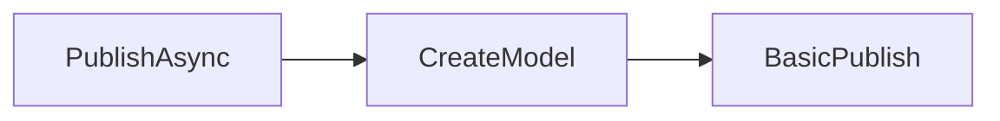
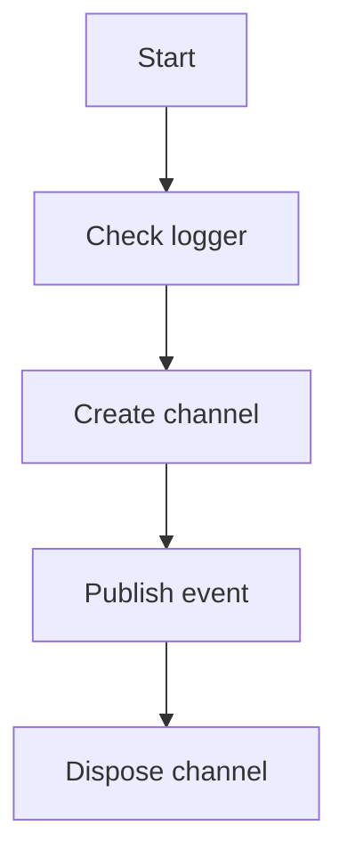

# Messaging

## RabbitMQEventBus ([source](https://github.com/akhileshap9/automated-doc-poc-repo/blob/main/src/EventBusRabbitMQ/RabbitMQEventBus.cs#L13-L319))

### Overview
`RabbitMQEventBus` is the core messaging component that implements the event bus pattern using RabbitMQ. It handles publishing, consuming, and managing event subscriptions, integrating with telemetry and configuration.

#### Methods

### PublishAsync ([source](https://github.com/akhileshap9/automated-doc-poc-repo/blob/main/src/EventBusRabbitMQ/RabbitMQEventBus.cs#L31-L40))
- **Overview:** Publishes an integration event to RabbitMQ. Uses the configured channel and applies retry logic.
**Call Graph:**

- **Flow Diagram:**

- **Exceptions:** Throws `InvalidOperationException` if the RabbitMQ connection is not open.
- **Configuration:**
  | Key                    | Default | Effect                                                      |
  |------------------------|---------|-------------------------------------------------------------|
  | SubscriptionClientName | (none)  | Used to determine the queue name for publishing.            |
  | RetryCount             | 10      | Used for retry policy when publishing events.                |

### StartAsync / StopAsync ([source](https://github.com/akhileshap9/automated-doc-poc-repo/blob/main/src/EventBusRabbitMQ/RabbitMQEventBus.cs#L225-L294))
- **Overview:** Starts or stops the event bus as a hosted service, managing consumer channels and subscriptions.
- **Exceptions:** May throw exceptions if RabbitMQ connection or channels are not properly initialized.

---
