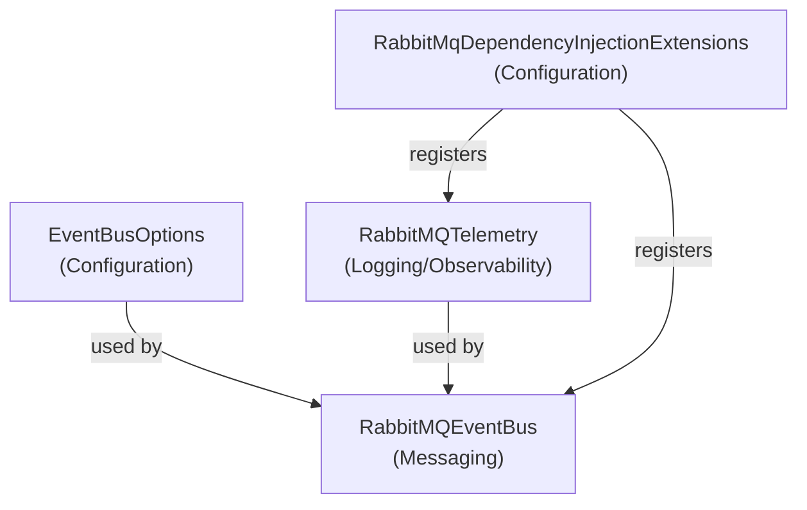

# EventBusRabbitMQ Overview

EventBusRabbitMQ provides a robust event bus implementation using RabbitMQ for distributed messaging in .NET applications. It enables reliable event publishing, subscription management, and integrates with OpenTelemetry for observability. The library is designed for extensibility and seamless integration into modern microservice architectures, supporting configuration, dependency injection, and tracing out of the box.

## File Dependency Diagram

## Documentation Contents

- [Configuration](./Configuration.md)
- [Messaging](./Messaging.md)
