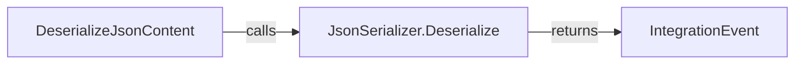
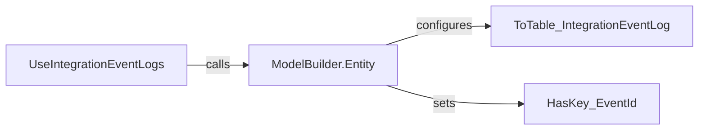

```mermaid
flowchart LR
	A[ExecuteAsync] --gets strategy--> B[CreateExecutionStrategy]
	B --starts--> C[BeginTransaction]
	C --executes--> D[Action]
	D --commits--> E[CommitAsync]
	click A "https://github.com/akhileshap9/automated-doc-poc-repo/blob/main/src/IntegrationEventLogEF/Utilities/ResilientTransaction.cs#L13-L27" "View implementation" _blank
	click C "https://github.com/akhileshap9/automated-doc-poc-repo/blob/main/src/IntegrationEventLogEF/Utilities/ResilientTransaction.cs#L18" "View transaction" _blank
	click E "https://github.com/akhileshap9/automated-doc-poc-repo/blob/main/src/IntegrationEventLogEF/Utilities/ResilientTransaction.cs#L21" "View commit" _blank
```

# Data Interactions

This section documents the core data interaction components of the IntegrationEventLogEF library, focusing on persistence, entity modeling, and transaction support.

## [EventStateEnum](https://github.com/akhileshap9/automated-doc-poc-repo/blob/main/src/IntegrationEventLogEF/EventStateEnum.cs#L1-L9)

### Overview
`EventStateEnum` defines the possible states for integration events within the event log. It is used throughout the persistence logic to track event lifecycle (e.g., NotPublished, InProgress, Published, PublishedFailed).
This enum is referenced by [`IntegrationEventLogEntry.State`](https://github.com/akhileshap9/automated-doc-poc-repo/blob/main/src/IntegrationEventLogEF/IntegrationEventLogEntry.cs#L29).

| State            | Value | Description                                 |
|------------------|-------|---------------------------------------------|
| NotPublished     | 0     | Event created, not yet published            |
| InProgress       | 1     | Event is being published                    |
| Published        | 2     | Event successfully published                |
| PublishedFailed  | 3     | Event publishing failed                     |


---

## [IntegrationEventLogEntry](https://github.com/akhileshap9/automated-doc-poc-repo/blob/main/src/IntegrationEventLogEF/IntegrationEventLogEntry.cs#L1-L49)

### Overview
`IntegrationEventLogEntry` represents the event log entity stored in the database. It encapsulates event metadata, state, and serialization logic for persistence and retrieval.

### Properties
| Property           | Type         | Description                                      |
|--------------------|--------------|--------------------------------------------------|
| EventId            | Guid         | Unique identifier for the event                   |
| EventTypeName      | string       | Full type name of the event                       |
| EventTypeShortName | string       | Short type name (last segment)                    |
| IntegrationEvent   | IntegrationEvent | Deserialized event object (not mapped)        |
| State              | EventStateEnum | Current state of the event                     |
| TimesSent          | int          | Number of publish attempts                        |
| CreationTime       | DateTime     | When the event was created                        |
| Content            | string       | Serialized event JSON                             |
| TransactionId      | Guid         | Transaction context for the event                 |

### [Constructor](https://github.com/akhileshap9/automated-doc-poc-repo/blob/main/src/IntegrationEventLogEF/IntegrationEventLogEntry.cs#L11-L21)

Initializes a new log entry from an event and transaction context.

### Methods

#### [DeserializeJsonContent](https://github.com/akhileshap9/automated-doc-poc-repo/blob/main/src/IntegrationEventLogEF/IntegrationEventLogEntry.cs#L39-L44)

Deserializes the `Content` JSON into an `IntegrationEvent` object using the provided type.

**Call Graph:**

**Description:**
1. [`DeserializeJsonContent`](https://github.com/akhileshap9/automated-doc-poc-repo/blob/main/src/IntegrationEventLogEF/IntegrationEventLogEntry.cs#L39-L44) calls `JsonSerializer.Deserialize` to convert JSON to an object.
2. The deserialized object is assigned to `IntegrationEvent`.
3. Returns the updated log entry.

**Exceptions:**
- Throws if JSON is invalid or type does not match expected event type.

**Usage Example:**
```csharp
var entry = new IntegrationEventLogEntry(myEvent, txId);
entry.DeserializeJsonContent(typeof(MyEventType));
```

---

## [IntegrationLogExtensions](https://github.com/akhileshap9/automated-doc-poc-repo/blob/main/src/IntegrationEventLogEF/IntegrationLogExtensions.cs#L1-L16)

### Overview
`IntegrationLogExtensions` provides Entity Framework ModelBuilder extensions to configure the event log table schema and relationships. It ensures the event log entity is correctly mapped and integrated with EF Core.

### Methods

#### [UseIntegrationEventLogs](https://github.com/akhileshap9/automated-doc-poc-repo/blob/main/src/IntegrationEventLogEF/IntegrationEventLogEntry.cs#L5)

Configures the `IntegrationEventLogEntry` entity for EF Core, setting the table name and primary key.

**Call Graph:**

**Description:**
1. `UseIntegrationEventLogs` calls `ModelBuilder.Entity` to start entity configuration.
2. Sets the table name to `IntegrationEventLog`.
3. Sets the primary key to `EventId`.

**Usage Example:**
```csharp
modelBuilder.UseIntegrationEventLogs();
```

---

## [ResilientTransaction](https://github.com/akhileshap9/automated-doc-poc-repo/blob/main/src/IntegrationEventLogEF/Utilities/ResilientTransaction.cs#L1-L28)

### Overview
`ResilientTransaction` is a helper class for managing resilient transactions in EF Core. It enables reliable execution of transactional operations, handling transient failures and retries as needed.

### Methods

#### [ExecuteAsync](https://github.com/akhileshap9/automated-doc-poc-repo/blob/main/src/IntegrationEventLogEF/Utilities/ResilientTransaction.cs#L13-L27)

Executes the provided action within a resilient transaction, using EF Core's execution strategy for retries.

**Call Graph:**

**Description:**
1. `ExecuteAsync` gets the execution strategy from the context.
2. Begins a new transaction.
3. Executes the provided action.
4. Commits the transaction.

**Exceptions:**
- Throws if the action fails after all retry attempts.
- Throws if transaction cannot be started or committed.

**Usage Example:**
```csharp
await ResilientTransaction.New(context).ExecuteAsync(async () =>
{
	// transactional work
});
```

---

