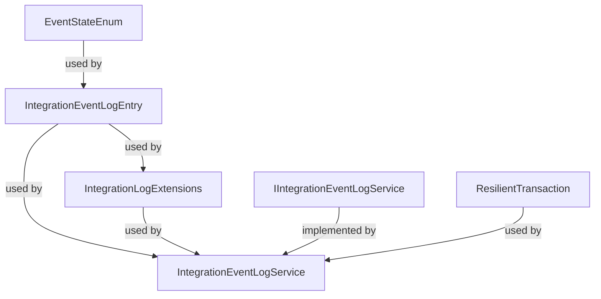

# IntegrationEventLogEF Library Overview

The IntegrationEventLogEF library provides robust infrastructure for managing integration event logs in distributed .NET applications. It enables reliable event persistence, transactional integrity, and orchestration of event publishing workflows using Entity Framework Core. The library is designed to support event-driven architectures, ensuring that events are tracked, retried, and published with resilience and traceability.

## File Dependency Diagram

## Documentation Walkthrough

- [Data Interactions](./Data%20Interactions.md):
  - Explains event state management, event log entity structure, EF Core configuration, and resilient transaction handling.
- [Services](./Services.md):
  - Details the orchestration of event log operations, including interface and implementation for event publishing, state transitions, and transactional workflows.

Refer to each section for deep dives into the respective components and their usage in distributed event-driven systems.
