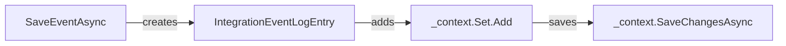
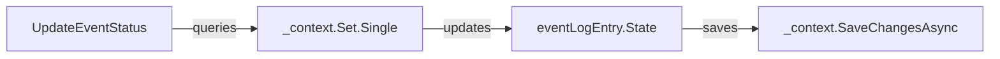

```mermaid
flowchart LR
	A[RetrieveEventLogsPendingToPublishAsync] --queries--> B[_context.Set]
	B --filters--> C[Where]
	C --orders--> D[OrderBy]
	D --deserializes--> E[DeserializeJsonContent]
	click A "https://github.com/akhileshap9/automated-doc-poc-repo/blob/main/src/IntegrationEventLogEF/Services/IntegrationEventLogService.cs#L16-L29" "View implementation" _blank
	click E "https://github.com/akhileshap9/automated-doc-poc-repo/blob/main/src/IntegrationEventLogEF/IntegrationEventLogEntry.cs#L39-L44" "View method" _blank
```

# Services

This section documents the service orchestration components of the IntegrationEventLogEF library, focusing on event log service interfaces and implementations.

## [IIntegrationEventLogService](https://github.com/akhileshap9/automated-doc-poc-repo/blob/main/src/IntegrationEventLogEF/Services/IIntegrationEventLogService.cs#L1-L13)

### Overview
`IIntegrationEventLogService` defines the contract for event log service orchestration, including methods for saving, retrieving, and updating integration events in the log.

### Methods

- [`RetrieveEventLogsPendingToPublishAsync(Guid transactionId)`](https://github.com/akhileshap9/automated-doc-poc-repo/blob/main/src/IntegrationEventLogEF/Services/IIntegrationEventLogService.cs#L5)
	- Retrieves event logs that are pending publication for a given transaction.
- [`SaveEventAsync(IntegrationEvent @event, IDbContextTransaction transaction)`](https://github.com/akhileshap9/automated-doc-poc-repo/blob/main/src/IntegrationEventLogEF/Services/IIntegrationEventLogService.cs#L6)
	- Saves a new integration event to the log within a transaction.
- [`MarkEventAsPublishedAsync(Guid eventId)`](https://github.com/akhileshap9/automated-doc-poc-repo/blob/main/src/IntegrationEventLogEF/Services/IIntegrationEventLogService.cs#L7)
	- Marks an event as published.
- [`MarkEventAsInProgressAsync(Guid eventId)`](https://github.com/akhileshap9/automated-doc-poc-repo/blob/main/src/IntegrationEventLogEF/Services/IIntegrationEventLogService.cs#L8)
	- Marks an event as in progress.
- [`MarkEventAsFailedAsync(Guid eventId)`](https://github.com/akhileshap9/automated-doc-poc-repo/blob/main/src/IntegrationEventLogEF/Services/IIntegrationEventLogService.cs#L9)
	- Marks an event as failed.

---

## [IntegrationEventLogService](https://github.com/akhileshap9/automated-doc-poc-repo/blob/main/src/IntegrationEventLogEF/Services/IntegrationEventLogService.cs#L1-L92)

### Overview
`IntegrationEventLogService` implements the event log service, orchestrating event persistence, state transitions, and transactional operations using EF Core and related helpers.

### Methods

#### [RetrieveEventLogsPendingToPublishAsync(Guid transactionId)](https://github.com/akhileshap9/automated-doc-poc-repo/blob/main/src/IntegrationEventLogEF/Services/IntegrationEventLogService.cs#L16-L29)
Retrieves event logs that are pending publication for a given transaction.

**Call Graph:**

**Description:**
1. Queries the event log entries for the given transaction and state.
2. Orders results by creation time.
3. Deserializes event content for each entry.

#### [SaveEventAsync(IntegrationEvent @event, IDbContextTransaction transaction)](https://github.com/akhileshap9/automated-doc-poc-repo/blob/main/src/IntegrationEventLogEF/Services/IntegrationEventLogService.cs#L31-L41)
Saves a new integration event to the log within a transaction.

**Call Graph:**

**Description:**
1. Creates a new log entry for the event.
2. Adds the entry to the context.
3. Saves changes to persist the entry.

#### [MarkEventAsPublishedAsync(Guid eventId)](https://github.com/akhileshap9/automated-doc-poc-repo/blob/main/src/IntegrationEventLogEF/Services/IntegrationEventLogService.cs#L43-L45)
Marks an event as published.

#### [MarkEventAsInProgressAsync(Guid eventId)](https://github.com/akhileshap9/automated-doc-poc-repo/blob/main/src/IntegrationEventLogEF/Services/IntegrationEventLogService.cs#L47-L49)
Marks an event as in progress.

#### [MarkEventAsFailedAsync(Guid eventId)](https://github.com/akhileshap9/automated-doc-poc-repo/blob/main/src/IntegrationEventLogEF/Services/IntegrationEventLogService.cs#L51-L53)
Marks an event as failed.

#### [UpdateEventStatus(Guid eventId, EventStateEnum status)](https://github.com/akhileshap9/automated-doc-poc-repo/blob/main/src/IntegrationEventLogEF/Services/IntegrationEventLogService.cs#L55-L67)
Updates the status of an event log entry.

**Call Graph:**

**Description:**
1. Queries for the event log entry by ID.
2. Updates the state and increments `TimesSent` if in progress.
3. Saves changes to persist the update.

#### [Dispose()](https://github.com/akhileshap9/automated-doc-poc-repo/blob/main/src/IntegrationEventLogEF/Services/IntegrationEventLogService.cs#L69-L80)
Disposes the underlying context and suppresses finalization.

---

