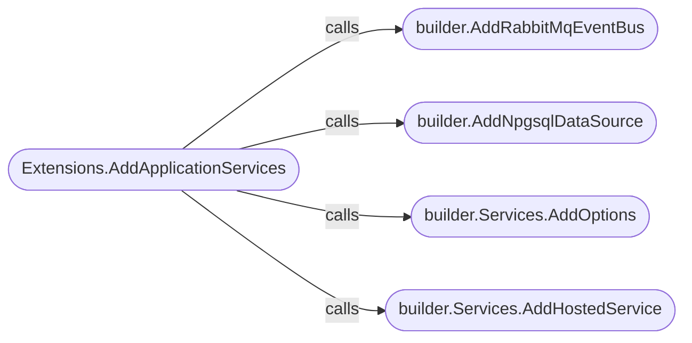

# Configuration/Adapters

## [Extensions](https://github.com/akhileshap9/automated-doc-poc-repo/blob/main/src/OrderProcessor/Extensions/Extensions.cs#L1-L22)

### Overview
The Extensions class provides extension methods for configuring application services in the OrderProcessor project. Its primary method, AddApplicationServices, registers dependencies such as RabbitMQ event bus, Npgsql data source, configuration options, and hosted services. This class is called during application startup to wire up infrastructure and background processing components.

### Methods
#### AddApplicationServices
- **Overview**: Public static method that extends IHostApplicationBuilder to register core services and configuration for the OrderProcessor application. It sets up event bus, serialization, database, and background service dependencies.
- **Parameters**: builder (IHostApplicationBuilder)
- **Return Type**: void

##### Call Graph

##### Flow Diagram

```mermaid
flowchart LR
    Start(["Start: AddApplicationServices called"]) --> Process1(["Process: Register RabbitMQ event bus"])
    Process1 --> Process2(["Process: Configure JSON serialization"])
    Process2 --> Process3(["Process: Register Npgsql data source"])
    Process3 --> Process4(["Process: Bind BackgroundTaskOptions"])
    Process4 --> Process5(["Process: Register GracePeriodManagerService as hosted service"])
    Process5 --> End(["End: Application services configured"])
    click Start "https://github.com/akhileshap9/automated-doc-poc-repo/blob/main/src/OrderProcessor/Extensions/Extensions.cs#L6"
    click Process1 "https://github.com/akhileshap9/automated-doc-poc-repo/blob/main/src/OrderProcessor/Extensions/Extensions.cs#L7"
    click Process2 "https://github.com/akhileshap9/automated-doc-poc-repo/blob/main/src/OrderProcessor/Extensions/Extensions.cs#L8"
    click Process3 "https://github.com/akhileshap9/automated-doc-poc-repo/blob/main/src/OrderProcessor/Extensions/Extensions.cs#L10"
    click Process4 "https://github.com/akhileshap9/automated-doc-poc-repo/blob/main/src/OrderProcessor/Extensions/Extensions.cs#L13"
    click Process5 "https://github.com/akhileshap9/automated-doc-poc-repo/blob/main/src/OrderProcessor/Extensions/Extensions.cs#L16"
    click End "https://github.com/akhileshap9/automated-doc-poc-repo/blob/main/src/OrderProcessor/Extensions/Extensions.cs#L20"
```

The method ensures all required infrastructure and background services are registered for the OrderProcessor application.

---
