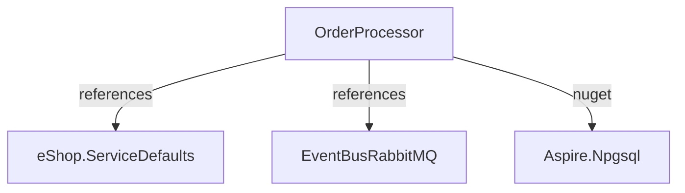
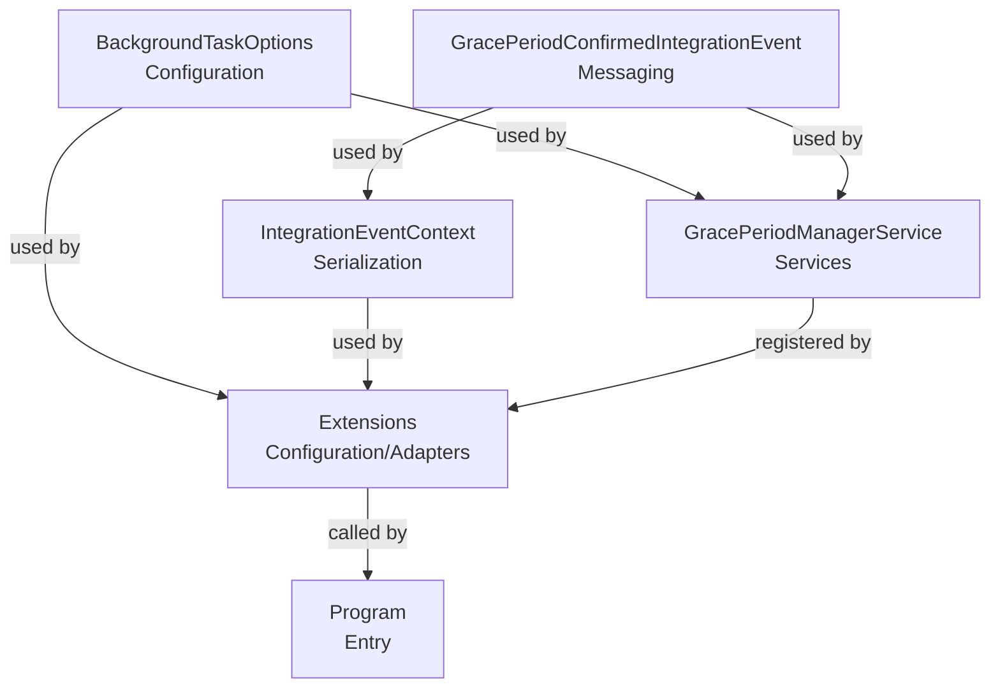

# Overview

OrderProcessor is a background service within the eShop architecture responsible for monitoring order states and publishing integration events when specific conditions, such as grace period confirmation, are met. Its key responsibilities include polling the database for eligible orders, publishing events to trigger downstream workflows, and managing configuration-driven timing for these operations. The service collaborates closely with infrastructure components like RabbitMQ (for event bus), Npgsql (for database access), and leverages configuration options for flexible operation. Notable constraints include its reliance on external services for event publishing and database access, and its continuous background execution model.

## Project Dependency Diagram



??? Legend
    - [OrderProcessor](./Overview.md)
    - [eShop.ServiceDefaults](../../eShop.ServiceDefaults/Overview.md)
    - [EventBusRabbitMQ](../../EventBusRabbitMQ/Overview.md)
    - [Aspire.Npgsql](https://www.nuget.org/packages/Aspire.Npgsql)

## Project Structure

```
appsettings.Development.json      # Development-specific configuration
appsettings.json                  # Main configuration file
BackgroundTaskOptions.cs          # Configuration class for background tasks
Events/                          # Contains event definitions
Extensions/                      # Extension methods for service registration
GlobalUsings.cs                  # Global using directives
OrderProcessor.csproj            # Project file
Program.cs                       # Application entry point
Properties/                      # Project properties
README.md                        # Project documentation
Services/                        # Background service implementations
```
- `Events/`: Contains integration event definitions for messaging between services.
- `Extensions/`: Provides extension methods for configuring and registering services.
- `Services/`: Implements background services such as GracePeriodManagerService.
- `BackgroundTaskOptions.cs`: Defines configuration options for background task timing.
- `Program.cs`: Entry point for the application, sets up service registration and execution.

## Class Relationship Diagram



??? Legend
    - [GracePeriodManagerService](./Services.md#graceperiodmanagerservice)
    - [Extensions](./Configuration-Adapters.md#extensions)
    - [BackgroundTaskOptions](./Configuration.md#backgroundtaskoptions)
    - [GracePeriodConfirmedIntegrationEvent](./Messaging.md#graceperiodconfirmedintegrationevent)
    - [IntegrationEventContext](./Serialization.md#integrationeventcontext)

## Documentation Walkthrough

- [Configuration](./Configuration.md): Details on configuration options for background tasks.
- [Messaging](./Messaging.md): Integration event definitions and messaging logic.
- [Serialization](./Serialization.md): Serialization context and metadata for integration events.
- [Configuration/Adapters](./Configuration-Adapters.md): Extension methods for service registration and configuration.
- [Services](./Services.md): Background service implementations and processing logic.
