# Services

## [GracePeriodManagerService](https://github.com/akhileshap9/automated-doc-poc-repo/blob/main/src/OrderProcessor/Services/GracePeriodManagerService.cs#L1-L66)

### Overview
GracePeriodManagerService is a background service responsible for monitoring orders and publishing integration events when the grace period for an order is confirmed. It inherits from BackgroundService and collaborates with BackgroundTaskOptions, IEventBus, ILogger, and NpgsqlDataSource. The service runs continuously, checking for eligible orders and publishing events to trigger downstream workflows.

### Methods
#### ExecuteAsync
- **Overview**: Protected override async method that runs the main background loop. It polls for confirmed grace period orders at intervals defined by CheckUpdateTime and publishes events for each eligible order. Parameters: stoppingToken (CancellationToken). Return type: Task.
- **Call Graph**:

```mermaid
flowchart LR
    GracePeriodManagerService_ExecuteAsync(["GracePeriodManagerService.ExecuteAsync"]) -->|calls| GracePeriodManagerService_CheckConfirmedGracePeriodOrders(["GracePeriodManagerService.CheckConfirmedGracePeriodOrders"])
    GracePeriodManagerService_ExecuteAsync -->|calls| Task_Delay(["Task.Delay"])
    GracePeriodManagerService_CheckConfirmedGracePeriodOrders -->|calls| GracePeriodManagerService_GetConfirmedGracePeriodOrders(["GracePeriodManagerService.GetConfirmedGracePeriodOrders"])
    GracePeriodManagerService_CheckConfirmedGracePeriodOrders -->|calls| eventBus_PublishAsync(["eventBus.PublishAsync"])
    GracePeriodManagerService_GetConfirmedGracePeriodOrders -->|calls| dataSource_CreateConnection(["dataSource.CreateConnection"])
    GracePeriodManagerService_GetConfirmedGracePeriodOrders -->|calls| command_ExecuteReaderAsync(["command.ExecuteReaderAsync"])
    click GracePeriodManagerService_ExecuteAsync "https://github.com/akhileshap9/automated-doc-poc-repo/blob/main/src/OrderProcessor/Services/GracePeriodManagerService.cs#L13-L54"
    click GracePeriodManagerService_CheckConfirmedGracePeriodOrders "https://github.com/akhileshap9/automated-doc-poc-repo/blob/main/src/OrderProcessor/Services/GracePeriodManagerService.cs#L56-L74"
    click GracePeriodManagerService_GetConfirmedGracePeriodOrders "https://github.com/akhileshap9/automated-doc-poc-repo/blob/main/src/OrderProcessor/Services/GracePeriodManagerService.cs#L76-L96"
```

??? Legend
    - **GracePeriodManagerService.ExecuteAsync** - [Link to method in markdown file](#graceperiodmanagerserviceexecuteasync)
    - **GracePeriodManagerService.CheckConfirmedGracePeriodOrders** - [Link to method in markdown file](#graceperiodmanagerservicecheckconfirmedgraceperiodorders)
    - **GracePeriodManagerService.GetConfirmedGracePeriodOrders** - [Link to method in markdown file](#graceperiodmanagerservicegetconfirmedgraceperiodorders)

- **Flow Diagram**:

```mermaid
flowchart LR
    Start(["Start: ExecuteAsync called"]) --> Decision(["Decision: Is cancellation requested?"])
    Decision -->|No| Process1(["Process: CheckConfirmedGracePeriodOrders"])
    Decision -->|Yes| End(["End: Stop service"])
    Process1 --> Process2(["Process: GetConfirmedGracePeriodOrders"])
    Process2 --> Process3(["Process: Publish GracePeriodConfirmedIntegrationEvent"])
    Process3 --> Wait(["End: Wait for next interval"])
    click Start "https://github.com/akhileshap9/automated-doc-poc-repo/blob/main/src/OrderProcessor/Services/GracePeriodManagerService.cs#L13"
    click Decision "https://github.com/akhileshap9/automated-doc-poc-repo/blob/main/src/OrderProcessor/Services/GracePeriodManagerService.cs#L17"
    click Process1 "https://github.com/akhileshap9/automated-doc-poc-repo/blob/main/src/OrderProcessor/Services/GracePeriodManagerService.cs#L56"
    click Process2 "https://github.com/akhileshap9/automated-doc-poc-repo/blob/main/src/OrderProcessor/Services/GracePeriodManagerService.cs#L76"
    click Process3 "https://github.com/akhileshap9/automated-doc-poc-repo/blob/main/src/OrderProcessor/Services/GracePeriodManagerService.cs#L56"
    click Wait "https://github.com/akhileshap9/automated-doc-poc-repo/blob/main/src/OrderProcessor/Services/GracePeriodManagerService.cs#L54"
```

The service loops, checking for orders that meet the grace period criteria and publishing events for each. It stops when cancellation is requested.

### Exceptions
- Throws ArgumentNullException if options are null.
- May throw database-related exceptions during connection or query execution.

### Configuration

| Key                | Source                | Effect                                      |
|--------------------|----------------------|---------------------------------------------|
| GracePeriodTime    | BackgroundTaskOptions| Sets grace period for order eligibility.    |
| CheckUpdateTime    | BackgroundTaskOptions| Sets polling interval for background loop.  |

### Abomination
??? This service is registered as a hosted service and runs in the background for the application's lifetime.

---
