# Domain Event Handling

Domain events are used to signal significant changes or actions within the domain model, such as order creation, cancellation, or payment verification. The Ordering.API service leverages MediatR and infrastructure services to dispatch and process these events, ensuring decoupled and consistent event handling.

---

## [OrderCancelledDomainEventHandler](https://github.com/akhileshap9/automated-doc-poc-repo/blob/main/src/Ordering.API/Application/DomainEventHandlers/OrderCancelledDomainEventHandler.cs)

**Overview:**
Handles the cancellation of an order by responding to the [`OrderCancelledDomainEvent`](../Ordering.Domain/DomainEvent.md#ordercancelleddomainevent). Collaborates with [`OrderRepository`](../Ordering.Infrastructure/Data%20Interactions.md#orderrepositorycs), [`BuyerRepository`](../Ordering.Infrastructure/Data%20Interactions.md#buyerrepositorycs), and `IOrderingIntegrationEventService` to update order status and publish integration events. Implements `INotificationHandler<OrderCancelledDomainEvent>`.

### Handle
**Overview:**
Public async method. Handles the domain event, retrieves the order and buyer, creates an integration event, and saves it. Parameters: `OrderCancelledDomainEvent domainEvent`, `CancellationToken cancellationToken`. Returns: `Task`.

**Call Graph:**
```mermaid
flowchart LR
    A([OrderCancelledDomainEventHandler.Handle]) --calls--> B([OrderingApiTrace.LogOrderStatusUpdated])
    B --calls--> C([OrderRepository.GetAsync])
    C --calls--> D([BuyerRepository.FindByIdAsync])
    D --calls--> E([OrderStatusChangedToCancelledIntegrationEvent])
    E --calls--> F([OrderingIntegrationEventService.AddAndSaveEventAsync])
    click A "https://github.com/akhileshap9/automated-doc-poc-repo/blob/main/src/Ordering.API/Application/DomainEventHandlers/OrderCancelledDomainEventHandler.cs#L28" "OrderCancelledDomainEventHandler.Handle"
    click C "https://github.com/akhileshap9/automated-doc-poc-repo/blob/main/src/Ordering.Infrastructure/Repositories/OrderRepository.cs#L26" "OrderRepository.GetAsync"
    click D "https://github.com/akhileshap9/automated-doc-poc-repo/blob/main/src/Ordering.Infrastructure/Repositories/BuyerRepository.cs#L48" "BuyerRepository.FindByIdAsync"
```

??? Call Graph Legend
    - **OrderCancelledDomainEventHandler.Handle** - [OrderCancelledDomainEventHandler.Handle](#ordercancelleddomaineventhandler)
    - **OrderRepository.GetAsync** - [OrderRepository.GetAsync](../Ordering.Infrastructure/Data%20Interactions.md#getasync)
    - **BuyerRepository.FindByIdAsync** - [BuyerRepository.FindByIdAsync](../Ordering.Infrastructure/Data%20Interactions.md#findbyidasyncint-id)

**Implementation flow:**
```mermaid
flowchart LR
    S([Start]) --> P1([Log order status updated])
    P1 --> P2([Get order])
    P2 --> P3([Get buyer])
    P3 --> P4([Create integration event])
    P4 --> P5([Save integration event])
    P5 --> E([End])
    click P2 "https://github.com/akhileshap9/automated-doc-poc-repo/blob/main/src/Ordering.Infrastructure/Repositories/OrderRepository.cs#L26" "OrderRepository.GetAsync"
    click P3 "https://github.com/akhileshap9/automated-doc-poc-repo/blob/main/src/Ordering.Infrastructure/Repositories/BuyerRepository.cs#L48" "BuyerRepository.FindByIdAsync"
```

**Exceptions:**
- Throws `ArgumentNullException` if any dependency is null in constructor.

---

## [OrderShippedDomainEventHandler](https://github.com/akhileshap9/automated-doc-poc-repo/blob/main/src/Ordering.API/Application/DomainEventHandlers/OrderShippedDomainEventHandler.cs)

**Overview:**
Handles the shipping of an order by responding to the `OrderShippedDomainEvent`. Collaborates with `OrderRepository`, `BuyerRepository`, and `IOrderingIntegrationEventService` to update order status and publish integration events. Implements `INotificationHandler<OrderShippedDomainEvent>`.

### Handle
**Overview:**
Public async method. Handles the domain event, retrieves the order and buyer, creates an integration event, and saves it. Parameters: `OrderShippedDomainEvent domainEvent`, `CancellationToken cancellationToken`. Returns: `Task`.

**Call Graph:**
```mermaid
flowchart LR
    A([OrderShippedDomainEventHandler.Handle]) --calls--> B([OrderingApiTrace.LogOrderStatusUpdated])
    B --calls--> C([OrderRepository.GetAsync])
    C --calls--> D([BuyerRepository.FindByIdAsync])
    D --calls--> E([OrderStatusChangedToShippedIntegrationEvent])
    E --calls--> F([OrderingIntegrationEventService.AddAndSaveEventAsync])
    click A "https://github.com/akhileshap9/automated-doc-poc-repo/blob/main/src/Ordering.API/Application/DomainEventHandlers/OrderShippedDomainEventHandler.cs#L28" "OrderShippedDomainEventHandler.Handle"
    click C "https://github.com/akhileshap9/automated-doc-poc-repo/blob/main/src/Ordering.Infrastructure/Repositories/OrderRepository.cs#L26" "OrderRepository.GetAsync"
    click D "https://github.com/akhileshap9/automated-doc-poc-repo/blob/main/src/Ordering.Infrastructure/Repositories/BuyerRepository.cs#L48" "BuyerRepository.FindByIdAsync"
```

??? Call Graph Legend
    - **OrderShippedDomainEventHandler.Handle** - [OrderShippedDomainEventHandler.Handle](#ordershippeddomaineventhandler)
    - **OrderRepository.GetAsync** - [OrderRepository.GetAsync](../Ordering.Infrastructure/Data%20Interactions.md#getasync)
    - **BuyerRepository.FindByIdAsync** - [BuyerRepository.FindByIdAsync](../Ordering.Infrastructure/Data%20Interactions.md#findbyidasyncint-id)

**Implementation flow:**
```mermaid
flowchart LR
    S([Start]) --> P1([Log order status updated])
    P1 --> P2([Get order])
    P2 --> P3([Get buyer])
    P3 --> P4([Create integration event])
    P4 --> P5([Save integration event])
    P5 --> E([End])
    click P2 "https://github.com/akhileshap9/automated-doc-poc-repo/blob/main/src/Ordering.Infrastructure/Repositories/OrderRepository.cs#L26" "OrderRepository.GetAsync"
    click P3 "https://github.com/akhileshap9/automated-doc-poc-repo/blob/main/src/Ordering.Infrastructure/Repositories/BuyerRepository.cs#L48" "BuyerRepository.FindByIdAsync"
```

**Exceptions:**
- Throws `ArgumentNullException` if any dependency is null in constructor.

---

## [OrderStatusChangedToAwaitingValidationDomainEventHandler](https://github.com/akhileshap9/automated-doc-poc-repo/blob/main/src/Ordering.API/Application/DomainEventHandlers/OrderStatusChangedToAwaitingValidationDomainEventHandler.cs)

**Overview:**
Handles the transition of an order status to 'Awaiting Validation' by responding to the `OrderStatusChangedToAwaitingValidationDomainEvent`. Collaborates with `OrderRepository`, `BuyerRepository`, and `IOrderingIntegrationEventService` to update order status and publish integration events. Implements `INotificationHandler<OrderStatusChangedToAwaitingValidationDomainEvent>`.

### Handle
**Overview:**
Public async method. Handles the domain event, retrieves the order and buyer, creates a stock list, creates an integration event, and saves it. Parameters: `OrderStatusChangedToAwaitingValidationDomainEvent domainEvent`, `CancellationToken cancellationToken`. Returns: `Task`.

**Call Graph:**
```mermaid
flowchart LR
    A([OrderStatusChangedToAwaitingValidationDomainEventHandler.Handle]) --calls--> B([OrderingApiTrace.LogOrderStatusUpdated])
    B --calls--> C([OrderRepository.GetAsync])
    C --calls--> D([BuyerRepository.FindByIdAsync])
    D --calls--> E([LINQ.Select])
    E --calls--> F([OrderStatusChangedToAwaitingValidationIntegrationEvent])
    F --calls--> G([OrderingIntegrationEventService.AddAndSaveEventAsync])
    click A "https://github.com/akhileshap9/automated-doc-poc-repo/blob/main/src/Ordering.API/Application/DomainEventHandlers/OrderStatusChangedToAwaitingValidationDomainEventHandler.cs#L28" "OrderStatusChangedToAwaitingValidationDomainEventHandler.Handle"
    click C "https://github.com/akhileshap9/automated-doc-poc-repo/blob/main/src/Ordering.Infrastructure/Repositories/OrderRepository.cs#L26" "OrderRepository.GetAsync"
    click D "https://github.com/akhileshap9/automated-doc-poc-repo/blob/main/src/Ordering.Infrastructure/Repositories/BuyerRepository.cs#L48" "BuyerRepository.FindByIdAsync"
```

??? Call Graph Legend
    - **OrderStatusChangedToAwaitingValidationDomainEventHandler.Handle** - [OrderStatusChangedToAwaitingValidationDomainEventHandler.Handle](#orderstatuschangedtoawaitingvalidationdomaineventhandler)
    - **OrderRepository.GetAsync** - [OrderRepository.GetAsync](../Ordering.Infrastructure/Data%20Interactions.md#getasync)
    - **BuyerRepository.FindByIdAsync** - [BuyerRepository.FindByIdAsync](../Ordering.Infrastructure/Data%20Interactions.md#findbyidasyncint-id)

**Implementation flow:**
```mermaid
flowchart LR
    S([Start]) --> P1([Log order status updated])
    P1 --> P2([Get order])
    P2 --> P3([Get buyer])
    P3 --> P4([Create stock list])
    P4 --> P5([Create integration event])
    P5 --> P6([Save integration event])
    P6 --> E([End])
    click P2 "https://github.com/akhileshap9/automated-doc-poc-repo/blob/main/src/Ordering.Infrastructure/Repositories/OrderRepository.cs#L26" "OrderRepository.GetAsync"
    click P3 "https://github.com/akhileshap9/automated-doc-poc-repo/blob/main/src/Ordering.Infrastructure/Repositories/BuyerRepository.cs#L48" "BuyerRepository.FindByIdAsync"
```

**Exceptions:**
- Throws `ArgumentNullException` if any dependency is null in constructor.

---

## [OrderStatusChangedToPaidDomainEventHandler](https://github.com/akhileshap9/automated-doc-poc-repo/blob/main/src/Ordering.API/Application/DomainEventHandlers/OrderStatusChangedToPaidDomainEventHandler.cs)

**Overview:**
Handles the transition of an order status to 'Paid' by responding to the `OrderStatusChangedToPaidDomainEvent`. Collaborates with `OrderRepository`, `BuyerRepository`, and `IOrderingIntegrationEventService` to update order status and publish integration events. Implements `INotificationHandler<OrderStatusChangedToPaidDomainEvent>`.

### Handle
**Overview:**
Public async method. Handles the domain event, retrieves the order and buyer, creates a stock list, creates an integration event, and saves it. Parameters: `OrderStatusChangedToPaidDomainEvent domainEvent`, `CancellationToken cancellationToken`. Returns: `Task`.

**Call Graph:**
```mermaid
flowchart LR
    A([OrderStatusChangedToPaidDomainEventHandler.Handle]) --calls--> B([OrderingApiTrace.LogOrderStatusUpdated])
    B --calls--> C([OrderRepository.GetAsync])
    C --calls--> D([BuyerRepository.FindByIdAsync])
    D --calls--> E([LINQ.Select])
    E --calls--> F([OrderStatusChangedToPaidIntegrationEvent])
    F --calls--> G([OrderingIntegrationEventService.AddAndSaveEventAsync])
    click A "https://github.com/akhileshap9/automated-doc-poc-repo/blob/main/src/Ordering.API/Application/DomainEventHandlers/OrderStatusChangedToPaidDomainEventHandler.cs#L27" "OrderStatusChangedToPaidDomainEventHandler.Handle"
    click C "https://github.com/akhileshap9/automated-doc-poc-repo/blob/main/src/Ordering.Infrastructure/Repositories/OrderRepository.cs#L26" "OrderRepository.GetAsync"
    click D "https://github.com/akhileshap9/automated-doc-poc-repo/blob/main/src/Ordering.Infrastructure/Repositories/BuyerRepository.cs#L48" "BuyerRepository.FindByIdAsync"
```

??? Call Graph Legend
    - **OrderStatusChangedToPaidDomainEventHandler.Handle** - [OrderStatusChangedToPaidDomainEventHandler.Handle](#orderstatuschangedtopaiddomaineventhandler)
    - **OrderRepository.GetAsync** - [OrderRepository.GetAsync](../Ordering.Infrastructure/Data%20Interactions.md#getasync)
    - **BuyerRepository.FindByIdAsync** - [BuyerRepository.FindByIdAsync](../Ordering.Infrastructure/Data%20Interactions.md#findbyidasyncint-id)

**Implementation flow:**
```mermaid
flowchart LR
    S([Start]) --> P1([Log order status updated])
    P1 --> P2([Get order])
    P2 --> P3([Get buyer])
    P3 --> P4([Create stock list])
    P4 --> P5([Create integration event])
    P5 --> P6([Save integration event])
    P6 --> E([End])
    click P2 "https://github.com/akhileshap9/automated-doc-poc-repo/blob/main/src/Ordering.Infrastructure/Repositories/OrderRepository.cs#L26" "OrderRepository.GetAsync"
    click P3 "https://github.com/akhileshap9/automated-doc-poc-repo/blob/main/src/Ordering.Infrastructure/Repositories/BuyerRepository.cs#L48" "BuyerRepository.FindByIdAsync"
```

**Exceptions:**
- Throws `ArgumentNullException` if any dependency is null in constructor.

---

## [OrderStatusChangedToStockConfirmedDomainEventHandler](https://github.com/akhileshap9/automated-doc-poc-repo/blob/main/src/Ordering.API/Application/DomainEventHandlers/OrderStatusChangedToStockConfirmedDomainEventHandler.cs)

**Overview:**
Handles the transition of an order status to 'Stock Confirmed' by responding to the `OrderStatusChangedToStockConfirmedDomainEvent`. Collaborates with `OrderRepository`, `BuyerRepository`, and `IOrderingIntegrationEventService` to update order status and publish integration events. Implements `INotificationHandler<OrderStatusChangedToStockConfirmedDomainEvent>`.

### Handle
**Overview:**
Public async method. Handles the domain event, retrieves the order and buyer, creates an integration event, and saves it. Parameters: `OrderStatusChangedToStockConfirmedDomainEvent domainEvent`, `CancellationToken cancellationToken`. Returns: `Task`.

**Call Graph:**
```mermaid
flowchart LR
    A([OrderStatusChangedToStockConfirmedDomainEventHandler.Handle]) --calls--> B([OrderingApiTrace.LogOrderStatusUpdated])
    B --calls--> C([OrderRepository.GetAsync])
    C --calls--> D([BuyerRepository.FindByIdAsync])
    D --calls--> E([OrderStatusChangedToStockConfirmedIntegrationEvent])
    E --calls--> F([OrderingIntegrationEventService.AddAndSaveEventAsync])
    click A "https://github.com/akhileshap9/automated-doc-poc-repo/blob/main/src/Ordering.API/Application/DomainEventHandlers/OrderStatusChangedToStockConfirmedDomainEventHandler.cs#L28" "OrderStatusChangedToStockConfirmedDomainEventHandler.Handle"
    click C "https://github.com/akhileshap9/automated-doc-poc-repo/blob/main/src/Ordering.Infrastructure/Repositories/OrderRepository.cs#L26" "OrderRepository.GetAsync"
    click D "https://github.com/akhileshap9/automated-doc-poc-repo/blob/main/src/Ordering.Infrastructure/Repositories/BuyerRepository.cs#L48" "BuyerRepository.FindByIdAsync"
```

??? Call Graph Legend
    - **OrderStatusChangedToStockConfirmedDomainEventHandler.Handle** - [OrderStatusChangedToStockConfirmedDomainEventHandler.Handle](#orderstatuschangedtostockconfirmeddomaineventhandler)
    - **OrderRepository.GetAsync** - [OrderRepository.GetAsync](../Ordering.Infrastructure/Data%20Interactions.md#getasync)
    - **BuyerRepository.FindByIdAsync** - [BuyerRepository.FindByIdAsync](../Ordering.Infrastructure/Data%20Interactions.md#findbyidasyncint-id)

**Implementation flow:**

**Exceptions:**
- Throws `ArgumentNullException` if any dependency is null in constructor.

---

## [UpdateOrderWhenBuyerAndPaymentMethodVerifiedDomainEventHandler](https://github.com/akhileshap9/automated-doc-poc-repo/blob/main/src/Ordering.API/Application/DomainEventHandlers/UpdateOrderWhenBuyerAndPaymentMethodVerifiedDomainEventHandler.cs)

**Overview:**
Handles updating the order when the buyer and payment method have been verified by responding to the `BuyerAndPaymentMethodVerifiedDomainEvent`. Collaborates with `OrderRepository` to update the order's buyer and payment method information. Implements `INotificationHandler<BuyerAndPaymentMethodVerifiedDomainEvent>`.

### Handle
**Overview:**
Public async method. Retrieves the order, updates payment method verification, and logs the update. Parameters: `BuyerAndPaymentMethodVerifiedDomainEvent domainEvent`, `CancellationToken cancellationToken`. Returns: `Task`.

**Call Graph:**
```mermaid
flowchart LR
    A([UpdateOrderWhenBuyerAndPaymentMethodVerifiedDomainEventHandler.Handle]) --calls--> B([OrderRepository.GetAsync])
    B --calls--> C([Order.SetPaymentMethodVerified])
    C --calls--> D([OrderingApiTrace.LogOrderPaymentMethodUpdated])
    click A "https://github.com/akhileshap9/automated-doc-poc-repo/blob/main/src/Ordering.API/Application/DomainEventHandlers/UpdateOrderWhenBuyerAndPaymentMethodVerifiedDomainEventHandler.cs#L24" "UpdateOrderWhenBuyerAndPaymentMethodVerifiedDomainEventHandler.Handle"
    click B "https://github.com/akhileshap9/automated-doc-poc-repo/blob/main/src/Ordering.Infrastructure/Repositories/OrderRepository.cs#L26" "OrderRepository.GetAsync"
```

??? Call Graph Legend
    - **UpdateOrderWhenBuyerAndPaymentMethodVerifiedDomainEventHandler.Handle** - [UpdateOrderWhenBuyerAndPaymentMethodVerifiedDomainEventHandler.Handle](#updateorderwhenbuyerandpaymentmethodverifieddomaineventhandler)
    - **OrderRepository.GetAsync** - [OrderRepository.GetAsync](../Ordering.Infrastructure/Data%20Interactions.md#getasync)
    - **Order.SetPaymentMethodVerified** - [Order.SetPaymentMethodVerified](../Ordering.Domain/Aggregate.md#order-aggregate)

**Implementation flow:**
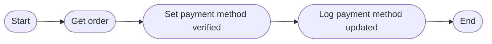

**Exceptions:**
- Throws `ArgumentNullException` if any dependency is null in constructor.

---

## [ValidateOrAddBuyerAggregateWhenOrderStartedDomainEventHandler](https://github.com/akhileshap9/automated-doc-poc-repo/blob/main/src/Ordering.API/Application/DomainEventHandlers/ValidateOrAddBuyerAggregateWhenOrderStartedDomainEventHandler.cs)

**Overview:**
Handles validation or addition of the buyer aggregate when an order is started by responding to the `OrderStartedDomainEvent`. Collaborates with `BuyerRepository` and `IOrderingIntegrationEventService` to verify or add payment methods, persist buyer information, and publish integration events. Implements `INotificationHandler<OrderStartedDomainEvent>`.

### Handle
**Overview:**
Public async method. Determines card type, finds or creates buyer, verifies or adds payment method, persists buyer, creates and saves integration event, and logs the update. Parameters: `OrderStartedDomainEvent domainEvent`, `CancellationToken cancellationToken`. Returns: `Task`.

**Call Graph:**
```mermaid
flowchart LR
    A([ValidateOrAddBuyerAggregateWhenOrderStartedDomainEventHandler.Handle]) --calls--> B([BuyerRepository.FindAsync])
    B --calls--> C([Buyer.Constructor])
    C --calls--> D([Buyer.VerifyOrAddPaymentMethod])
    D --calls--> E([BuyerRepository.Add])
    E --calls--> F([IUnitOfWork.SaveEntitiesAsync])
    F --calls--> G([OrderStatusChangedToSubmittedIntegrationEvent])
    G --calls--> H([OrderingIntegrationEventService.AddAndSaveEventAsync])
    H --calls--> I([OrderingApiTrace.LogOrderBuyerAndPaymentValidatedOrUpdated])
    click A "https://github.com/akhileshap9/automated-doc-poc-repo/blob/main/src/Ordering.API/Application/DomainEventHandlers/ValidateOrAddBuyerAggregateWhenOrderStartedDomainEventHandler.cs#L25" "ValidateOrAddBuyerAggregateWhenOrderStartedDomainEventHandler.Handle"
    click B "https://github.com/akhileshap9/automated-doc-poc-repo/blob/main/src/Ordering.Infrastructure/Repositories/BuyerRepository.cs#L38" "BuyerRepository.FindAsync"
    click E "https://github.com/akhileshap9/automated-doc-poc-repo/blob/main/src/Ordering.Infrastructure/Repositories/BuyerRepository.cs#L19" "BuyerRepository.Add"
    click F "https://github.com/akhileshap9/automated-doc-poc-repo/blob/main/src/Ordering.Infrastructure/OrderingContext.cs#L52" "IUnitOfWork.SaveEntitiesAsync"
```

??? Call Graph Legend
    - **ValidateOrAddBuyerAggregateWhenOrderStartedDomainEventHandler.Handle** - [ValidateOrAddBuyerAggregateWhenOrderStartedDomainEventHandler.Handle](#validateoraddbuyeraggregatewhenorderstarteddomaineventhandler)
    - **BuyerRepository.FindAsync** - [BuyerRepository.FindAsync](../Ordering.Infrastructure/Data%20Interactions.md#findasyncstring-identity)
    - **BuyerRepository.Add** - [BuyerRepository.Add](../Ordering.Infrastructure/Data%20Interactions.md#addbuyer-buyer)
    - **IUnitOfWork.SaveEntitiesAsync** - [SaveEntitiesAsync](../Ordering.Infrastructure/Data%20Interactions.md#saveentitiesasynccancellationtoken-cancellationtoken--default)

**Implementation flow:**
```mermaid
flowchart LR
    S([Start]) --> P1([Determine card type])
    P1 --> P2([Find buyer])
    P2 --> D1{Buyer exists?}
    D1 -- No --> P3([Create buyer])
    D1 -- Yes --> P4([Verify or add payment method])
    P3 --> P4
    P4 --> D2{Buyer existed?}
    D2 -- No --> P5([Add buyer])
    D2 -- Yes --> P6([Skip add])
    P5 --> P7([Save buyer])
    P6 --> P7
    P7 --> P8([Create integration event])
    P8 --> P9([Save integration event])
    P9 --> P10([Log update])
    P10 --> E([End])
    click P2 "https://github.com/akhileshap9/automated-doc-poc-repo/blob/main/src/Ordering.Infrastructure/Repositories/BuyerRepository.cs#L38" "BuyerRepository.FindAsync"
    click P5 "https://github.com/akhileshap9/automated-doc-poc-repo/blob/main/src/Ordering.Infrastructure/Repositories/BuyerRepository.cs#L19" "BuyerRepository.Add"
    click P7 "https://github.com/akhileshap9/automated-doc-poc-repo/blob/main/src/Ordering.Infrastructure/OrderingContext.cs#L52" "IUnitOfWork.SaveEntitiesAsync"
```

**Exceptions:**
- Throws `ArgumentNullException` if any dependency is null in constructor.

---
