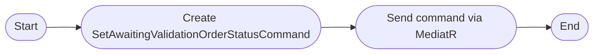
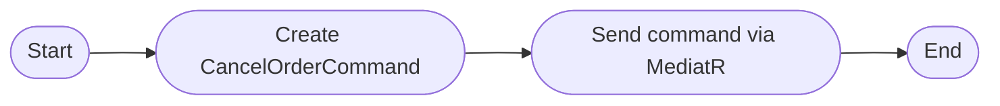
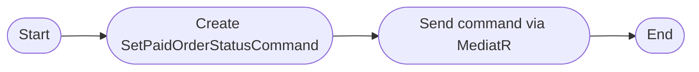
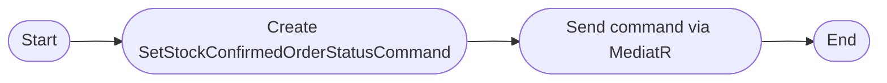
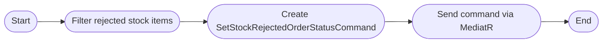

```mermaid
flowchart LR
    A([GracePeriodConfirmedIntegrationEventHandler.Handle]) --calls--> B([SetAwaitingValidationOrderStatusCommand.Constructor])
    B --calls--> C([IMediator.Send])
    click A "https://github.com/akhileshap9/automated-doc-poc-repo/blob/main/src/Ordering.API/Application/IntegrationEvents/EventHandling/GracePeriodConfirmedIntegrationEventHandler.cs#L10" "GracePeriodConfirmedIntegrationEventHandler.Handle"
    click B "https://github.com/akhileshap9/automated-doc-poc-repo/blob/main/src/Ordering.API/Application/Commands/SetAwaitingValidationOrderStatusCommand.cs" "SetAwaitingValidationOrderStatusCommand"
```

```mermaid
flowchart LR
    A([OrderPaymentFailedIntegrationEventHandler.Handle]) --calls--> B([CancelOrderCommand.Constructor])
    B --calls--> C([IMediator.Send])
    click A "https://github.com/akhileshap9/automated-doc-poc-repo/blob/main/src/Ordering.API/Application/IntegrationEvents/EventHandling/OrderPaymentFailedIntegrationEventHandler.cs#L8" "OrderPaymentFailedIntegrationEventHandler.Handle"
    click B "https://github.com/akhileshap9/automated-doc-poc-repo/blob/main/src/Ordering.API/Application/Commands/CancelOrderCommand.cs" "CancelOrderCommand"
```

```mermaid
flowchart LR
    A([OrderPaymentSucceededIntegrationEventHandler.Handle]) --calls--> B([SetPaidOrderStatusCommand.Constructor])
    B --calls--> C([IMediator.Send])
    click A "https://github.com/akhileshap9/automated-doc-poc-repo/blob/main/src/Ordering.API/Application/IntegrationEvents/EventHandling/OrderPaymentSucceededIntegrationEventHandler.cs#L8" "OrderPaymentSucceededIntegrationEventHandler.Handle"
    click B "https://github.com/akhileshap9/automated-doc-poc-repo/blob/main/src/Ordering.API/Application/Commands/SetPaidOrderStatusCommand.cs" "SetPaidOrderStatusCommand"
```

```mermaid
flowchart LR
    A([OrderStockConfirmedIntegrationEventHandler.Handle]) --calls--> B([SetStockConfirmedOrderStatusCommand.Constructor])
    B --calls--> C([IMediator.Send])
    click A "https://github.com/akhileshap9/automated-doc-poc-repo/blob/main/src/Ordering.API/Application/IntegrationEvents/EventHandling/OrderStockConfirmedIntegrationEventHandler.cs#L8" "OrderStockConfirmedIntegrationEventHandler.Handle"
    click B "https://github.com/akhileshap9/automated-doc-poc-repo/blob/main/src/Ordering.API/Application/Commands/SetStockConfirmedOrderStatusCommand.cs" "SetStockConfirmedOrderStatusCommand"
```

```mermaid
flowchart LR
    A([OrderStockRejectedIntegrationEventHandler.Handle]) --calls--> B([OrderStockRejectedIntegrationEvent.OrderStockItems.FindAll])
    B --calls--> C([Select])
    C --calls--> D([ToList])
    D --calls--> E([SetStockRejectedOrderStatusCommand.Constructor])
    E --calls--> F([IMediator.Send])
    click A "https://github.com/akhileshap9/automated-doc-poc-repo/blob/main/src/Ordering.API/Application/IntegrationEvents/EventHandling/OrderStockRejectedIntegrationEventHandler.cs#L8" "OrderStockRejectedIntegrationEventHandler.Handle"
    click E "https://github.com/akhileshap9/automated-doc-poc-repo/blob/main/src/Ordering.API/Application/Commands/SetStockRejectedOrderStatusCommand.cs" "SetStockRejectedOrderStatusCommand"
```

# Integration Event Handlers

Integration event handlers are responsible for processing events that originate from other microservices or external systems. They enable the Ordering.API service to react to changes in the broader system, such as payment results, stock confirmations, or order status updates. Handlers typically consume integration events, update domain models, and trigger workflows or notifications as needed.

---

## [GracePeriodConfirmedIntegrationEventHandler](https://github.com/akhileshap9/automated-doc-poc-repo/blob/main/src/Ordering.API/Application/IntegrationEvents/EventHandling/GracePeriodConfirmedIntegrationEventHandler.cs)

**Overview:**
Handles the `GracePeriodConfirmedIntegrationEvent` to confirm that the grace period for an order has completed, allowing the order process to continue for validation. Collaborates with `IMediator` to send commands and `ILogger` for logging. Implements `IIntegrationEventHandler<GracePeriodConfirmedIntegrationEvent>`.

### Handle
**Overview:**
Public async method. Logs the event, creates a `SetAwaitingValidationOrderStatusCommand`, logs the command, and sends it via MediatR. Parameters: `GracePeriodConfirmedIntegrationEvent @event`. Returns: `Task`.

**Call Graph:**

??? Call Graph Legend
    - **GracePeriodConfirmedIntegrationEventHandler.Handle** - [GracePeriodConfirmedIntegrationEventHandler.Handle](#graceperiodconfirmedintegrationeventhandler)
    - **SetAwaitingValidationOrderStatusCommand.Constructor** - [SetAwaitingValidationOrderStatusCommand](../Ordering.API/Models.md#setawaitingvalidationorderstatuscommand)

**Implementation flow:**

**Exceptions:**
- None explicit; errors are handled by MediatR or logging infrastructure.

---

## [OrderPaymentFailedIntegrationEventHandler](https://github.com/akhileshap9/automated-doc-poc-repo/blob/main/src/Ordering.API/Application/IntegrationEvents/EventHandling/OrderPaymentFailedIntegrationEventHandler.cs)

**Overview:**
Handles the `OrderPaymentFailedIntegrationEvent` to process failed payment events and trigger order cancellation. Collaborates with `IMediator` to send commands and `ILogger` for logging. Implements `IIntegrationEventHandler<OrderPaymentFailedIntegrationEvent>`.

### Handle
**Overview:**
Public async method. Logs the event, creates a `CancelOrderCommand`, logs the command, and sends it via MediatR. Parameters: `OrderPaymentFailedIntegrationEvent @event`. Returns: `Task`.

**Call Graph:**

??? Call Graph Legend
    - **OrderPaymentFailedIntegrationEventHandler.Handle** - [OrderPaymentFailedIntegrationEventHandler.Handle](#orderpaymentfailedintegrationeventhandler)
    - **CancelOrderCommand.Constructor** - [CancelOrderCommand](../Ordering.API/Models.md#cancelordercommand)

**Implementation flow:**

**Exceptions:**
- None explicit; errors are handled by MediatR or logging infrastructure.

---

## [OrderPaymentSucceededIntegrationEventHandler](https://github.com/akhileshap9/automated-doc-poc-repo/blob/main/src/Ordering.API/Application/IntegrationEvents/EventHandling/OrderPaymentSucceededIntegrationEventHandler.cs)

**Overview:**
Handles the `OrderPaymentSucceededIntegrationEvent` to process successful payment events and update order status to paid. Collaborates with `IMediator` to send commands and `ILogger` for logging. Implements `IIntegrationEventHandler<OrderPaymentSucceededIntegrationEvent>`.

### Handle
**Overview:**
Public async method. Logs the event, creates a `SetPaidOrderStatusCommand`, logs the command, and sends it via MediatR. Parameters: `OrderPaymentSucceededIntegrationEvent @event`. Returns: `Task`.

**Call Graph:**

??? Call Graph Legend
    - **OrderPaymentSucceededIntegrationEventHandler.Handle** - [OrderPaymentSucceededIntegrationEventHandler.Handle](#orderpaymentsucceededintegrationeventhandler)
    - **SetPaidOrderStatusCommand.Constructor** - [SetPaidOrderStatusCommand](../Ordering.API/Models.md#setpaidorderstatuscommand)

**Implementation flow:**

**Exceptions:**
- None explicit; errors are handled by MediatR or logging infrastructure.

---

## [OrderStockConfirmedIntegrationEventHandler](https://github.com/akhileshap9/automated-doc-poc-repo/blob/main/src/Ordering.API/Application/IntegrationEvents/EventHandling/OrderStockConfirmedIntegrationEventHandler.cs)

**Overview:**
Handles the `OrderStockConfirmedIntegrationEvent` to process stock confirmation events and update order status. Collaborates with `IMediator` to send commands and `ILogger` for logging. Implements `IIntegrationEventHandler<OrderStockConfirmedIntegrationEvent>`.

### Handle
**Overview:**
Public async method. Logs the event, creates a `SetStockConfirmedOrderStatusCommand`, logs the command, and sends it via MediatR. Parameters: `OrderStockConfirmedIntegrationEvent @event`. Returns: `Task`.

**Call Graph:**

??? Call Graph Legend
    - **OrderStockConfirmedIntegrationEventHandler.Handle** - [OrderStockConfirmedIntegrationEventHandler.Handle](#orderstockconfirmedintegrationeventhandler)
    - **SetStockConfirmedOrderStatusCommand.Constructor** - [SetStockConfirmedOrderStatusCommand](../Ordering.API/Models.md#setstockconfirmedorderstatuscommand)

**Implementation flow:**

**Exceptions:**
- None explicit; errors are handled by MediatR or logging infrastructure.

---

## [OrderStockRejectedIntegrationEventHandler](https://github.com/akhileshap9/automated-doc-poc-repo/blob/main/src/Ordering.API/Application/IntegrationEvents/EventHandling/OrderStockRejectedIntegrationEventHandler.cs)

**Overview:**
Handles the `OrderStockRejectedIntegrationEvent` to process stock rejection events and update order status. Collaborates with `IMediator` to send commands and `ILogger` for logging. Implements `IIntegrationEventHandler<OrderStockRejectedIntegrationEvent>`.

### Handle
**Overview:**
Public async method. Logs the event, filters rejected stock items, creates a `SetStockRejectedOrderStatusCommand`, logs the command, and sends it via MediatR. Parameters: `OrderStockRejectedIntegrationEvent @event`. Returns: `Task`.

**Call Graph:**

??? Call Graph Legend
    - **OrderStockRejectedIntegrationEventHandler.Handle** - [OrderStockRejectedIntegrationEventHandler.Handle](#orderstockrejectedintegrationeventhandler)
    - **SetStockRejectedOrderStatusCommand.Constructor** - [SetStockRejectedOrderStatusCommand](../Ordering.API/Models.md#setstockrejectedorderstatuscommand)

**Implementation flow:**

**Exceptions:**
- None explicit; errors are handled by MediatR or logging infrastructure.

---
