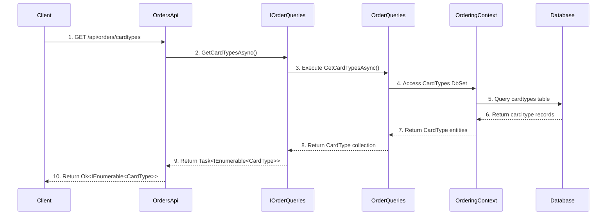

# Card Types Management

## Overview
The Card Types Management feature provides functionality to retrieve available payment card types within the Ordering API. It offers a simple GET endpoint that returns a list of supported card types for use in order creation and payment processing. This feature serves as a reference data service for frontend applications and payment validation systems, ensuring that only supported card types are used throughout the order creation process.

## Sequence Diagram


??? Sequence Diagram Legend
    - **1. [GET /api/orders/cardtypes](https://github.com/akhileshap9/automated-doc-poc-repo/blob/main/src/Ordering.API/Apis/OrdersApi.cs#L105)** - Controller method for invoking retrieve card types
    - **2. [GetCardTypesAsync()](../Queries.md#getcardtypesasync)** - Query service method call to retrieve card types
    - **3. [Execute GetCardTypesAsync()](../Queries.md#getcardtypesasync)** - Concrete implementation of card types query operation
    - **4. [Access CardTypes DbSet](../../Ordering.Infrastructure/Data%20Interactions.md#orderingcontext)** - Entity Framework DbSet access for card types
    - **5. [Query cardtypes table](../../Ordering.Infrastructure/Configuration.md#cardtypeentitytypeconfiguration)** - Database query execution via EF Core mapping
    - **6. Return card type records** - Raw database result set from cardtypes table
    - **7. [Return CardType entities](../../Ordering.Domain/ValueObject.md#cardtype)** - Mapped Entity Framework entities to domain objects
    - **8. [Return CardType collection](../Queries.md#getcardtypesasync)** - Query service result collection
    - **9. [Return Task<IEnumerable<CardType>>](../Queries.md#getcardtypesasync)** - Async method result with card type collection
    - **10. Return Ok<IEnumerable<CardType>>** - HTTP 200 response with card types collection

## Implementation Flow

```mermaid
flowchart LR
    Start([HTTP GET Request]) --> Validate{Valid Request?}
    Validate -- No --> BadRequest[Return BadRequest]
    Validate -- Yes --> Inject[Inject IOrderQueries]
    Inject --> CallQuery[Call GetCardTypesAsync]
    CallQuery --> QueryDB[Query CardTypes Table]
    QueryDB --> MapResults[Map to CardType DTOs]
    MapResults --> CheckResults{Results Found?}
    CheckResults -- Yes --> ReturnOk[Return Ok with CardTypes]
    CheckResults -- No --> ReturnEmpty[Return Empty Collection]
    ReturnOk --> End([HTTP 200 Response])
    ReturnEmpty --> End
    BadRequest --> EndError([HTTP 400 Response])

    click Start "https://github.com/akhileshap9/automated-doc-poc-repo/blob/main/src/Ordering.API/Apis/OrdersApi.cs#L105" "API Endpoint"
    click Inject "https://github.com/akhileshap9/automated-doc-poc-repo/blob/main/src/Ordering.API/Application/Queries/IOrderQueries.cs" "IOrderQueries Interface"
    click CallQuery "https://github.com/akhileshap9/automated-doc-poc-repo/blob/main/src/Ordering.API/Application/Queries/OrderQueries.cs#L51" "OrderQueries Implementation"
    click QueryDB "https://github.com/akhileshap9/automated-doc-poc-repo/blob/main/src/Ordering.Infrastructure/OrderingContext.cs" "OrderingContext"
    click MapResults "https://github.com/akhileshap9/automated-doc-poc-repo/blob/main/src/Ordering.API/Application/Queries/CardType.cs" "CardType DTO"
```


??? Implementation Flow Legend
    - **1. [HTTP GET Request](https://github.com/akhileshap9/automated-doc-poc-repo/blob/main/src/Ordering.API/Apis/OrdersApi.cs#L100)** - Controller method endpoint for card types retrieval
    - **2. Valid Request?** - ASP.NET Core request validation and routing
    - **3. [Inject OrderQueries](../Queries.md#orderqueries)** - Dependency injection of concrete query service implementation
    - **4. [Call GetCardTypesAsync](../Queries.md#getcardtypesasync)** - Execute query method to retrieve card types from database
    - **5. [Query CardTypes Table](../../Ordering.Infrastructure/Configuration.md#cardtypeentitytypeconfiguration)** - Entity Framework Core database query execution
    - **6. [Map to CardType DTOs](../Queries.md#getcardtypesasync)** - Transform domain entities to data transfer objects
    - **7. Results Found?** - Collection validation check for query results
    - **8. [Return Ok with CardTypes](https://github.com/akhileshap9/automated-doc-poc-repo/blob/main/src/Ordering.API/Apis/OrdersApi.cs#L105)** - TypedResults.Ok response with card types
    - **9. Return Empty Collection** - Empty IEnumerable<CardType> when no results found

## Pseudo Code
```
FUNCTION GetCardTypesAsync(orderQueries: IOrderQueries)
BEGIN
    TRY
        // Step 1: Call the query service to retrieve card types
        cardTypes = AWAIT orderQueries.GetCardTypesAsync()
        
        // Step 2: Query the database via Entity Framework
        WITHIN OrderQueries.GetCardTypesAsync():
            dbCardTypes = context.CardTypes
                .Select(ct => new CardType 
                {
                    Id = ct.Id,
                    Name = ct.Name
                })
                .ToListAsync()
            
            RETURN dbCardTypes
        
        // Step 3: Return successful HTTP response
        RETURN TypedResults.Ok(cardTypes)
        
    CATCH DatabaseException ex
        // Handle database connectivity issues
        LOG error: "Database error retrieving card types: " + ex.Message
        RETURN TypedResults.Problem("Database error occurred")
        
    CATCH Exception ex
        // Handle unexpected exceptions
        LOG error: "Unexpected error: " + ex.Message
        RETURN TypedResults.Problem("Internal server error")
        
END FUNCTION

// Predefined card types seeded in database:
// 1. Amex (Id: 1)
// 2. Visa (Id: 2) 
// 3. MasterCard (Id: 3)
```

## Dependencies
- **OrderQueries** - [OrderQueries Implementation](../Queries.md#orderqueries) - Concrete implementation of order query operations using Entity Framework
- **IOrderQueries** - [IOrderQueries Interface](../Queries.md#iorderqueries) - Query service interface contract for order-related data access operations
- **CardType (Query DTO)** - [CardType Query DTO](../Queries.md#getcardtypesasync) - Data transfer object representing payment card type information for API responses
- **CardType (Domain Entity)** - [CardType Domain Entity](../../Ordering.Domain/ValueObject.md#cardtype) - Domain value object representing payment card types in the system
- **OrderingContext** - [OrderingContext](../../Ordering.Infrastructure/Data%20Interactions.md#orderingcontext) - Entity Framework database context for data access operations
- **CardTypeEntityTypeConfiguration** - [CardTypeEntityTypeConfiguration](../../Ordering.Infrastructure/Configuration.md#cardtypeentitytypeconfiguration) - EF Core entity configuration for CardType database mapping
- **OrderingContextSeed** - [OrderingContextSeed](https://github.com/akhileshap9/automated-doc-poc-repo/blob/main/src/Ordering.API/Infrastructure/OrderingContextSeed.cs) - Database seeder that initializes predefined card types data
- **TypedResults** - ASP.NET Core typed HTTP results for strongly-typed response handling

## Technical Implementation Details

### API Endpoint
- **Route**: `GET /api/orders/cardtypes`
- **HTTP Method**: GET
- **Response Type**: `Ok<IEnumerable<CardType>>`
- **Authentication**: Not required (public reference data)
- **Caching**: Recommended for performance optimization

### Database Schema
The feature relies on the `cardtypes` table with the following structure:
- **Id**: Primary key, integer, not auto-generated
- **Name**: Card type name, varchar(200), required

### Predefined Card Types
The system comes with three predefined card types:
1. **Amex** (Id: 1)
2. **Visa** (Id: 2)
3. **MasterCard** (Id: 3)

### Performance Considerations
- Results are lightweight reference data suitable for caching
- No complex joins or calculations required
- Consider implementing response caching middleware
- Database query is simple SELECT with projection

### Error Handling
- **Database Exceptions**: Handled by global exception middleware
- **No Data Scenarios**: Returns empty collection (not an error)
- **General Exceptions**: Logged and return generic problem response

### Usage Examples
This endpoint is typically used by:
- Frontend payment forms for card type selection
- Order creation validation to ensure valid card types
- Payment processing systems for card type verification
- Administrative interfaces for payment method management

??? Notes
    - Read-only operation with minimal resource overhead
    - Returns static reference data that changes infrequently
    - No side effects or state modifications
    - Suitable for client-side caching strategies