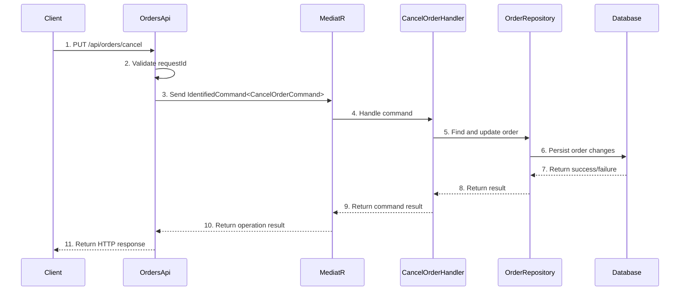

# Order Cancellation

## Overview
The Order Cancellation feature provides functionality to cancel existing orders within the Ordering API. It handles order cancellation requests through a PUT endpoint that validates request IDs, processes cancellation commands via MediatR, and returns appropriate responses. This feature ensures proper order state management and provides audit logging for cancellation operations.

## Sequence Diagram

??? Sequence Diagram Legend
    - **1. PUT /api/orders/cancel** - [OrdersApi.CancelOrderAsync](https://github.com/akhileshap9/automated-doc-poc-repo/blob/main/src/Ordering.API/Apis/OrdersApi.cs#L21)
    - **2. Validate requestId** - Request ID validation logic
    - **3. Send IdentifiedCommand<CancelOrderCommand>** - [CancelOrderCommand](../Commands.md#cancelordercommand)
    - **4. Handle command** - [CancelOrderCommandHandler](../Commands.md#cancelordercommandhandler)
    - **5. Find and update order** - Order repository operations
    - **6. Persist order changes** - Database persistence layer
    - **7. Return success/failure** - Database operation result
    - **8. Return result** - Repository operation result
    - **9. Return command result** - Command handler result
    - **10. Return operation result** - MediatR mediation result
    - **11. Return HTTP response** - API response to client

## Dependencies
- **CancelOrderCommand** - [CancelOrderCommand](../Commands.md#cancelordercommand) - Command for cancelling orders with order number validation
- **CancelOrderCommandHandler** - [CancelOrderCommandHandler](../Commands.md#cancelordercommandhandler) - Handler that processes order cancellation logic
- **IdentifiedCommand** - [IdentifiedCommand](../Commands.md#identifiedcommand) - Wrapper command that includes request ID for idempotency
- **OrderServices** - Service collection containing MediatR, Logger, and other dependencies
- **MediatR** - Command/query mediator for handling business logic
- **TypedResults** - ASP.NET Core typed HTTP results for response handling

??? Notes
    - Requires valid request ID header (`x-requestid`) to prevent duplicate operations
    - Returns 400 Bad Request for invalid/empty request IDs
    - Returns 500 Internal Server Error if cancellation processing fails
    - Logs all command operations for audit purposes

## Exception Handling
- **Empty RequestId**: Returns BadRequest with descriptive message
- **Command Processing Failure**: Returns ProblemHttpResult with 500 status code
- **General Exceptions**: Handled by global exception middleware
