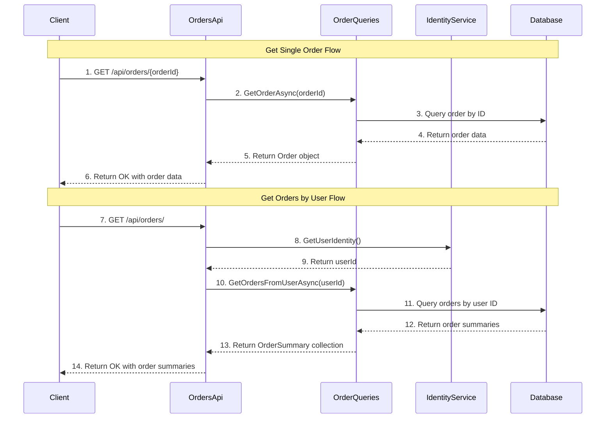

# Order Retrieval

## Overview
The Order Retrieval feature provides functionality to query and retrieve order information from the Ordering API. It includes endpoints for fetching individual orders by ID and retrieving all orders for a specific user. This feature handles order data access through query services and provides appropriate error handling for missing resources.

## Sequence Diagram

??? Sequence Diagram Legend
    - **1. GET /api/orders/{orderId}** - [OrdersApi.GetOrderAsync](https://github.com/akhileshap9/automated-doc-poc-repo/blob/main/src/Ordering.API/Apis/OrdersApi.cs#L73)
    - **2. GetOrderAsync(orderId)** - [GetOrderAsync](../Queries.md#getorderasync)
    - **3. Query order by ID** - Database query execution
    - **4. Return order data** - Database result
    - **5. Return Order object** - Query service result
    - **6. Return OK with order data** - API response with order details
    - **7. GET /api/orders/** - [OrdersApi.GetOrdersByUserAsync](https://github.com/akhileshap9/automated-doc-poc-repo/blob/main/src/Ordering.API/Apis/OrdersApi.cs#L84)
    - **8. GetUserIdentity()** - Identity service user extraction
    - **9. Return userId** - Current user identifier
    - **10. GetOrdersFromUserAsync(userId)** - [GetOrdersFromUserAsync](../Queries.md#getordersfromuserasync)
    - **11. Query orders by user ID** - Database query execution
    - **12. Return order summaries** - Database result
    - **13. Return OrderSummary collection** - Query service result
    - **14. Return OK with order summaries** - API response with order list

## Dependencies
- **IOrderQueries** - [IOrderQueries](../Queries.md#iorderqueries) - Query service interface for order data access
- **OrderQueries** - [OrderQueries](../Queries.md#orderqueries) - Concrete implementation of order query operations
- **OrderServices** - Service collection containing queries, identity service, and logger
- **IIdentityService** - Service for extracting user identity from current context
- **Order** - [Order](../Models.md#order) - Order entity model for detailed order information
- **OrderSummary** - [OrderSummary](../Models.md#ordersummary) - Summary model for order list views
- **TypedResults** - ASP.NET Core typed HTTP results for response handling

??? Notes
    - Single order retrieval returns 404 Not Found if order doesn't exist
    - User orders retrieval requires authenticated context to extract user identity
    - All queries are read-only operations with no side effects
    - Supports efficient querying through optimized database access patterns

## Exception Handling
- **Order Not Found**: Returns NotFound result for invalid order IDs
- **Authentication Issues**: Handled by identity service integration
- **Database Exceptions**: Caught and converted to appropriate HTTP responses
- **General Exceptions**: Handled by global exception middleware
