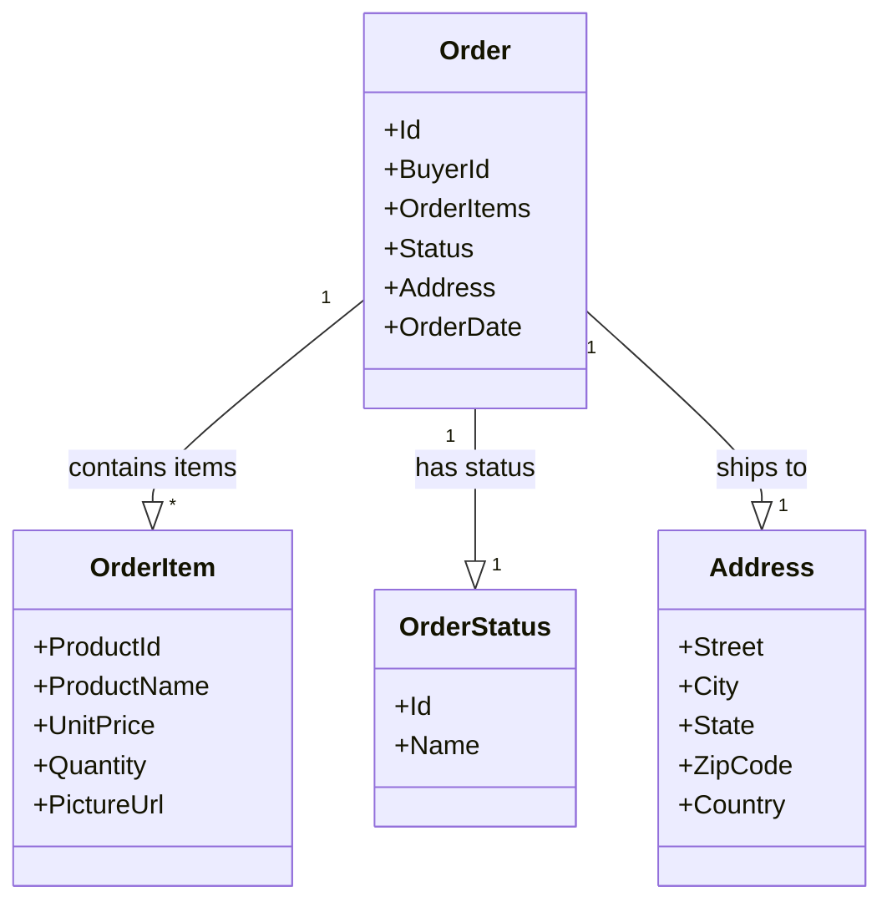
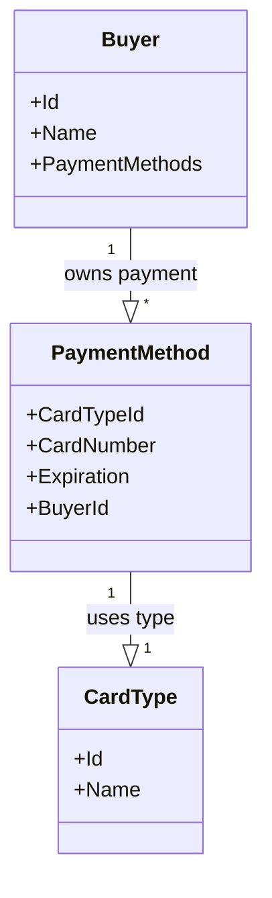

# Aggregates

Aggregates are the main consistency boundaries in the domain. They encapsulate entities and value objects, enforce invariants, and raise domain events.

---

## Order (Aggregate)

**Overview:**
The `Order` aggregate represents a customer's order, including its items, status, and delivery address. It coordinates order lifecycle, status transitions, and domain events.

**Properties:**

| Property    | Description               | Mandatory |
|:----------- |:------------------------- |:---------:|
| Id          | Unique order identifier   | Yes       |
| BuyerId     | Identifier for the buyer  | Yes       |
| OrderItems  | List of items in the order| Yes       |
| Status      | Current order status      | Yes       |
| Address     | Delivery address          | Yes       |
| OrderDate   | Date the order was placed | Yes       |

**Class Diagram:**

**Legend:**

- **Order**: [Documentation](./Aggregate.md#order-aggregate)
- **OrderItem**: [Documentation](./ValueObject.md#orderitem)
- **OrderStatus**: [Documentation](./ValueObject.md#orderstatus)
- **Address**: [Documentation](./ValueObject.md#address)

**Domain Operations:**

- Submit order (raises [OrderStartedDomainEvent](./DomainEvent.md#orderstarteddomainevent))
- Cancel order (raises [OrderCancelledDomainEvent](./DomainEvent.md#ordercancelleddomainevent))
- Ship order (raises [OrderShippedDomainEvent](./DomainEvent.md#ordershippeddomainevent))
- Change status (raises status change domain events)

[View on GitHub](https://github.com/akhileshap9/automated-doc-poc-repo/blob/main/src/Ordering.Domain/AggregatesModel/OrderAggregate/Order.cs)

---

## Buyer (Aggregate)

**Overview:**
The `Buyer` aggregate models a customer, including their payment methods and identity. It manages payment verification and buyer-related domain events.

**Properties:**

| Property       | Description              | Mandatory |
|:-------------- |:------------------------ |:---------:|
| Id             | Unique buyer identifier  | Yes       |
| Name           | Buyer's name             | Yes       |
| PaymentMethods | List of payment methods  | Yes       |

**Class Diagram:**

**Legend:**

- **Buyer**: [Documentation](./Aggregate.md#buyer-aggregate)
- **PaymentMethod**: [Documentation](./ValueObject.md#paymentmethod)
- **CardType**: [Documentation](./ValueObject.md#cardtype)

**Domain Operations:**

- Verify payment method (raises [BuyerPaymentMethodVerifiedDomainEvent](./DomainEvent.md#buyerpaymentmethodverifieddomainevent))
- Add payment method

[View on GitHub](https://github.com/akhileshap9/automated-doc-poc-repo/blob/main/src/Ordering.Domain/AggregatesModel/BuyerAggregate/Buyer.cs)
