# Overview

The `Ordering.Infrastructure` library provides the data access, configuration, and service integration layer for the Ordering domain. It enables robust Entity Framework Core support for schema management, repository patterns, idempotency, and MediatR-based event handling. The library is designed for maintainability and extensibility, supporting advanced scenarios like migrations, domain event dispatching, and custom entity configurations.

The project is organized into clear classification groups: Configuration, Data Interactions, Services, and Migrations. Each group is documented in its own markdown file, making it easy for developers to navigate and understand the responsibilities of each area.

## Project Structure

```text
Ordering.Infrastructure/
├── EntityConfigurations/   # Entity type configuration classes for EF Core
├── Idempotency/            # Classes for request management and idempotency
├── Migrations/             # EF Core migration classes and model snapshots
├── Repositories/           # Repository implementations for domain entities
├── MediatorExtension.cs    # MediatR integration extension
├── OrderingContext.cs      # Main EF Core DbContext
├── GlobalUsings.cs         # Global using directives
```
- `EntityConfigurations/`: Contains configuration classes for mapping domain entities to the database schema.
- `Idempotency/`: Implements request management and idempotency logic for reliable command processing.
- `Migrations/`: Holds migration classes and model snapshots for schema evolution.
- `Repositories/`: Provides repository implementations for Buyer and Order entities.
- `MediatorExtension.cs`: Integrates MediatR for domain event and command handling.
- `OrderingContext.cs`: The main EF Core DbContext for the ordering domain.
- `GlobalUsings.cs`: Centralizes global using directives for the project.

## Dependency Diagram

```mermaid
flowchart TD
    GlobalUsings["GlobalUsings.cs"]
    BuyerConfig["BuyerEntityTypeConfiguration.cs"]
    OrderConfig["OrderEntityTypeConfiguration.cs"]
    CardTypeConfig["CardTypeEntityTypeConfiguration.cs"]
    PaymentMethodConfig["PaymentMethodEntityTypeConfiguration.cs"]
    OrderItemConfig["OrderItemEntityTypeConfiguration.cs"]
    ClientRequestConfig["ClientRequestEntityTypeConfiguration.cs"]
    Migrations["Migrations/*.cs"]

    OrderingContext["OrderingContext.cs"]
    BuyerRepo["BuyerRepository.cs"]
    OrderRepo["OrderRepository.cs"]
    RequestManager["RequestManager.cs"]
    IRequestManager["IRequestManager.cs"]
    ClientRequest["ClientRequest.cs"]
    MediatorExtension["MediatorExtension.cs"]

    GlobalUsings --> OrderingContext
    BuyerConfig --> OrderingContext
    OrderConfig --> OrderingContext
    CardTypeConfig --> OrderingContext
    PaymentMethodConfig --> OrderingContext
    OrderItemConfig --> OrderingContext
    ClientRequestConfig --> OrderingContext
    Migrations --> OrderingContext

    OrderingContext --> BuyerRepo
    OrderingContext --> OrderRepo
    OrderingContext --> RequestManager
    OrderingContext --> ClientRequest

    RequestManager --> IRequestManager
    RequestManager --> ClientRequest

    BuyerRepo --> MediatorExtension
    OrderRepo --> MediatorExtension
    RequestManager --> MediatorExtension
    click GlobalUsings "https://github.com/akhileshap9/automated-doc-poc-repo/blob/main/src/Ordering.Infrastructure/GlobalUsings.cs#L1" "GlobalUsings.cs"
    click BuyerConfig "https://github.com/akhileshap9/automated-doc-poc-repo/blob/main/src/Ordering.Infrastructure/EntityConfigurations/BuyerEntityTypeConfiguration.cs#L1" "BuyerEntityTypeConfiguration.cs"
    click OrderConfig "https://github.com/akhileshap9/automated-doc-poc-repo/blob/main/src/Ordering.Infrastructure/EntityConfigurations/OrderEntityTypeConfiguration.cs#L1" "OrderEntityTypeConfiguration.cs"
    click CardTypeConfig "https://github.com/akhileshap9/automated-doc-poc-repo/blob/main/src/Ordering.Infrastructure/EntityConfigurations/CardTypeEntityTypeConfiguration.cs#L1" "CardTypeEntityTypeConfiguration.cs"
    click PaymentMethodConfig "https://github.com/akhileshap9/automated-doc-poc-repo/blob/main/src/Ordering.Infrastructure/EntityConfigurations/PaymentMethodEntityTypeConfiguration.cs#L1" "PaymentMethodEntityTypeConfiguration.cs"
    click OrderItemConfig "https://github.com/akhileshap9/automated-doc-poc-repo/blob/main/src/Ordering.Infrastructure/EntityConfigurations/OrderItemEntityTypeConfiguration.cs#L1" "OrderItemEntityTypeConfiguration.cs"
    click ClientRequestConfig "https://github.com/akhileshap9/automated-doc-poc-repo/blob/main/src/Ordering.Infrastructure/EntityConfigurations/ClientRequestEntityTypeConfiguration.cs#L1" "ClientRequestEntityTypeConfiguration.cs"
    click Migrations "https://github.com/akhileshap9/automated-doc-poc-repo/blob/main/src/Ordering.Infrastructure/Migrations/" "Migrations"
    click OrderingContext "https://github.com/akhileshap9/automated-doc-poc-repo/blob/main/src/Ordering.Infrastructure/OrderingContext.cs#L1" "OrderingContext.cs"
    click BuyerRepo "https://github.com/akhileshap9/automated-doc-poc-repo/blob/main/src/Ordering.Infrastructure/Repositories/BuyerRepository.cs#L1" "BuyerRepository.cs"
    click OrderRepo "https://github.com/akhileshap9/automated-doc-poc-repo/blob/main/src/Ordering.Infrastructure/Repositories/OrderRepository.cs#L1" "OrderRepository.cs"
    click RequestManager "https://github.com/akhileshap9/automated-doc-poc-repo/blob/main/src/Ordering.Infrastructure/Idempotency/RequestManager.cs#L1" "RequestManager.cs"
    click IRequestManager "https://github.com/akhileshap9/automated-doc-poc-repo/blob/main/src/Ordering.Infrastructure/Idempotency/IRequestManager.cs#L1" "IRequestManager.cs"
    click ClientRequest "https://github.com/akhileshap9/automated-doc-poc-repo/blob/main/src/Ordering.Infrastructure/Idempotency/ClientRequest.cs#L1" "ClientRequest.cs"
    click MediatorExtension "https://github.com/akhileshap9/automated-doc-poc-repo/blob/main/src/Ordering.Infrastructure/MediatorExtension.cs#L1" "MediatorExtension.cs"
```



??? note "Legend"
    - [**GlobalUsings.cs**](./Configuration.md#globalusingscs): Global using directives
    - [**BuyerConfig**](./Configuration.md#buyerentitytypeconfigurationcs): Buyer entity configuration
    - [**OrderConfig**](./Configuration.md#orderentitytypeconfigurationcs): Order entity configuration
    - [**CardTypeConfig**](./Configuration.md#cardtypeentitytypeconfigurationcs): Card type configuration
    - [**PaymentMethodConfig**](./Configuration.md#paymentmethodentitytypeconfigurationcs): Payment method configuration
    - [**OrderItemConfig**](./Configuration.md#orderitementitytypeconfigurationcs): Order item configuration
    - [**ClientRequestConfig**](./Configuration.md#clientrequestentitytypeconfigurationcs): Client request configuration
    - [**Migrations**](./Migrations.md): EF Core migrations
    - [**OrderingContext**](./Data%20Interactions.md#orderingcontextcs): Main EF Core DbContext
    - [**BuyerRepo**](./Data%20Interactions.md#buyerrepositorycs): Buyer repository
    - [**OrderRepo**](./Data%20Interactions.md#orderrepositorycs): Order repository
    - [**RequestManager**](./Data%20Interactions.md#requestmanagercs): Request management/idempotency
    - [**IRequestManager**](./Data%20Interactions.md#irequestmanagercs): Request manager interface
    - [**ClientRequest**](./Data%20Interactions.md#clientrequestcs): Client request entity
    - [**MediatorExtension**](./Services.md#mediatorextensioncs): MediatR integration extension

## Documentation Areas

- [Configuration](./Configuration.md): Entity type configuration classes for EF Core.
- [Data Interactions](./Data%20Interactions.md): DbContext, repositories, and idempotency logic.
- [Services](./Services.md): MediatR integration and domain event handling.
- [Migrations](./Migrations.md): EF Core migration classes and model snapshots.


