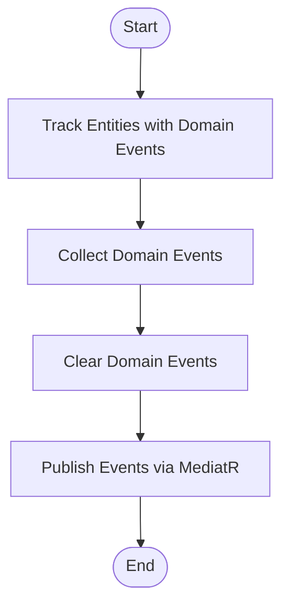

# Services

This section documents the service extension class in the `Ordering.Infrastructure` library.

## MediatorExtension

[Source: MediatorExtension.cs](https://github.com/akhileshap9/automated-doc-poc-repo/blob/main/src/Ordering.Infrastructure/MediatorExtension.cs#L1)

### Overview

`MediatorExtension` provides an extension method for MediatR to dispatch domain events tracked by the `OrderingContext`. This enables decoupled, consistent handling of domain events after changes to domain entities.

### Methods

#### DispatchDomainEventsAsync

**Overview:**
Dispatches all domain events for entities tracked by the `OrderingContext` using MediatR. After publishing, it clears the domain events from each entity.

**Call Graph:**


**Flow Diagram:**


*Description:* The method finds all entities with domain events, collects and publishes those events using MediatR, and then clears the events from each entity to prevent duplicate handling.

**Exceptions:**
- Throws if MediatR is not properly configured or if publishing fails.

### Threading Considerations

- The method is asynchronous and should be awaited to avoid blocking the calling thread.
- Domain events are published sequentially in the current implementation.

### Usage Example

```csharp
await mediator.DispatchDomainEventsAsync(orderingContext);
```

---
