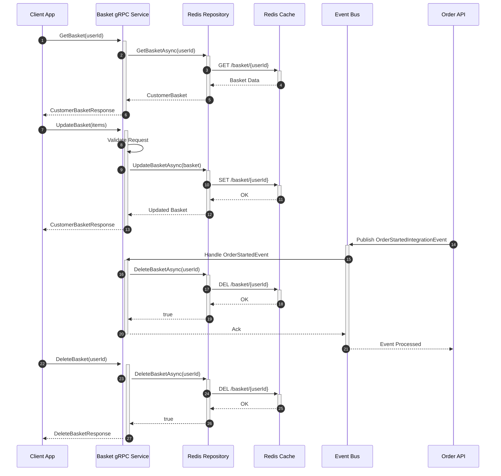
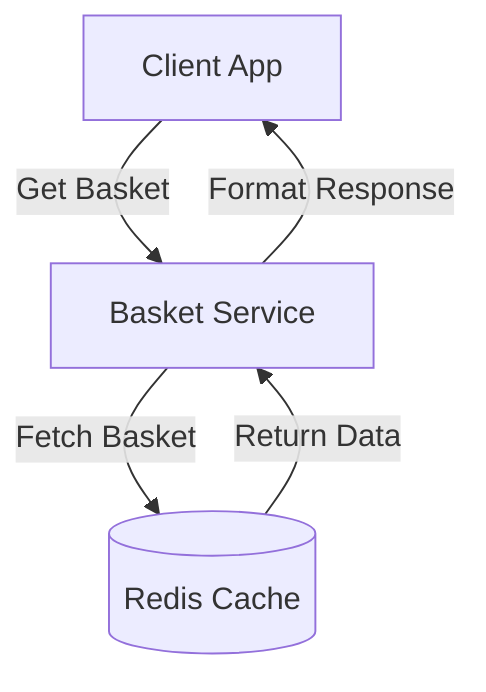
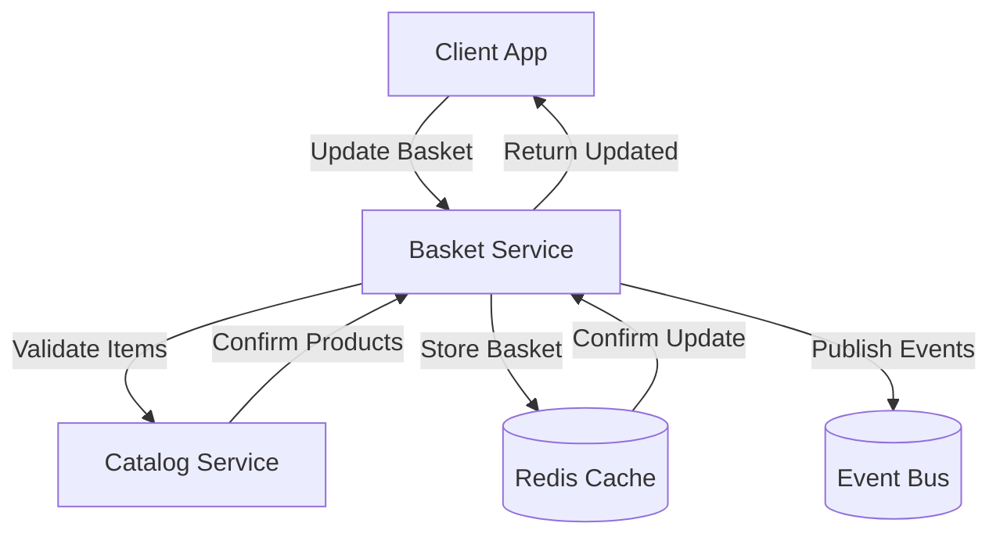
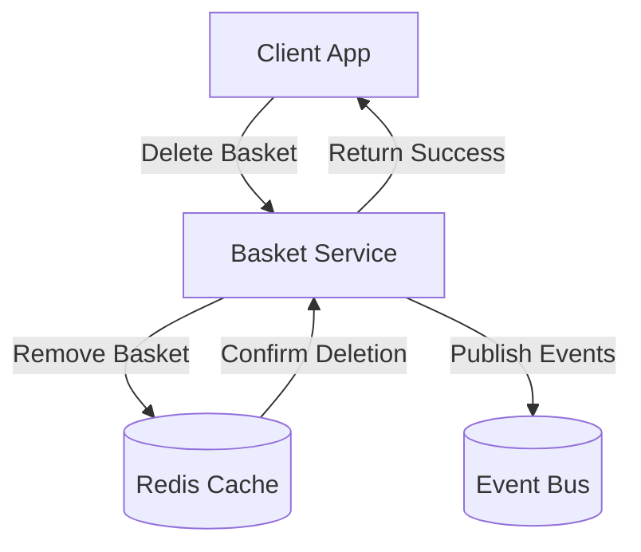
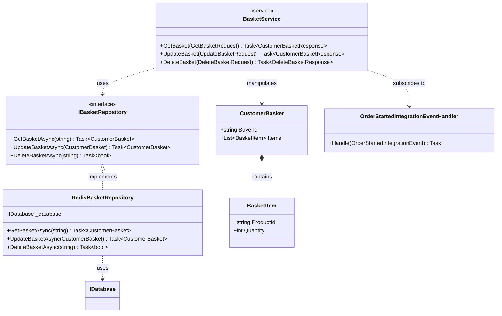

# eShop - Basket gRPC Service Documentation

## 1. Feature Overview

### Purpose
The Basket API is a gRPC-based microservice that manages shopping baskets in the eShop application. It serves as a temporary storage solution for users' shopping sessions, using Redis as its backing store and integrating with other services through an event-driven architecture.

### Business Motivation
- Enable seamless shopping cart management across devices
- Provide high-performance basket operations using gRPC
- Support real-time basket updates and synchronization
- Integrate with ordering system for checkout process
- Ensure data consistency during concurrent operations

### Key Stakeholders
- End users (shoppers managing their baskets)
- Client applications (web, mobile, desktop)
- Order processing system
- System administrators
- DevOps team (monitoring and maintenance)

## 2. Business Implementation Details

### Business Rules

1. Basket Management
   - Each user can have only one active basket
   - Baskets are identified by user ID
   - Anonymous users can create temporary baskets
   - Basket items must reference valid products
   - Quantity must be positive integers

2. Session Management
   - Baskets are stored in Redis with configurable expiration
   - Basket state is preserved across user sessions
   - Automatic cleanup of abandoned baskets
   - Concurrent access handling

3. Integration Rules
   - Basket is cleared after successful order creation
   - Real-time synchronization with catalog updates
   - Support for order draft creation
   - Price consistency validation

### Use Cases

1. Shopping Session Management
   - Create/retrieve shopping basket
   - Add items to basket
   - Update item quantities
   - Remove items from basket
   - Clear entire basket
   - View basket contents

2. Order Processing
   - Convert basket to order draft
   - Validate basket contents
   - Process checkout
   - Handle failed checkouts
   - Maintain order history

3. Basket Synchronization
   - Handle product updates
   - Manage price changes
   - Deal with product availability
   - Cross-device synchronization
   - Session management

### Business Flow Sequence Diagram



The sequence diagram illustrates the four main flows in the Basket API:
1. Retrieving a basket: Shows the flow from client request through Redis cache
2. Updating a basket: Demonstrates validation and Redis update operations
3. Order event handling: Shows the interaction with the Event Bus when an order starts
4. Deleting a basket: Shows the cleanup process, either manual or event-triggered

## 3. Technical Implementation Details

### gRPC Service Definition

```protobuf
service Basket {
    rpc GetBasket(GetBasketRequest) returns (CustomerBasketResponse) {}
    rpc UpdateBasket(UpdateBasketRequest) returns (CustomerBasketResponse) {}
    rpc DeleteBasket(DeleteBasketRequest) returns (DeleteBasketResponse) {}
}

message CustomerBasketResponse {
    repeated BasketItem items = 1;
}

### API Endpoints

#### Basket Management

**GetBasket**
- Purpose: Retrieves user's shopping basket
- Request: GetBasketRequest (userId)
- Response: CustomerBasketResponse
- Success: Returns basket items
- Error: Basket not found



**UpdateBasket**
- Purpose: Updates basket contents (add/update/remove items)
- Request: UpdateBasketRequest (userId, items[])
- Response: CustomerBasketResponse
- Success: Returns updated basket
- Error: Invalid items or user



**DeleteBasket**
- Purpose: Removes user's basket (checkout or clear)
- Request: DeleteBasketRequest (userId)
- Response: DeleteBasketResponse
- Success: Basket cleared
- Error: Basket not found



### Class Dependency Diagram



### Integration Points

1. Redis Integration
   - Primary data store for basket state
   - Key format: "/basket/{userId}"
   - JSON serialization for basket data
   - Configurable connection settings

2. Event Bus Integration
   - OrderStartedIntegrationEvent handling
   - Catalog price/stock update events
   - RabbitMQ message broker
   - Event publishing and subscription

3. Authentication Integration
   - JWT token validation
   - User identity extraction
   - Role-based authorization
   - Anonymous basket support

4. Monitoring Integration
   - Health checks for Redis
   - Performance metrics collection
   - Error tracking and logging
   - Distributed tracing

## 4. Validation and Error Handling

### Input Validation

1. Request Validation
   - User identity verification
   - Basket ownership validation
   - Item quantity validation
   - Product reference validation

2. Business Rule Validation
   - Basket size limits
   - Item quantity limits
   - Product availability checks
   - Concurrent update handling

### Error Handling

1. gRPC Status Codes
   - OK (0): Successful operation
   - UNAUTHENTICATED (16): Missing/invalid authentication
   - NOT_FOUND (5): Basket not found
   - INVALID_ARGUMENT (3): Invalid request data
   - INTERNAL (13): Server errors

2. Error Response Format
```protobuf
message Error {
    string code = 1;
    string message = 2;
    map<string, string> details = 3;
}
```

3. Error Logging Strategy
   - Structured logging with correlation IDs
   - Error categorization and severity
   - Performance metric tracking
   - Integration with monitoring systems

## 5. Security and Access Control

### Authentication
1. JWT Token Validation
   - Token extraction from metadata
   - Claim validation
   - Scope verification
   - Identity resolution

2. Authorization Levels
   - Anonymous access (read-only)
   - Authenticated access (full CRUD)
   - Admin access (monitoring)

### Security Measures
1. Data Protection
   - TLS for gRPC communication
   - Redis connection encryption
   - Secure configuration handling
   - Data isolation between users

2. Rate Limiting
   - Per-user request limits
   - Concurrent connection limits
   - DDoS protection
   - Error rate monitoring

## 6. Testing Strategy

### Test Categories

1. Unit Tests
   - Service method validation
   - Repository operations
   - Event handling logic
   - Mapping functions
   - Error handling

2. Integration Tests
   - Redis operations
   - Event bus integration
   - Authentication flow
   - Concurrent operations

3. Performance Tests
   - Response time under load
   - Redis connection pooling
   - Memory usage patterns
   - Network latency impact

### Testing Tools
- xUnit for unit testing
- BenchmarkDotNet for performance
- Redis test container
- Mock event bus
- gRPC test client

## 7. Deployment Considerations

### Configuration Management

1. Service Settings
```json
{
    "Redis": {
        "ConnectionString": "localhost:6379",
        "InstanceName": "eShop_",
        "BasketExpirationMinutes": 60
    },
    "EventBus": {
        "Connection": "rabbitmq",
        "ClientName": "Basket",
        "RetryCount": 5
    }
}
```

2. Infrastructure Requirements
   - Redis instance (or cluster)
   - RabbitMQ server
   - gRPC endpoint
   - Health check endpoints

### Scaling Strategy
1. Horizontal Scaling
   - Stateless service instances
   - Redis cluster support
   - Load balancer configuration
   - Session affinity options

2. Monitoring Setup
   - Redis metrics
   - gRPC service metrics
   - Error rate tracking
   - Resource utilization

## 8. References

### Documentation
- [gRPC Service Definition](./Proto/basket.proto)
- [Redis Documentation](https://redis.io/documentation)
- [Event Schema](../EventBus/Events/README.md)

### Related Components
- [Catalog.API](../Catalog.API/README.md)
- [Ordering.API](../Ordering.API/README.md)
- [Identity.API](../Identity.API/README.md)

### External Resources
- [gRPC Best Practices](https://grpc.io/docs/guides/performance/)
- [Redis Best Practices](https://redis.io/topics/memory-optimization)
- [RabbitMQ Documentation](https://www.rabbitmq.com/documentation.html)
