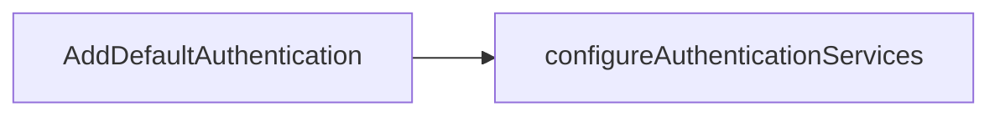

# Authentication

This section documents authentication-related extension classes in `eShop.ServiceDefaults`.

## Classes

### 1. [AuthenticationExtensions](https://github.com/akhileshap9/automated-doc-poc-repo/blob/main/src/eShop.ServiceDefaults/AuthenticationExtensions.cs)

#### Overview
Provides extension methods for authentication, simplifying user identity and claims management in ASP.NET Core projects.

#### Methods

##### [`AddDefaultAuthentication`](https://github.com/akhileshap9/automated-doc-poc-repo/blob/main/src/eShop.ServiceDefaults/AuthenticationExtensions.cs#L10)

- **Overview:**
	Registers default authentication services using configuration values for Identity URL and Audience. Intended for ASP.NET Core host builders.

- **Call Graph:**

- **Flow Diagram:**

1. Reads identity configuration values from the app settings.
2. Configures authentication services using these values.
3. Returns the updated service collection for further setup.

- **Exceptions:**
	- Throws if required configuration values are missing (e.g., Identity URL, Audience).

- **Configuration:**

	| Key         | Default | Effect                                 |
	|-------------|---------|----------------------------------------|
	| Identity:Url| None    | Sets the authority for authentication   |
	| Identity:Audience | None | Sets the audience for authentication |

---

### 2. [ClaimsPrincipalExtensions](https://github.com/akhileshap9/automated-doc-poc-repo/blob/main/src/eShop.ServiceDefaults/ClaimsPrincipalExtensions.cs)

#### Overview
Offers extension methods for working with `ClaimsPrincipal`, making it easier to extract and manipulate user claims for authorization and identity purposes.

#### Methods

##### [`GetUserId`](https://github.com/akhileshap9/automated-doc-poc-repo/blob/main/src/eShop.ServiceDefaults/ClaimsPrincipalExtensions.cs#L7)

- **Overview:**
	Retrieves the user's unique identifier (`sub` claim) from the principal.

- **Call Graph:**

- **Flow Diagram:**

1. Begins by searching for the 'sub' claim in the principal.
2. Returns the claim value if found, otherwise returns null.

- **Exceptions:**
	- None (returns null if claim not found).

##### [`GetUserName`](https://github.com/akhileshap9/automated-doc-poc-repo/blob/main/src/eShop.ServiceDefaults/ClaimsPrincipalExtensions.cs#L10)

- **Overview:**
	Retrieves the user's name (`ClaimTypes.Name` claim) from the principal.

- **Call Graph:**

- **Flow Diagram:**

1. Searches for the 'Name' claim in the principal.
2. Returns the claim value if found, otherwise returns null.

- **Exceptions:**
	- None (returns null if claim not found).

