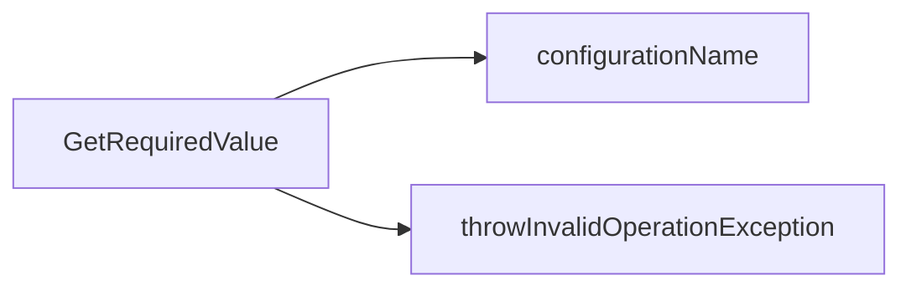
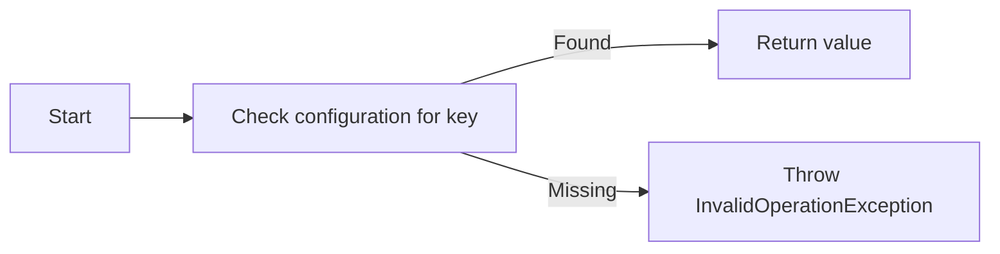
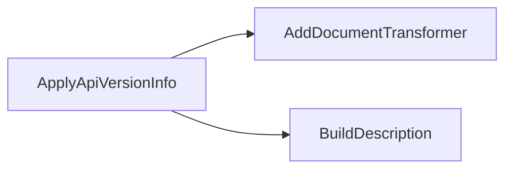
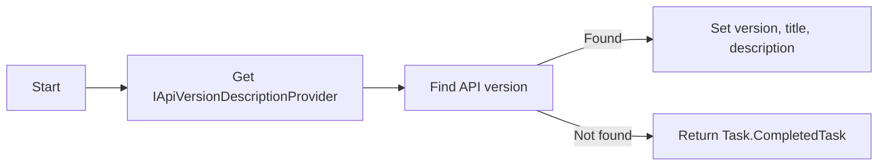

# Configuration Extension

This section documents all configuration-related extension classes in `eShop.ServiceDefaults`.

## Classes

### 1. [ConfigurationExtensions](https://github.com/akhileshap9/automated-doc-poc-repo/blob/main/src/eShop.ServiceDefaults/ConfigurationExtensions.cs)

#### Overview
Provides extension methods for working with configuration sources, simplifying access to configuration values and binding options.

#### Methods

##### [`GetRequiredValue`](https://github.com/akhileshap9/automated-doc-poc-repo/blob/main/src/eShop.ServiceDefaults/ConfigurationExtensions.cs#L5)

- **Overview:**
	Retrieves a required configuration value by key. Throws if the value is missing, ensuring critical configuration is present at runtime.

- **Call Graph:**

- **Flow Diagram:**

1. The method starts by checking if the requested configuration key exists.
2. If found, it returns the value; if missing, it throws an exception to enforce required configuration.

- **Exceptions:**

	- Throws `InvalidOperationException` if the configuration value is missing.

- **Configuration:**

	| Key   | Default | Effect                        |
	|-------|---------|-------------------------------|
	| name  | None    | Required config value by name |

---

### 2. [OpenApiOptionsExtensions](https://github.com/akhileshap9/automated-doc-poc-repo/blob/main/src/eShop.ServiceDefaults/OpenApiOptionsExtensions.cs)

#### Overview
Offers extension methods for configuring OpenAPI options, enabling easier setup and customization of OpenAPI/Swagger documentation in ASP.NET Core projects.

#### Methods

##### [`ApplyApiVersionInfo`](https://github.com/akhileshap9/automated-doc-poc-repo/blob/main/src/eShop.ServiceDefaults/OpenApiOptionsExtensions.cs#L16)

- **Overview:**
	Adds API version information to the OpenAPI document, including title and description, and marks deprecated versions.

- **Call Graph:**

1. Adds a document transformer to the OpenAPI options.
2. Uses a helper to build the description for the API version.

- **Flow Diagram:**

1. Gets the API version description provider from the service container.
2. Finds the API version for the current document.
3. If found, sets the version, title, and description; if not, returns a completed task.

- **Exceptions:**
	- None (returns Task.CompletedTask if API version not found).

- **Configuration:**

	| Key   | Default | Effect                        |
	|-------|---------|-------------------------------|
	| title | None    | OpenAPI document title        |
	| description | None | OpenAPI document description |

