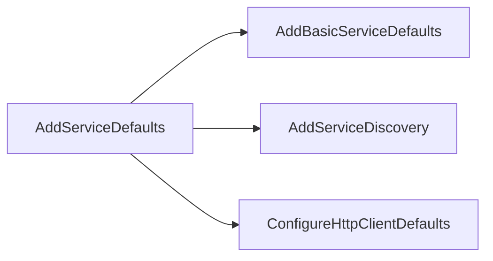
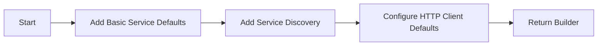
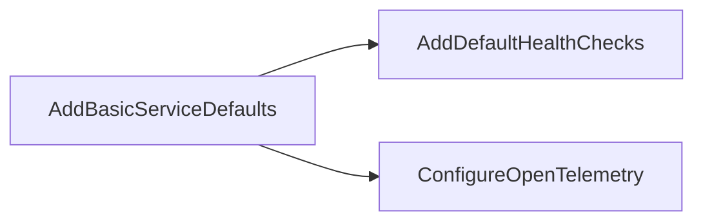
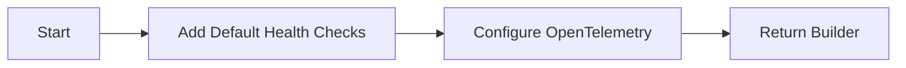
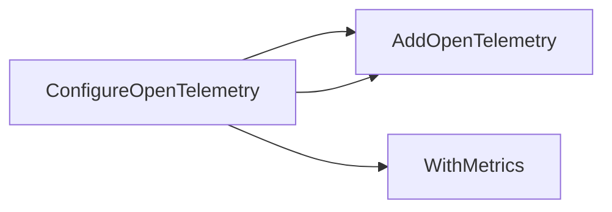
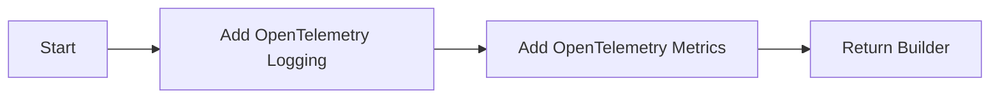
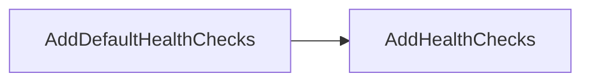
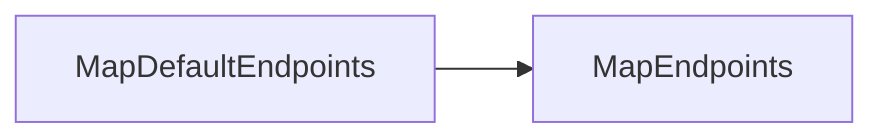
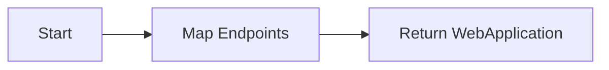

# General Utilities

This section documents general utility extension classes in `eShop.ServiceDefaults`.

## Classes

### 1. [Extensions](https://github.com/akhileshap9/automated-doc-poc-repo/blob/main/src/eShop.ServiceDefaults/Extensions.cs)

#### Overview
Provides general-purpose extension methods and helpers used throughout the solution, improving code reuse and maintainability.

#### Methods

##### [`AddServiceDefaults`](https://github.com/akhileshap9/automated-doc-poc-repo/blob/main/src/eShop.ServiceDefaults/Extensions.cs#L16)

- **Overview:**
	Adds service defaults including service discovery, HTTP client resilience, and telemetry to the host builder.

- **Call Graph:**

- **Flow Diagram:**

1. Starts by adding basic service defaults to the host builder.
2. Adds service discovery capabilities.
3. Configures HTTP client defaults for resilience and discovery.
4. Returns the updated builder for further configuration.

##### [`AddBasicServiceDefaults`](https://github.com/akhileshap9/automated-doc-poc-repo/blob/main/src/eShop.ServiceDefaults/Extensions.cs#L40)

- **Overview:**
	Adds basic service defaults such as health checks and telemetry, without outgoing HTTP calls.

- **Call Graph:**

- **Flow Diagram:**

1. Adds default health checks to the application.
2. Configures OpenTelemetry for logging and metrics.
3. Returns the updated builder for further configuration.

##### [`ConfigureOpenTelemetry`](https://github.com/akhileshap9/automated-doc-poc-repo/blob/main/src/eShop.ServiceDefaults/Extensions.cs#L50)

- **Overview:**
	Configures OpenTelemetry logging and metrics for the host builder.

- **Call Graph:**

- **Flow Diagram:**

1. Adds OpenTelemetry logging to the host builder.
2. Adds OpenTelemetry metrics for observability.
3. Returns the updated builder for further configuration.

##### [`AddDefaultHealthChecks`](https://github.com/akhileshap9/automated-doc-poc-repo/blob/main/src/eShop.ServiceDefaults/Extensions.cs#L99)

- **Overview:**
	Adds default health checks for the application, including event bus and self health checks.

- **Call Graph:**

- **Flow Diagram:**

1. Adds health checks to the application for monitoring.
2. Returns the updated builder for further configuration.

##### [`MapDefaultEndpoints`](https://github.com/akhileshap9/automated-doc-poc-repo/blob/main/src/eShop.ServiceDefaults/Extensions.cs#L108)

- **Overview:**
	Maps default endpoints for the web application, including health checks and other service endpoints.

- **Call Graph:**

- **Flow Diagram:**

1. Maps default endpoints for the web application.
2. Returns the updated web application instance.
