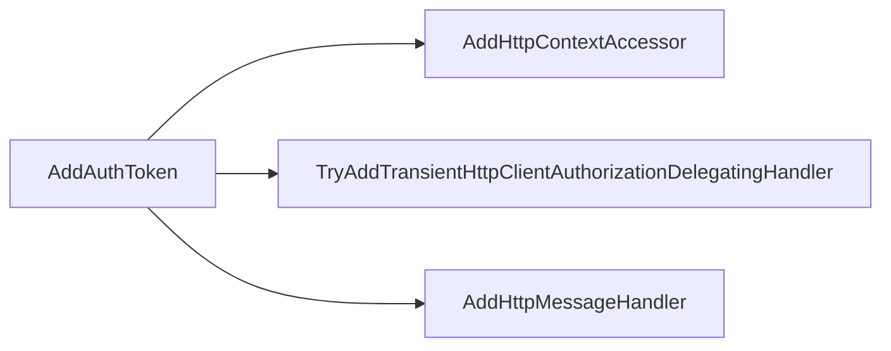

# HTTP Extension

This section documents HTTP-related extension classes in `eShop.ServiceDefaults`.

## Classes

### 1. [HttpClientExtensions](https://github.com/akhileshap9/automated-doc-poc-repo/blob/main/src/eShop.ServiceDefaults/HttpClientExtensions.cs)

#### Overview
Provides extension methods for working with `HttpClient`, enabling easier configuration, request handling, and integration with ASP.NET Core services.

#### Methods

##### [`AddAuthToken`](https://github.com/akhileshap9/automated-doc-poc-repo/blob/main/src/eShop.ServiceDefaults/HttpClientExtensions.cs#L11)

- **Overview:**
	Registers a delegating handler to automatically add authentication tokens to outgoing HTTP requests using the current HTTP context.

- **Call Graph:**

- **Flow Diagram:**

1. Starts by adding the HTTP context accessor to the service collection.
2. Registers a delegating handler for authorization.
3. Adds the handler to the HTTP client pipeline.
4. Returns the configured HTTP client builder.

