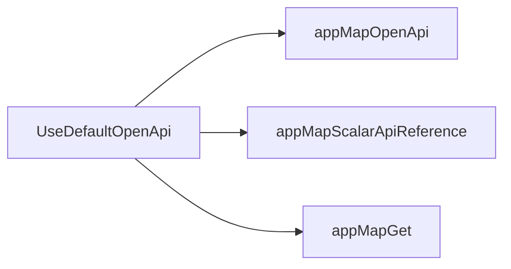
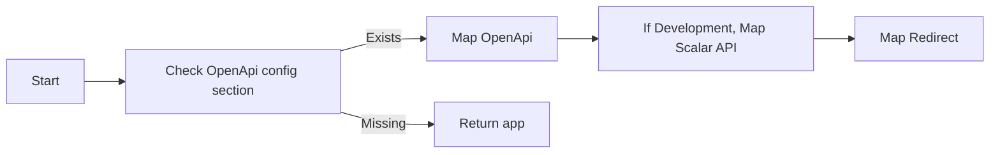
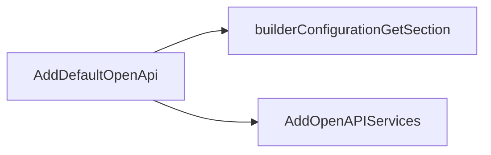
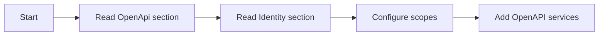

# OpenAPI Extension

This section documents OpenAPI-related extension classes in `eShop.ServiceDefaults`.

## Classes

### 1. [OpenApiExtensions](https://github.com/akhileshap9/automated-doc-poc-repo/blob/main/src/eShop.ServiceDefaults/OpenApi.Extensions.cs)

#### Overview
Provides extension methods for working with OpenAPI/Swagger, simplifying the setup of API documentation and contracts in ASP.NET Core projects.

#### Methods

##### [`UseDefaultOpenApi`](https://github.com/akhileshap9/automated-doc-poc-repo/blob/main/src/eShop.ServiceDefaults/OpenApi.Extensions.cs#L14)

- **Overview:**
	Maps OpenAPI endpoints and sets up API reference documentation, including development-only features and redirects.

- **Call Graph:**

- **Flow Diagram:**

1. Checks if the OpenAPI configuration section exists in the app settings.
2. If present, maps OpenAPI endpoints and sets up documentation.
3. In development, maps Scalar API reference and a redirect.
4. If missing, returns the app unchanged.

- **Configuration:**

	| Key      | Default | Effect                        |
	|----------|---------|-------------------------------|
	| OpenApi  | None    | Enables OpenAPI endpoints      |

##### [`AddDefaultOpenApi`](https://github.com/akhileshap9/automated-doc-poc-repo/blob/main/src/eShop.ServiceDefaults/OpenApi.Extensions.cs#L39)

- **Overview:**
	Adds default OpenAPI services and configuration to the host builder, including scopes and identity integration.

- **Call Graph:**

- **Flow Diagram:**

1. Reads the OpenAPI section from configuration.
2. Reads the Identity section for authentication scopes.
3. Configures scopes for OpenAPI security.
4. Adds OpenAPI services to the host builder.

- **Exceptions:**
	- None.

- **Configuration:**

	| Key      | Default | Effect                        |
	|----------|---------|-------------------------------|
	| OpenApi  | None    | OpenAPI config section         |
	| Identity | None    | Identity config section        |
