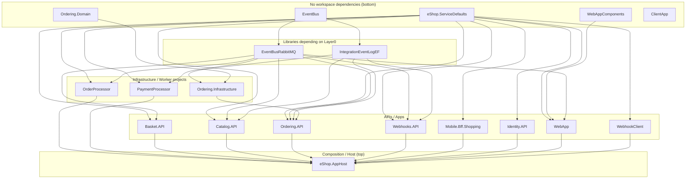

(# Workspace analysis
Generated diagrams and per-project class/interface mappings.

## Requirements checklist

- [x] Analyze all project metadata (.csproj and related) and determine dependency order (bottom-up)
- [x] Create a TD Mermaid diagram showing project dependencies (bottom = no workspace deps)
- [x] Create one LR Mermaid diagram per project showing classes/interfaces and cross-project implementations
- [x] Do not use `.github` or `docs` folders for source content

---

## 1. Project dependency diagram (TD)

The graph is TD (bottom = projects with no workspace dependencies). Arrows point upward from dependency -> dependent.

