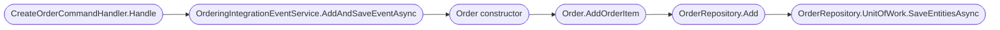
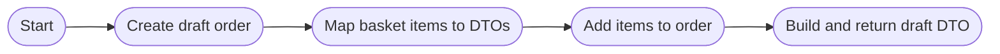
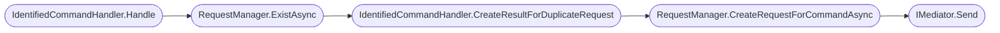
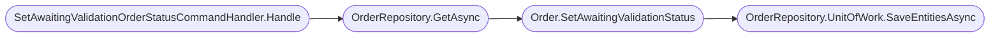
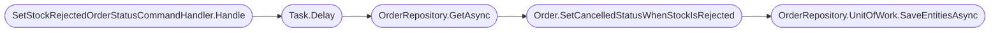
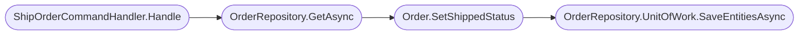

# Commands

This file documents the command classes and their responsibilities in the Ordering.API service.

## [CancelOrderCommandHandler](https://github.com/akhileshap9/automated-doc-poc-repo/blob/main/src/Ordering.API/Application/Commands/CancelOrderCommandHandler.cs)

**Overview:**
The `CancelOrderCommandHandler` handles requests to cancel an order, collaborating with the [OrderRepository](../Ordering.Infrastructure/Repositories/OrderRepository.md) to update order status. It implements the `IRequestHandler<CancelOrderCommand, bool>` interface and is responsible for processing cancellation logic and persisting changes. The command uses the [CancelOrderCommand](../Ordering.API/Models.md#cancelordercommand) model for input.

### Handle
**Overview:**
Public async method. Processes the cancellation command, retrieves the order, updates its status, and saves changes. Parameters: `CancelOrderCommand command`, `CancellationToken cancellationToken`. Returns: `Task<bool>`.

**Call Graph:**


??? Call Graph Legend
    - **CancelOrderCommandHandler.Handle** - [CancelOrderCommandHandler.Handle](#cancelordercommandhandler)
    - **OrderRepository.GetAsync** - [OrderRepository.GetAsync](../Ordering.Infrastructure/Data%20Interactions.md#getasync)
    - **Order.SetCancelledStatus** - [Order.SetCancelledStatus](../Ordering.Domain/Aggregate.md#setcancelledstatus)
    - **OrderRepository.UnitOfWork.SaveEntitiesAsync** - [SaveEntitiesAsync](../Ordering.Infrastructure/Data%20Interactions.md#saveentitiesasynccancellationtoken-cancellationtoken--default)

**Implementation flow:**


??? Usage Example
```csharp
var handler = new CancelOrderCommandHandler(orderRepository);
bool result = await handler.Handle(command, cancellationToken);
```

---

## [CancelOrderIdentifiedCommandHandler](https://github.com/akhileshap9/automated-doc-poc-repo/blob/main/src/Ordering.API/Application/Commands/CancelOrderCommandHandler.cs)

**Overview:**
The `CancelOrderIdentifiedCommandHandler` extends [IdentifiedCommandHandler](../Ordering.API/Models.md#identifiedcommand) to provide idempotency for cancel order requests. It ensures duplicate requests are ignored and only processed once.

### CreateResultForDuplicateRequest
**Overview:**
Protected override method. Returns `true` to indicate duplicate cancel requests are ignored. No parameters. Returns: `bool`.

---

## [CreateOrderCommandHandler](https://github.com/akhileshap9/automated-doc-poc-repo/blob/main/src/Ordering.API/Application/Commands/CreateOrderCommandHandler.cs)

**Overview:**
The `CreateOrderCommandHandler` is responsible for handling order creation requests, collaborating with [OrderRepository](../Ordering.Infrastructure/Repositories/OrderRepository.md), `IIdentityService`, `IMediator`, and `IOrderingIntegrationEventService`. It implements `IRequestHandler<CreateOrderCommand, bool>` and manages the creation of order aggregates and integration events. The command uses the [CreateOrderCommand](../Ordering.API/Models.md#createordercommand) model and [OrderItemDTO](../Ordering.API/Models.md#orderitemdto) for order items.

### Handle
**Overview:**
Public async method. Processes the order creation command, creates integration events, builds the order aggregate, adds order items, and saves the order. Parameters: `CreateOrderCommand message`, `CancellationToken cancellationToken`. Returns: `Task<bool>`.

**Call Graph:**


??? Call Graph Legend
    - **CreateOrderCommandHandler.Handle** - [CreateOrderCommandHandler.Handle](#createordercommandhandler)
    - **OrderingIntegrationEventService.AddAndSaveEventAsync** - [AddAndSaveEventAsync](../Ordering.Infrastructure/README.md#addandsaveeventasync)
    - **Order (constructor)** - [Order (constructor)](../Ordering.Domain/Aggregate.md#order-constructor)
    - **Order.AddOrderItem** - [Order.AddOrderItem](../Ordering.Domain/Aggregate.md#addorderitem)
    - **OrderRepository.Add** - [OrderRepository.Add](../Ordering.Infrastructure/Data%20Interactions.md#addorder-order)
    - **OrderRepository.UnitOfWork.SaveEntitiesAsync** - [SaveEntitiesAsync](../Ordering.Infrastructure/Data%20Interactions.md#saveentitiesasynccancellationtoken-cancellationtoken--default)

**Implementation flow:**


---

## [CreateOrderIdentifiedCommandHandler](https://github.com/akhileshap9/automated-doc-poc-repo/blob/main/src/Ordering.API/Application/Commands/CreateOrderCommandHandler.cs)

**Overview:**
The `CreateOrderIdentifiedCommandHandler` extends [IdentifiedCommandHandler](../Ordering.API/Models.md#identifiedcommand) to provide idempotency for order creation requests. It ensures duplicate requests are ignored and only processed once.

### CreateResultForDuplicateRequest
**Overview:**
Protected override method. Returns `true` to indicate duplicate create requests are ignored. No parameters. Returns: `bool`.

---

## [CreateOrderDraftCommandHandler](https://github.com/akhileshap9/automated-doc-poc-repo/blob/main/src/Ordering.API/Application/Commands/CreateOrderDraftCommandHandler.cs)

**Overview:**
The `CreateOrderDraftCommandHandler` handles requests to create order drafts, using domain models and DTOs to build draft orders. It implements `IRequestHandler<CreateOrderDraftCommand, OrderDraftDTO>`. The command uses the [CreateOrderDraftCommand](../Ordering.API/Models.md#createorderdraftcommand) model and [BasketItem](../Ordering.API/Models.md#basketitem) for basket items.

### Handle
**Overview:**
Public method. Builds a draft order from basket items, adds items to the order, and returns an `OrderDraftDTO`. Parameters: `CreateOrderDraftCommand message`, `CancellationToken cancellationToken`. Returns: `Task<OrderDraftDTO>`.

**Call Graph:**


??? Call Graph Legend
    - **CreateOrderDraftCommandHandler.Handle** - [CreateOrderDraftCommandHandler.Handle](#createorderdraftcommandhandler)
    - **Order.NewDraft** - [Order.NewDraft](../Ordering.Domain/Aggregate.md#newdraft)
    - **BasketItem.ToOrderItemDTO** - [BasketItem.ToOrderItemDTO](../Ordering.API/Models.md#basketitem)
    - **Order.AddOrderItem** - [Order.AddOrderItem](../Ordering.Domain/Aggregate.md#addorderitem)
    - **OrderDraftDTO.FromOrder** - [OrderDraftDTO.FromOrder](../Ordering.API/Models.md#orderdraftdto)

**Implementation flow:**


---

## [IdentifiedCommandHandler](https://github.com/akhileshap9/automated-doc-poc-repo/blob/main/src/Ordering.API/Application/Commands/IdentifiedCommandHandler.cs)

**Overview:**
The `IdentifiedCommandHandler<T, R>` is an abstract base class for handling idempotent command processing. It collaborates with `IMediator`, [RequestManager](../Ordering.Infrastructure/Idempotency/RequestManager.md), and `ILogger` to ensure duplicate requests are detected and handled appropriately. See [IdentifiedCommand](../Ordering.API/Models.md#identifiedcommand) for the command model.

### Handle
**Overview:**
Public async method. Checks for duplicate requests, creates request records, and delegates command execution. Parameters: `IdentifiedCommand<T, R> message`, `CancellationToken cancellationToken`. Returns: `Task<R>`.

**Call Graph:**


??? Call Graph Legend
    - **IdentifiedCommandHandler.Handle** - [IdentifiedCommandHandler.Handle](#identifiedcommandhandler)
    - **RequestManager.ExistAsync** - [ExistAsync](../Ordering.Infrastructure/Data%20Interactions.md#existasyncguid-id)
    - **IdentifiedCommandHandler.CreateResultForDuplicateRequest** - [CreateResultForDuplicateRequest](#identifiedcommandhandler)
    - **RequestManager.CreateRequestForCommandAsync** - [CreateRequestForCommandAsync](../Ordering.Infrastructure/Data%20Interactions.md#createrequestforcommandasyncguid-id)
    - **IMediator.Send** - [IMediator.Send](../Ordering.Infrastructure/README.md#send)

**Implementation flow:**


---

## [SetAwaitingValidationOrderStatusCommandHandler](https://github.com/akhileshap9/automated-doc-poc-repo/blob/main/src/Ordering.API/Application/Commands/SetAwaitingValidationOrderStatusCommandHandler.cs)

**Overview:**
Handles requests to set an order's status to 'Awaiting Validation', collaborating with the [OrderRepository](../Ordering.Infrastructure/Repositories/OrderRepository.md). Implements `IRequestHandler<SetAwaitingValidationOrderStatusCommand, bool>`. The command uses the [SetAwaitingValidationOrderStatusCommand](../Ordering.API/Models.md#setawaitingvalidationorderstatuscommand) model.

### Handle
**Overview:**
Public async method. Retrieves the order, updates its status, and saves changes. Parameters: `SetAwaitingValidationOrderStatusCommand command`, `CancellationToken cancellationToken`. Returns: `Task<bool>`.

**Call Graph:**


??? Call Graph Legend
    - **SetAwaitingValidationOrderStatusCommandHandler.Handle** - [SetAwaitingValidationOrderStatusCommandHandler.Handle](#setawaitingvalidationorderstatuscommandhandler)
    - **OrderRepository.GetAsync** - [OrderRepository.GetAsync](../Ordering.Infrastructure/Data%20Interactions.md#getasync)
    - **Order.SetAwaitingValidationStatus** - [Order.SetAwaitingValidationStatus](../Ordering.Domain/Aggregate.md#setawaitingvalidationstatus)
    - **OrderRepository.UnitOfWork.SaveEntitiesAsync** - [SaveEntitiesAsync](../Ordering.Infrastructure/Data%20Interactions.md#saveentitiesasynccancellationtoken-cancellationtoken--default)

**Implementation flow:**


---

## [SetAwaitingValidationIdentifiedOrderStatusCommandHandler](https://github.com/akhileshap9/automated-doc-poc-repo/blob/main/src/Ordering.API/Application/Commands/SetAwaitingValidationOrderStatusCommandHandler.cs)

**Overview:**
Extends [IdentifiedCommandHandler](../Ordering.API/Models.md#identifiedcommand) to provide idempotency for status update requests.

### CreateResultForDuplicateRequest
**Overview:**
Protected override method. Returns `true` to indicate duplicate requests are ignored. No parameters. Returns: `bool`.

---

## [SetPaidOrderStatusCommandHandler](https://github.com/akhileshap9/automated-doc-poc-repo/blob/main/src/Ordering.API/Application/Commands/SetPaidOrderStatusCommandHandler.cs)

**Overview:**
Handles requests to set an order's status to 'Paid', collaborating with the [OrderRepository](../Ordering.Infrastructure/Repositories/OrderRepository.md). Implements `IRequestHandler<SetPaidOrderStatusCommand, bool>`. The command uses the [SetPaidOrderStatusCommand](../Ordering.API/Models.md#setpaidorderstatuscommand) model.

### Handle
**Overview:**
Public async method. Simulates payment validation, retrieves the order, updates its status, and saves changes. Parameters: `SetPaidOrderStatusCommand command`, `CancellationToken cancellationToken`. Returns: `Task<bool>`.

**Call Graph:**


??? Call Graph Legend
    - **SetPaidOrderStatusCommandHandler.Handle** - [SetPaidOrderStatusCommandHandler.Handle](#setpaidorderstatuscommandhandler)
    - **Task.Delay** - [Task.Delay](https://learn.microsoft.com/en-us/dotnet/api/system.threading.tasks.task.delay)
    - **OrderRepository.GetAsync** - [OrderRepository.GetAsync](../Ordering.Infrastructure/Data%20Interactions.md#getasync)
    - **Order.SetPaidStatus** - [Order.SetPaidStatus](../Ordering.Domain/Aggregate.md#setpaidstatus)
    - **OrderRepository.UnitOfWork.SaveEntitiesAsync** - [SaveEntitiesAsync](../Ordering.Infrastructure/Data%20Interactions.md#saveentitiesasynccancellationtoken-cancellationtoken--default)

**Implementation flow:**


---

## [SetPaidIdentifiedOrderStatusCommandHandler](https://github.com/akhileshap9/automated-doc-poc-repo/blob/main/src/Ordering.API/Application/Commands/SetPaidOrderStatusCommandHandler.cs)

**Overview:**
Extends [IdentifiedCommandHandler](../Ordering.API/Models.md#identifiedcommand) to provide idempotency for paid status update requests.

### CreateResultForDuplicateRequest
**Overview:**
Protected override method. Returns `true` to indicate duplicate requests are ignored. No parameters. Returns: `bool`.

---

## [SetStockConfirmedOrderStatusCommandHandler](https://github.com/akhileshap9/automated-doc-poc-repo/blob/main/src/Ordering.API/Application/Commands/SetStockConfirmedOrderStatusCommandHandler.cs)

**Overview:**
Handles requests to set an order's status to 'Stock Confirmed', collaborating with the [OrderRepository](../Ordering.Infrastructure/Repositories/OrderRepository.md). Implements `IRequestHandler<SetStockConfirmedOrderStatusCommand, bool>`. The command uses the [SetStockConfirmedOrderStatusCommand](../Ordering.API/Models.md#setstockconfirmedorderstatuscommand) model.

### Handle
**Overview:**
Public async method. Simulates stock confirmation, retrieves the order, updates its status, and saves changes. Parameters: `SetStockConfirmedOrderStatusCommand command`, `CancellationToken cancellationToken`. Returns: `Task<bool>`.

**Call Graph:**


??? Call Graph Legend
    - **SetStockConfirmedOrderStatusCommandHandler.Handle** - [SetStockConfirmedOrderStatusCommandHandler.Handle](#setstockconfirmedorderstatuscommandhandler)
    - **Task.Delay** - [Task.Delay](https://learn.microsoft.com/en-us/dotnet/api/system.threading.tasks.task.delay)
    - **OrderRepository.GetAsync** - [OrderRepository.GetAsync](../Ordering.Infrastructure/Data%20Interactions.md#getasync)
    - **Order.SetStockConfirmedStatus** - [Order.SetStockConfirmedStatus](../Ordering.Domain/Aggregate.md#setstockconfirmedstatus)
    - **OrderRepository.UnitOfWork.SaveEntitiesAsync** - [SaveEntitiesAsync](../Ordering.Infrastructure/Data%20Interactions.md#saveentitiesasynccancellationtoken-cancellationtoken--default)

**Implementation flow:**


---

## [SetStockConfirmedOrderStatusIdentifiedCommandHandler](https://github.com/akhileshap9/automated-doc-poc-repo/blob/main/src/Ordering.API/Application/Commands/SetStockConfirmedOrderStatusCommandHandler.cs)

**Overview:**
Extends [IdentifiedCommandHandler](../Ordering.API/Models.md#identifiedcommand) to provide idempotency for stock confirmed status update requests.

### CreateResultForDuplicateRequest
**Overview:**
Protected override method. Returns `true` to indicate duplicate requests are ignored. No parameters. Returns: `bool`.

---

## [SetStockRejectedOrderStatusCommandHandler](https://github.com/akhileshap9/automated-doc-poc-repo/blob/main/src/Ordering.API/Application/Commands/SetStockRejectedOrderStatusCommandHandler.cs)

**Overview:**
Handles requests to set an order's status to 'Stock Rejected', collaborating with the [OrderRepository](../Ordering.Infrastructure/Repositories/OrderRepository.md). Implements `IRequestHandler<SetStockRejectedOrderStatusCommand, bool>`. The command uses the [SetStockRejectedOrderStatusCommand](../Ordering.API/Models.md#setstockrejectedorderstatuscommand) model.

### Handle
**Overview:**
Public async method. Simulates stock rejection, retrieves the order, updates its status, and saves changes. Parameters: `SetStockRejectedOrderStatusCommand command`, `CancellationToken cancellationToken`. Returns: `Task<bool>`.

**Call Graph:**


??? Call Graph Legend
    - **SetStockRejectedOrderStatusCommandHandler.Handle** - [SetStockRejectedOrderStatusCommandHandler.Handle](#setstockrejectedorderstatuscommandhandler)
    - **Task.Delay** - [Task.Delay](https://learn.microsoft.com/en-us/dotnet/api/system.threading.tasks.task.delay)
    - **OrderRepository.GetAsync** - [OrderRepository.GetAsync](../Ordering.Infrastructure/Data%20Interactions.md#getasync)
    - **Order.SetCancelledStatusWhenStockIsRejected** - [Order.SetCancelledStatusWhenStockIsRejected](../Ordering.Domain/Aggregate.md#setcancelledstatuswhenstockisrejected)
    - **OrderRepository.UnitOfWork.SaveEntitiesAsync** - [SaveEntitiesAsync](../Ordering.Infrastructure/Data%20Interactions.md#saveentitiesasynccancellationtoken-cancellationtoken--default)

**Implementation flow:**


---

## [SetStockRejectedOrderStatusIdentifiedCommandHandler](https://github.com/akhileshap9/automated-doc-poc-repo/blob/main/src/Ordering.API/Application/Commands/SetStockRejectedOrderStatusCommandHandler.cs)

**Overview:**
Extends [IdentifiedCommandHandler](../Ordering.API/Models.md#identifiedcommand) to provide idempotency for stock rejected status update requests.

### CreateResultForDuplicateRequest
**Overview:**
Protected override method. Returns `true` to indicate duplicate requests are ignored. No parameters. Returns: `bool`.

---

## [ShipOrderCommandHandler](https://github.com/akhileshap9/automated-doc-poc-repo/blob/main/src/Ordering.API/Application/Commands/ShipOrderCommandHandler.cs)

**Overview:**
Handles requests to set an order's status to 'Shipped', collaborating with the [OrderRepository](../Ordering.Infrastructure/Repositories/OrderRepository.md). Implements `IRequestHandler<ShipOrderCommand, bool>`. The command uses the [ShipOrderCommand](../Ordering.API/Models.md#shipordercommand) model.

### Handle
**Overview:**
Public async method. Retrieves the order, updates its status, and saves changes. Parameters: `ShipOrderCommand command`, `CancellationToken cancellationToken`. Returns: `Task<bool>`.

**Call Graph:**


??? Call Graph Legend
    - **ShipOrderCommandHandler.Handle** - [ShipOrderCommandHandler.Handle](#shipordercommandhandler)
    - **OrderRepository.GetAsync** - [OrderRepository.GetAsync](../Ordering.Infrastructure/Data%20Interactions.md#getasync)
    - **Order.SetShippedStatus** - [Order.SetShippedStatus](../Ordering.Domain/Aggregate.md#setshippedstatus)
    - **OrderRepository.UnitOfWork.SaveEntitiesAsync** - [SaveEntitiesAsync](../Ordering.Infrastructure/Data%20Interactions.md#saveentitiesasynccancellationtoken-cancellationtoken--default)

**Implementation flow:**


---

## [ShipOrderIdentifiedCommandHandler](https://github.com/akhileshap9/automated-doc-poc-repo/blob/main/src/Ordering.API/Application/Commands/ShipOrderCommandHandler.cs)

**Overview:**
Extends [IdentifiedCommandHandler](../Ordering.API/Models.md#identifiedcommand) to provide idempotency for shipped status update requests.

### CreateResultForDuplicateRequest
**Overview:**
Protected override method. Returns `true` to indicate duplicate requests are ignored. No parameters. Returns: `bool`.
