# Extensions

This document describes the extension classes implemented in the `Ordering.API/Extensions` folder. It provides an overview of each extension class, their responsibilities, and how they are used to enhance the functionality and maintainability of the Ordering.API service.

---

## [Extensions](https://github.com/akhileshap9/automated-doc-poc-repo/blob/main/src/Ordering.API/Extensions/Extensions.cs)

**Overview:**
The `Extensions` class provides extension methods for configuring application services, dependency injection, and event bus subscriptions in the Ordering.API. It is responsible for registering core services, validators, MediatR behaviors, and event bus handlers. This class is internal and static, and is typically used during application startup.

### AddApplicationServices
**Overview:**
Public static method. Registers authentication, DbContext, integration services, MediatR, validators, repositories, and event bus subscriptions. Parameters: `IHostApplicationBuilder builder`. No return value.

**Implementation flow:**

```mermaid
flowchart LR
    S([Start]) --> P1([Add authentication])
    P1 --> P2([Add DbContext])
    P2 --> P3([Add integration services])
    P3 --> P4([Add MediatR and behaviors])
    P4 --> P5([Register validators])
    P5 --> P6([Register repositories])
    P6 --> P7([Add event bus subscriptions])
    P7 --> E([End])
    click P1 "https://github.com/akhileshap9/automated-doc-poc-repo/blob/main/src/Ordering.API/Extensions/Extensions.cs#L13" "AddAuthentication"
    click P2 "https://github.com/akhileshap9/automated-doc-poc-repo/blob/main/src/Ordering.API/Extensions/Extensions.cs#L14" "AddDbContext"
    click P3 "https://github.com/akhileshap9/automated-doc-poc-repo/blob/main/src/Ordering.API/Extensions/Extensions.cs#L15" "AddIntegrationServices"
    click P4 "https://github.com/akhileshap9/automated-doc-poc-repo/blob/main/src/Ordering.API/Extensions/Extensions.cs#L16" "AddMediatR"
    click P5 "https://github.com/akhileshap9/automated-doc-poc-repo/blob/main/src/Ordering.API/Extensions/Extensions.cs#L17" "RegisterValidators"
    click P6 "https://github.com/akhileshap9/automated-doc-poc-repo/blob/main/src/Ordering.API/Extensions/Extensions.cs#L18" "RegisterRepositories"
    click P7 "https://github.com/akhileshap9/automated-doc-poc-repo/blob/main/src/Ordering.API/Extensions/Extensions.cs#L19" "AddEventBusSubscriptions"
```

### AddEventBusSubscriptions (private)
**Overview:**
Private static method. Registers event bus subscriptions for integration events and their handlers. Parameters: `IEventBusBuilder eventBus`. No return value.

**Implementation flow:**

---

## [LinqSelectExtensions](https://github.com/akhileshap9/automated-doc-poc-repo/blob/main/src/Ordering.API/Extensions/LinqSelectExtensions.cs)

**Overview:**
The `LinqSelectExtensions` class provides extension methods for safe LINQ select operations that handle exceptions gracefully. It includes methods to project collections with error handling and to process exceptions using custom handlers. This class is public and static.

### SelectTry
**Overview:**
Public static method. Projects each element of a sequence into a new form, capturing exceptions for each element. Parameters: `IEnumerable<TSource> enumerable`, `Func<TSource, TResult> selector`. Returns: `IEnumerable<SelectTryResult<TSource, TResult>>`.

### OnCaughtException (overloads)
**Overview:**
Public static methods. Processes the results of `SelectTry`, handling exceptions using a provided handler function. Parameters: `IEnumerable<SelectTryResult<TSource, TResult>> enumerable`, handler function. Returns: `IEnumerable<TResult>`.

---

## [OrderingApiTrace](https://github.com/akhileshap9/automated-doc-poc-repo/blob/main/src/Ordering.API/Extensions/OrderingApiTrace.cs)

**Overview:**
The `OrderingApiTrace` class provides partial static methods for structured logging of order-related events, such as status updates and payment method changes. It is internal and static, and is used for trace-level logging throughout the API.

---

## [BasketItemExtensions](https://github.com/akhileshap9/automated-doc-poc-repo/blob/main/src/Ordering.API/Extensions/BasketItemExtensions.cs)

**Overview:**
The `BasketItemExtensions` class provides extension methods for converting basket items to order item DTOs. It is public and static, and is used to map between basket and order models for order creation and processing.

### ToOrderItemsDTO
**Overview:**
Public static method. Converts a collection of `BasketItem` objects to a collection of `OrderItemDTO` objects. Parameters: `IEnumerable<BasketItem> basketItems`. Returns: `IEnumerable<OrderItemDTO>`.

### ToOrderItemDTO
**Overview:**
Public static method. Converts a single `BasketItem` object to an `OrderItemDTO` object. Parameters: `BasketItem item`. Returns: `OrderItemDTO`.

---
