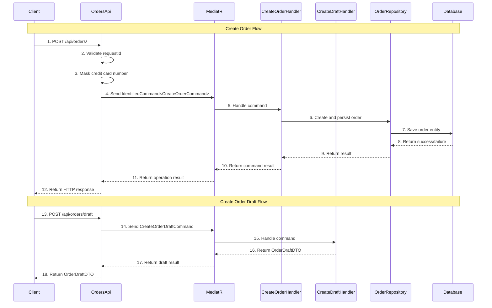

# Order Creation

## Overview
The Order Creation feature provides functionality to create new orders and order drafts within the Ordering API. It includes endpoints for creating complete orders with payment information and generating order drafts for preview purposes. This feature handles complex order validation, payment data masking, and command processing through MediatR with proper idempotency support.

## Sequence Diagram

??? Sequence Diagram Legend
    - **1. POST /api/orders/** - [OrdersApi.CreateOrderAsync](https://github.com/akhileshap9/automated-doc-poc-repo/blob/main/src/Ordering.API/Apis/OrdersApi.cs#L106)
    - **2. Validate requestId** - Request ID validation logic
    - **3. Mask credit card number** - Payment data security processing
    - **4. Send IdentifiedCommand<CreateOrderCommand>** - [CreateOrderCommand](../Commands.md#createordercommand)
    - **5. Handle command** - [CreateOrderCommandHandler](../Commands.md#createordercommandhandler)
    - **6. Create and persist order** - Order repository operations
    - **7. Save order entity** - Database persistence layer
    - **8. Return success/failure** - Database operation result
    - **9. Return result** - Repository operation result
    - **10. Return command result** - Command handler result
    - **11. Return operation result** - MediatR mediation result
    - **12. Return HTTP response** - API response to client
    - **13. POST /api/orders/draft** - [OrdersApi.CreateOrderDraftAsync](https://github.com/akhileshap9/automated-doc-poc-repo/blob/main/src/Ordering.API/Apis/OrdersApi.cs#L95)
    - **14. Send CreateOrderDraftCommand** - [CreateOrderDraftCommand](../Commands.md#createorderdraftcommand)
    - **15. Handle command** - [CreateOrderDraftCommandHandler](../Commands.md#createorderdraftcommandhandler)
    - **16. Return OrderDraftDTO** - Draft calculation result
    - **17. Return draft result** - MediatR mediation result
    - **18. Return OrderDraftDTO** - API response with draft details

## Dependencies
- **CreateOrderCommand** - [CreateOrderCommand](../Commands.md#createordercommand) - Command for creating new orders with full validation
- **CreateOrderCommandHandler** - [CreateOrderCommandHandler](../Commands.md#createordercommandhandler) - Handler that processes order creation logic
- **CreateOrderDraftCommand** - [CreateOrderDraftCommand](../Commands.md#createorderdraftcommand) - Command for generating order previews
- **CreateOrderDraftCommandHandler** - [CreateOrderDraftCommandHandler](../Commands.md#createorderdraftcommandhandler) - Handler that processes order draft generation
- **IdentifiedCommand** - [IdentifiedCommand](../Commands.md#identifiedcommand) - Wrapper command that includes request ID for idempotency
- **CreateOrderRequest** - Request model containing order details and payment information
- **OrderDraftDTO** - [OrderDraftDTO](../Models.md#orderdraftdto) - Data transfer object for order draft responses
- **BasketItem** - [BasketItem](../Models.md#basketitem) - Model representing items in the order
- **OrderServices** - Service collection containing MediatR, Logger, and other dependencies
- **MediatR** - Command/query mediator for handling business logic
- **TypedResults** - ASP.NET Core typed HTTP results for response handling

??? Notes
    - **Order Creation**: Requires valid request ID header (`x-requestid`) to prevent duplicate operations
    - **Payment Security**: Automatically masks credit card numbers in logs and processing
    - **Validation**: Comprehensive validation of order items, payment details, and shipping information
    - **Idempotency**: Supports safe retry operations through identified commands
    - **Audit Logging**: Logs all operations without exposing sensitive payment data

## Exception Handling
- **Empty RequestId**: Returns BadRequest with descriptive message for order creation
- **Invalid Payment Data**: Validation errors returned with detailed messages
- **Command Processing Failure**: Appropriate error responses with status codes
- **Draft Generation Errors**: Handled gracefully with error details
- **General Exceptions**: Handled by global exception middleware

## Security Considerations
- Credit card numbers are masked in all logging operations
- Sensitive payment data is not included in debug logs
- Request scoping ensures proper audit trail correlation
- Payment information is processed securely through validated commands
