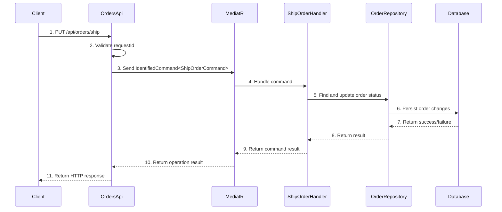

# Order Shipping

## Overview
The Order Shipping feature provides functionality to mark orders as shipped within the Ordering API. It handles order shipping requests through a PUT endpoint that validates request IDs, processes shipping commands via MediatR, and returns appropriate responses. This feature manages order fulfillment state transitions and provides audit logging for shipping operations.

## Sequence Diagram

??? Sequence Diagram Legend
    - **1. PUT /api/orders/ship** - [OrdersApi.ShipOrderAsync](https://github.com/akhileshap9/automated-doc-poc-repo/blob/main/src/Ordering.API/Apis/OrdersApi.cs#L46)
    - **2. Validate requestId** - Request ID validation logic
    - **3. Send IdentifiedCommand<ShipOrderCommand>** - [ShipOrderCommand](../Commands.md#shipordercommand)
    - **4. Handle command** - [ShipOrderCommandHandler](../Commands.md#shipordercommandhandler)
    - **5. Find and update order status** - Order repository operations
    - **6. Persist order changes** - Database persistence layer
    - **7. Return success/failure** - Database operation result
    - **8. Return result** - Repository operation result
    - **9. Return command result** - Command handler result
    - **10. Return operation result** - MediatR mediation result
    - **11. Return HTTP response** - API response to client

## Dependencies
- **ShipOrderCommand** - [ShipOrderCommand](../Commands.md#shipordercommand) - Command for shipping orders with order number validation
- **ShipOrderCommandHandler** - [ShipOrderCommandHandler](../Commands.md#shipordercommandhandler) - Handler that processes order shipping logic
- **IdentifiedCommand** - [IdentifiedCommand](../Commands.md#identifiedcommand) - Wrapper command that includes request ID for idempotency
- **OrderServices** - Service collection containing MediatR, Logger, and other dependencies
- **MediatR** - Command/query mediator for handling business logic
- **TypedResults** - ASP.NET Core typed HTTP results for response handling

??? Notes
    - Requires valid request ID header (`x-requestid`) to prevent duplicate operations
    - Returns 400 Bad Request for invalid/empty request IDs
    - Returns 500 Internal Server Error if shipping processing fails
    - Logs all command operations for audit purposes

## Exception Handling
- **Empty RequestId**: Returns BadRequest with descriptive message
- **Command Processing Failure**: Returns ProblemHttpResult with 500 status code
- **General Exceptions**: Handled by global exception middleware
