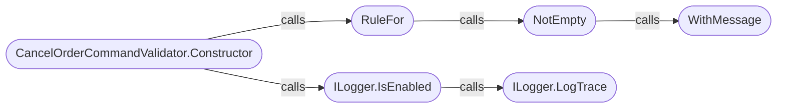
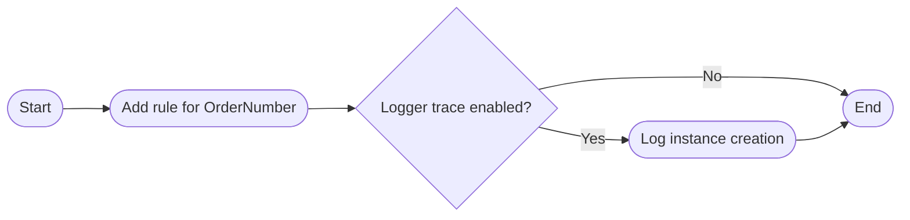
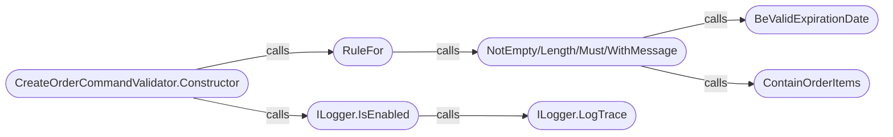
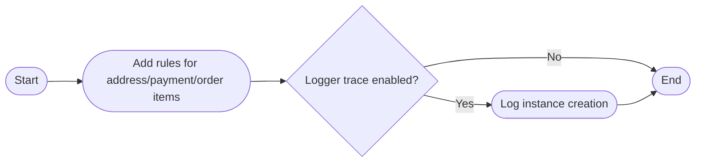
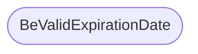
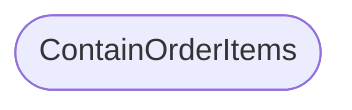
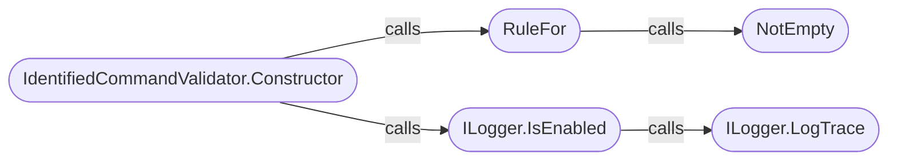
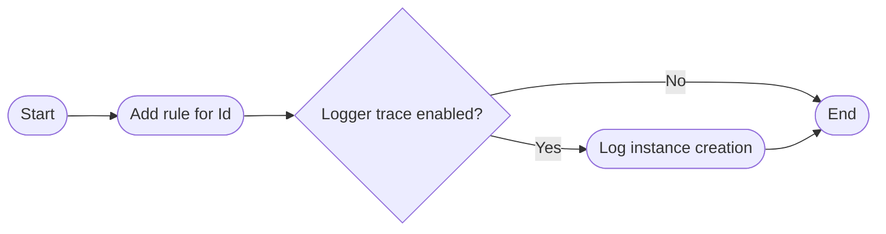
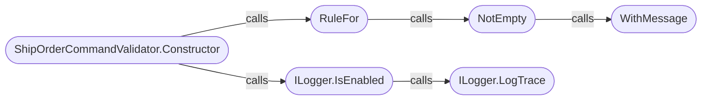

# Validations

Validation classes in Ordering.API are responsible for checking the correctness of incoming data, enforcing business rules, and preventing invalid operations. These validations are typically applied to commands, models, or DTOs before processing them in the application layer.

---

## [CancelOrderCommandValidator](https://github.com/akhileshap9/automated-doc-poc-repo/blob/main/src/Ordering.API/Application/Validations/CancelOrderCommandValidator.cs)

**Overview:**
The `CancelOrderCommandValidator` class validates the `CancelOrderCommand` to ensure the order number is provided. It inherits from `AbstractValidator<CancelOrderCommand>` ([FluentValidation AbstractValidator](https://docs.fluentvalidation.net/en/latest/)). Collaborates with `ILogger` for trace logging.

### Constructor
**Overview:**
Public constructor. Sets up validation rules for the order number and logs instance creation if trace logging is enabled. Parameters: `ILogger<CancelOrderCommandValidator> logger`.

**Call Graph:**

??? Call Graph Legend
    - **CancelOrderCommandValidator.Constructor** - [CancelOrderCommandValidator.Constructor](#cancelordercommandvalidator)

**Implementation flow:**

**Exceptions:**
- None explicit; validation failures are handled by FluentValidation.

---

## [CreateOrderCommandValidator](https://github.com/akhileshap9/automated-doc-poc-repo/blob/main/src/Ordering.API/Application/Validations/CreateOrderCommandValidator.cs)

**Overview:**
The `CreateOrderCommandValidator` class validates the `CreateOrderCommand` to ensure all required fields and business rules are satisfied. Inherits from `AbstractValidator<CreateOrderCommand>`. Collaborates with `ILogger` for trace logging. Uses custom validation for card expiration and order items.

### Constructor
**Overview:**
Public constructor. Sets up validation rules for address, payment, and order items, and logs instance creation if trace logging is enabled. Parameters: `ILogger<CreateOrderCommandValidator> logger`.

**Call Graph:**

??? Call Graph Legend
    - **CreateOrderCommandValidator.Constructor** - [CreateOrderCommandValidator.Constructor](#createordercommandvalidator)
    - **BeValidExpirationDate** - [BeValidExpirationDate](#createordercommandvalidator)
    - **ContainOrderItems** - [ContainOrderItems](#createordercommandvalidator)

**Implementation flow:**

### BeValidExpirationDate
**Overview:**
Private method. Checks if the provided expiration date is in the future. Parameters: `DateTime dateTime`. Returns: `bool`.

**Call Graph:**

### ContainOrderItems
**Overview:**
Private method. Checks if the order contains at least one [OrderItemDTO](../Ordering.API/Models.md#orderitemdto). Parameters: `IEnumerable<OrderItemDTO> orderItems`. Returns: `bool`.

**Call Graph:**

**Exceptions:**
- None explicit; validation failures are handled by FluentValidation.

---

## [IdentifiedCommandValidator](https://github.com/akhileshap9/automated-doc-poc-repo/blob/main/src/Ordering.API/Application/Validations/IdentifiedCommandValidator.cs)

**Overview:**
The `IdentifiedCommandValidator` class validates the `IdentifiedCommand<CreateOrderCommand, bool>` to ensure the command ID is provided. Inherits from `AbstractValidator<IdentifiedCommand<CreateOrderCommand, bool>>`. Collaborates with `ILogger` for trace logging.

### Constructor
**Overview:**
Public constructor. Sets up validation rules for the command ID and logs instance creation if trace logging is enabled. Parameters: `ILogger<IdentifiedCommandValidator> logger`.

**Call Graph:**

??? Call Graph Legend
    - **IdentifiedCommandValidator.Constructor** - [IdentifiedCommandValidator.Constructor](#identifiedcommandvalidator)

**Implementation flow:**

**Exceptions:**
- None explicit; validation failures are handled by FluentValidation.

---

## [ShipOrderCommandValidator](https://github.com/akhileshap9/automated-doc-poc-repo/blob/main/src/Ordering.API/Application/Validations/ShipOrderCommandValidator.cs)

**Overview:**
The `ShipOrderCommandValidator` class validates the `ShipOrderCommand` to ensure the order number is provided. Inherits from `AbstractValidator<ShipOrderCommand>`. Collaborates with `ILogger` for trace logging.

### Constructor
**Overview:**
Public constructor. Sets up validation rules for the order number and logs instance creation if trace logging is enabled. Parameters: `ILogger<ShipOrderCommandValidator> logger`.

**Call Graph:**

??? Call Graph Legend
    - **ShipOrderCommandValidator.Constructor** - [ShipOrderCommandValidator.Constructor](#shipordercommandvalidator)

**Implementation flow:**

**Exceptions:**
- None explicit; validation failures are handled by FluentValidation.

---
