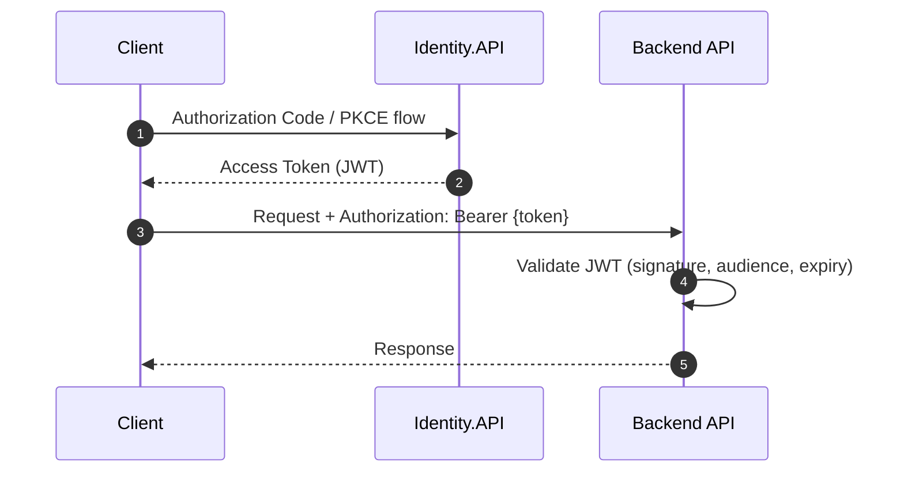

# API Design and Contracts

## API Versioning Strategy

The system uses **URL-based API versioning** via `Asp.Versioning`:

- **v1**: Original API surface
- **v2**: Enhanced endpoints (currently Catalog only) with query parameter filters and route-based IDs

Version is specified via `api-version` query parameter. Services declare supported versions using `NewVersionedApi()` and `MapToApiVersion()`.

## Authentication and Authorization

### Token Flow

All API authentication uses **JWT Bearer tokens** issued by Identity.API:



### Per-Service Auth Configuration

| Service | Auth Required? | Audience | Configuration |
|---------|---------------|----------|---------------|
| **Ordering.API** | Yes (all endpoints) | `orders` | `RequireAuthorization()` on route group |
| **Basket.API** | Partial (Get is anonymous) | `basket` | Per-method `[AllowAnonymous]` / `[Authorize]` |
| **Catalog.API** | No | -- | No auth middleware registered |
| **Identity.API** | Self (cookie + IdentityServer) | -- | MVC `[Authorize]` on consent/device controllers |

### Shared Auth Setup

`eShop.ServiceDefaults.AddDefaultAuthentication`:
- Reads `Identity:Url` for JWT authority
- Reads `Identity:Audience` for token validation
- Disables HTTPS metadata requirement (development)
- Preserves `sub` claim mapping (no default remapping)
- Adds `AddAuthorization()`

### Token Forwarding

`AddAuthToken()` on `HttpClient` registrations adds a delegating handler that copies the `access_token` from the incoming request's `HttpContext` to outgoing HTTP calls. This enables service-to-service auth propagation.

## Complete Endpoint Inventory

### Ordering.API (`/api/orders`, v1)

| Method | Route | Auth | Request Body | Response | Description |
|--------|-------|------|-------------|----------|-------------|
| `POST` | `/` | Yes + `x-requestid` header | `CreateOrderRequest` | `200 OK` / `400 Bad Request` | Create order |
| `POST` | `/draft` | Yes | `CreateOrderDraftCommand` | `OrderDraftDTO` | Preview order |
| `PUT` | `/cancel` | Yes + `x-requestid` | `{ OrderNumber }` | `200 OK` | Cancel order |
| `PUT` | `/ship` | Yes + `x-requestid` | `{ OrderNumber }` | `200 OK` | Ship order |
| `GET` | `/{orderId:int}` | Yes | -- | `Order` | Get order details |
| `GET` | `/` | Yes | -- | `OrderSummary[]` | Current user's orders |
| `GET` | `/cardtypes` | Yes | -- | `CardType[]` | List card types |

### Catalog.API (`/api/catalog`, v1 + v2)

| Method | Route | Version | Auth | Description |
|--------|-------|---------|------|-------------|
| `GET` | `/items` | v1 | No | Paginated list (pageSize, pageIndex) |
| `GET` | `/items` | v2 | No | Filtered list (+ brand, type query params) |
| `GET` | `/items/{id}` | v1/v2 | No | Single item |
| `GET` | `/items/by?ids=` | v1/v2 | No | Multiple items by IDs |
| `GET` | `/items/{id}/pic` | v1/v2 | No | Product image file |
| `GET` | `/items/withsemanticrelevance/{text}` | v1 | No | Semantic search (path param) |
| `GET` | `/items/withsemanticrelevance?text=` | v2 | No | Semantic search (query param) |
| `POST` | `/items` | v1/v2 | No | Create item |
| `PUT` | `/items` | v1 | No | Update item (ID in body) |
| `PUT` | `/items/{id}` | v2 | No | Update item (ID in route) |
| `DELETE` | `/items/{id}` | v1/v2 | No | Delete item |
| `GET` | `/catalogtypes` | v1/v2 | No | List types |
| `GET` | `/catalogbrands` | v1/v2 | No | List brands |

### Basket.API (gRPC)

| RPC | Auth | Request | Response | Description |
|-----|------|---------|----------|-------------|
| `GetBasket` | Anonymous | `GetBasketRequest(userId)` | `CustomerBasketResponse` | Get basket |
| `UpdateBasket` | Required | `UpdateBasketRequest(items)` | `CustomerBasketResponse` | Update basket |
| `DeleteBasket` | Required | `DeleteBasketRequest(userId)` | `DeleteBasketResponse` | Delete basket |

## OpenAPI / Scalar

Services that call `AddDefaultOpenApi` get auto-generated OpenAPI v3 documents at `/openapi/v1.json` (and `/openapi/v2.json` for Catalog). In development, **Scalar** UI is available at `/scalar/v1`, and the root `/` redirects there.

OpenAPI documents include:
- OAuth2 security scheme definitions (from `Identity:Scopes` configuration)
- API version parameters
- Deprecation annotations for superseded v1 endpoints

## Request/Response Patterns

### Pagination

Catalog list endpoints use `PaginationRequest` (pageSize, pageIndex) and return `PaginatedItems<T>`:

```json
{
  "pageIndex": 0,
  "pageSize": 10,
  "count": 142,
  "data": [ ... ]
}
```

### Idempotency

Order mutation endpoints require an `x-requestid` header (GUID). The server deduplicates requests using the `requests` table. Sending the same `x-requestid` twice returns success without re-executing the command.

### Error Handling

- **Ordering**: `ProblemDetails` middleware. Domain validation failures throw `OrderingDomainException`.
- **Catalog**: `UseStatusCodePages()` for standard HTTP error responses.
- **Basket**: gRPC status codes (`Unauthenticated`, `NotFound`).

## Service Discovery

In the Aspire environment, services reference each other by logical name (e.g., `http://catalog-api`, `http://ordering-api`, `http://basket-api`). `AddServiceDiscovery()` from ServiceDefaults resolves these to actual endpoints at runtime.

### Mobile BFF (YARP)

The Mobile BFF (`Mobile.Bff.Shopping`) acts as a reverse proxy for mobile/hybrid clients:

| External Path | Internal Target | Notes |
|--------------|----------------|-------|
| `/catalog-api/*` | `http://catalog-api` | Path prefix stripped |
| `/api/catalog/*` | `http://catalog-api` | Direct pass-through |
| `/api/orders/*` | `http://ordering-api` | Direct pass-through |
| `/identity/*` | Identity.API | Path prefix stripped |
