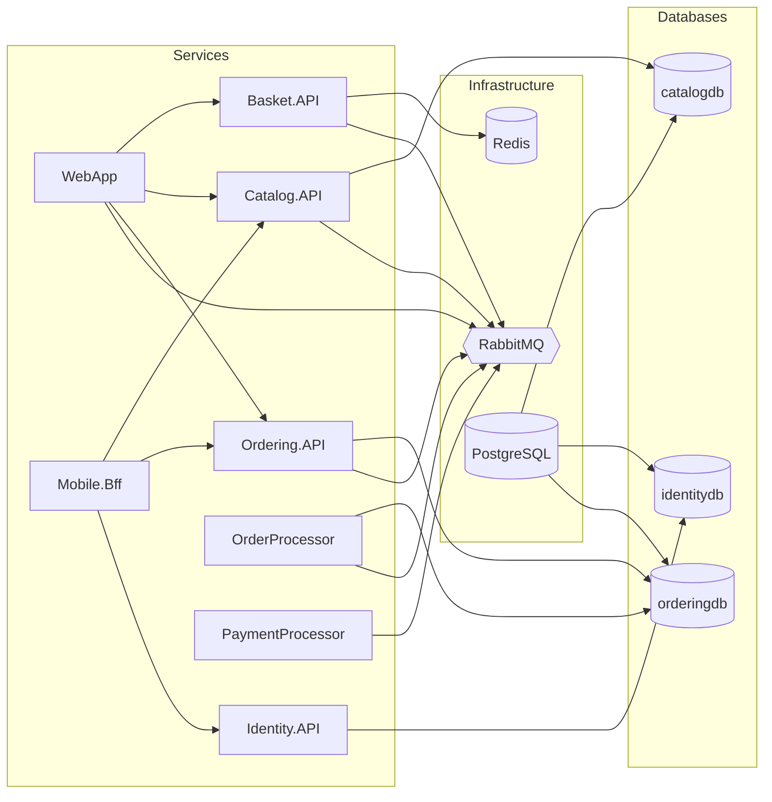

# Aspire Orchestration and Deployment

## Overview

The `eShop.AppHost` project is the .NET Aspire orchestrator. It declares all infrastructure resources and service projects, providing automatic service discovery, connection string injection, health-based startup ordering, and a unified developer dashboard.

**Location**: `src/eShop.AppHost/`

## Infrastructure Resources

| Resource | Type | Persistence | Used By |
|----------|------|:-----------:|---------|
| `redis` | Redis | No | Basket.API |
| `eventbus` | RabbitMQ | Yes (persistent lifetime) | All messaging services |
| `postgres` | PostgreSQL (pgvector image) | Yes | Catalog, Ordering, Identity |
| `catalogdb` | PostgreSQL database | -- | Catalog.API |
| `identitydb` | PostgreSQL database | -- | Identity.API |
| `orderingdb` | PostgreSQL database | -- | Ordering.API, OrderProcessor |
| `webhooksdb` | PostgreSQL database | -- | Webhooks.API (project not in repo) |

## Service Wiring



## Startup Ordering (WaitFor)

Aspire's `WaitFor` ensures services start only after their dependencies are healthy:

| Service | Waits For |
|---------|-----------|
| All messaging services | `eventbus` (RabbitMQ) |
| Ordering.API | `orderingdb` |
| OrderProcessor | `ordering-api` (ensures migrations have run) |
| Catalog.API | `catalogdb` |
| Identity.API | `identitydb` |
| WebApp | Basket.API, Catalog.API, Ordering.API |

## Environment and Configuration

### Forwarded Headers

`Extensions.AddForwardedHeaders` sets `ASPNETCORE_FORWARDEDHEADERS_ENABLED=true` on all projects via an Aspire lifecycle hook. This enables proper handling of `X-Forwarded-*` headers when running behind a reverse proxy.

### Identity URL Injection

Each service that needs authentication receives:
- `Identity__Url`: The identity service endpoint for JWT validation
- Callback URLs for OAuth redirect flows (WebApp, WebhookClient)

### HTTP vs HTTPS

`ShouldUseHttpForEndpoints()` checks `ESHOP_USE_HTTP_ENDPOINTS` environment variable. When set to `1` (e.g., in CI/Playwright environments), services use HTTP instead of HTTPS.

### Optional AI

When configured, AppHost can wire:
- **OpenAI**: `AddOpenAIClientFromConfiguration("openai")` for catalog embeddings and chatbot
- **Ollama**: `AddOllama` with embedding and chat models

## Local Development

### Running the System

```bash
# From the src/eShop.AppHost directory
dotnet run
```

This starts the Aspire dashboard (typically at `https://localhost:15888`) where you can view:
- All running services with their endpoints
- Health check status
- Distributed traces
- Structured logs

### Service Discovery

Services reference each other by logical name in configuration and code:
- `http://catalog-api` -> Catalog.API
- `http://ordering-api` -> Ordering.API
- `http://basket-api` -> Basket.API
- `http://identity-api` -> Identity.API

Aspire resolves these to actual ports at runtime.

### Database Migrations

Services that use EF Core (`Ordering.API`, `Catalog.API`, `Identity.API`) run migrations automatically on startup via `AddMigration<TContext, TSeed>()` from the shared `MigrateDbContextExtensions`.

## Known Issues

- **Webhooks.API**: The AppHost references `Projects.Webhooks_API` but the project folder is not present in this repository. The AppHost will fail to build unless this reference is removed or the project is restored.
- **Mobile BFF health checks**: `Extensions.AddApplicationServices` in the BFF registers additional URL-based health checks, but this method is not called from `Program.cs`, so those checks are inactive.

## Deployment Considerations

This repository does not include:
- **Docker/Compose files**: No `Dockerfile` or `docker-compose.yml` present
- **CI/CD pipelines**: No `.github/workflows` at the repository root
- **Kubernetes manifests**: No Helm charts or K8s YAML

For production deployment, you would need to:
1. Create Dockerfiles for each service
2. Set up a container orchestrator (Kubernetes, Azure Container Apps, etc.)
3. Configure proper IdentityServer signing keys (replace `AddDeveloperSigningCredential`)
4. Set up persistent PostgreSQL and Redis instances
5. Configure RabbitMQ clustering or use a managed service
6. Set up OTLP-compatible observability backend (Jaeger, Azure Monitor, etc.)
7. Enable HTTPS with proper certificates
8. Configure proper health check endpoints (currently dev-only)
